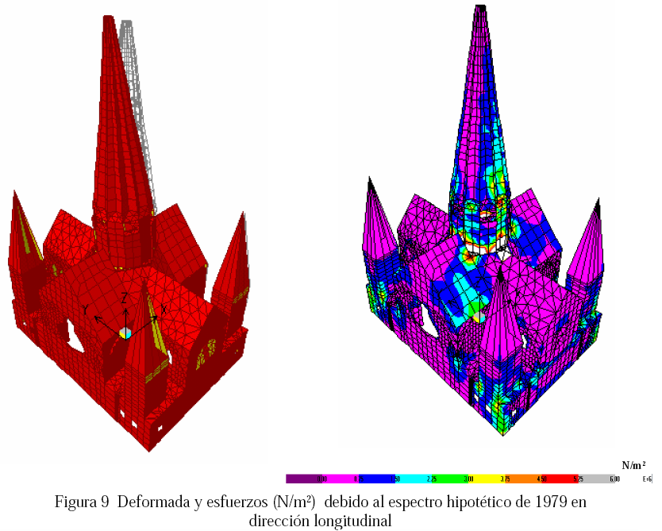

# Universidad Nacional de Colombia - Sede Manizales
# Análisis estructural por elementos finitos
# 4101210 - G2 - Aplicaciones de elementos finitos 1
# 4200685 - G1 - Aplicaciones de elementos finitos 2

  

   

Tomado de:
* [Omar Darío Cardona. Vulnerabilidad sísmica estructural y diseño del refuerzo sismorresistente de la Catedral Basílica de Manizales, Colombia. Revista Internacional de Ingeniería de Estructuras. Vol 7. No. 1 2002. págs 47-66](http://idea.manizales.unal.edu.co/gestion_riesgos/descargas/gestion/Catedralm1.pdf)
* [WIKIMEDIA Fotografía de la Catedral Basílica de Manizales por Pablo Andrés Toro Arias](https://commons.wikimedia.org/wiki/File:2007-06-12_catedral_de_manizales-pablo_andres_toro_arias.jpg)

## Tabla de contenido: 
- [Temario y observaciones generales del curso 1](docs/01_temario_y_observaciones_generales_1.md)
- [Temario y observaciones generales del curso 2](docs/01_temario_y_observaciones_generales_2.md)
- [Diapositivas](./diapositivas/)
- [Códigos](./codigo/)
- [Recursos](docs/recursos.md)
- [Video tutoriales de GiD](docs/GiD.md)
- [Video tutoriales de COMSOL Multiphysics v. 3.5](docs/COMSOL.md)

## Examenes y talleres de EFs 1
- [Tema de los exámenes](docs/tema_examenes_EF1.md)
- [Taller 1](talleres/EF1/taller_1_2019b.md): barras 
- [Taller 2](talleres/EF1/taller_2_2019b.md): estructuras en tensión y deformaciónplana
- [Taller 3](talleres/EF1/taller_3_2019b.md): estructuras 3D y con simetría axial

## Examenes y talleres de EFs 2
- [Tema de los exámenes](docs/tema_examenes_EF2.md)
- [Taller 1](talleres/EF2/taller_1_2020a.md): vigas
- [Taller 2](talleres/EF2/taller_2_2020a.md): losas
- [Taller 3](talleres/EF2/taller_3_2020a.md): cascarones + dinámica
