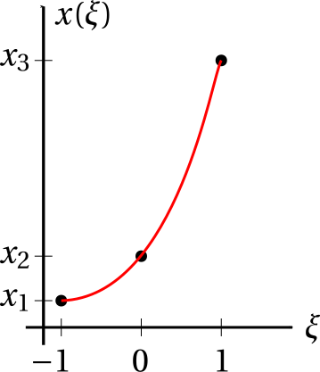

# Elemento finito de barra de `n` nodos

## Deducción de la matriz de rigidez `K` y el vector de fuerzas nodales equivalentes `f`
A continuación se hace la deducción de la matriz de rigidez `K` y el vector de fuerzas nodales equivalentes `f` de un elemento isoparamétrico de barra lagrangiano cuadrático (de tres nodos), suponiendo que `E`, `A` y `b` son constantes en el elemento y que los nodos están igualmente espaciados.

La salida de 
* MATLAB: [calculo_K_y_f.m](calculo_K_y_f.m)
* PYTHON: [calculo_K_y_f.py](calculo_K_y_f.m)

es:
```
K = 
    ⎡14   -16   2 ⎤
A⋅E ⎢             ⎥
───⋅⎢-16  32   -16⎥
6⋅L ⎢             ⎥
    ⎣ 2   -16  14 ⎦

f = 
    ⎡1⎤
L⋅b ⎢ ⎥
───⋅⎢4⎥
 6  ⎢ ⎥
    ⎣1⎦
```


## Comparación de varios algoritmos de interpolación implementados en MATLAB
* MATLAB: [comparing_interpolation_algorithms.m](comparing_interpolation_algorithms.m)


## Funciones de forma lagrangianas para EFs de 2, 3, 4 y 5 nodos

* MATLAB: [funciones_forma_lagrangianos1D.m](funciones_forma_lagrangianos1D.m)
* PYTHON: [funciones_forma_lagrangianos1D.py](funciones_forma_lagrangianos1D.py)

Al ejecutar este código obtenemos no solo la función de forma sino su dibujo, por ejemplo en el caso de las funciones lagrangianas cúbicas, tenemos:
```
Funciones de forma lagrangianas de CUATRO nodos:

N1 = 
    (xi - 1) (3 xi - 1) (3 xi + 1)
  - ------------------------------
                  16

N2 = 
  9 (xi - 1) (3 xi - 1) (xi + 1)
  ------------------------------
                16

N3 = 
    9 (xi - 1) (3 xi + 1) (xi + 1)
  - ------------------------------
                  16

N4 = 
  (3 xi - 1) (3 xi + 1) (xi + 1)
  ------------------------------
                16
```
Y la imagen:


## Cuadraturas de Gauss-Legendre
La teoría asociada con las cuadraturas de Gauss-Legendre se encuentra en:
* http://mathworld.wolfram.com/Legendre-GaussQuadrature.html

Una tabla bonita con los pesos se encuentra en:
* https://de.wikipedia.org/wiki/Gau%C3%9F-Quadratur

Recuerde que:
<!---
Compile en: https://tex.s2cms.com

x = \frac{a+b}{2} + \frac{b-a}{2}\xi
--->


y
<!---
\frac{\mathrm{d}x}{\mathrm{d}\xi} = \frac{b-a}{2}
--->


por lo tanto
<!---
\int_a^b f(x) \mathrm{d} x = \int_{-1}^{+1} \frac{b-a}{2} f\left(\frac{a+b}{2} + \frac{b-a}{2}\xi\right) \mathrm{d} \xi
--->
%20%5Cmathrm%7Bd%7D%20x%20%3D%20%5Cint_%7B-1%7D%5E%7B%2B1%7D%20%5Cfrac%7Bb-a%7D%7B2%7D%20f%5Cleft(%5Cfrac%7Ba%2Bb%7D%7B2%7D%20%2B%20%5Cfrac%7Bb-a%7D%7B2%7D%5Cxi%5Cright)%20%5Cmathrm%7Bd%7D%20%5Cxi)

y utilizando las cuadraturas de Gauss-Legendre la integral anterior se puede expresar como:
<!---
\int_a^b f(x) \mathrm{d} x \approx \frac{b-a}{2}\sum_{i=1}^m w_i f\left(\frac{a+b}{2} + \frac{b-a}{2}\xi_i\right)
--->
%20%5Cmathrm%7Bd%7D%20x%20%5Capprox%20%5Cfrac%7Bb-a%7D%7B2%7D%5Csum_%7Bi%3D1%7D%5Em%20w_i%20f%5Cleft(%5Cfrac%7Ba%2Bb%7D%7B2%7D%20%2B%20%5Cfrac%7Bb-a%7D%7B2%7D%5Cxi_i%5Cright))

Código para generar los pesos y puntos de Gauss para la cuadratura de Gauss-Legendre:
* MATLAB: [gausslegendre_quad.m](../../gausslegendre_quad.m)
* PYTHON: utilice la función `numpy.polynomial.legendre.leggauss()`

### Ejemplo 1

Dada la integral:
<!---
\int_0^{0.8} 0.2 + 25 x - 200 x^2 + 675x^3 - 900x^4 + 400x^5 \ \mathrm{d}x 
--->


La solución exacta se obtiene con el código de MATLAB: 
```matlab
syms x
int(0.2 + 25*x - 200*x^2 + 675*x^3 - 900*x^4 + 400*x^5,x,0,0.8)
```
Siendo la respuesta `3076/1875`.

La integración con las cuadraturas de Gauss-Legendre se realiza con el código:
* MATLAB: [cuadratura_poly_sin_GL.m](cuadratura_poly_sin_GL.m)

El resultado de la ejecución de este código es:


**Análisis de resultados:** Recuerde que la cuadratura de Gauss-Legendre de orden n integra __EXACTAMENTE__ un polinomio de grado `2n-1` o menor. Por lo tanto con una cuadratura de grado 3 o mayor se integra exactamente este polinomio (que es de cuarto orden).

### Ejemplo 2

Dada la integral:
<!---
Compile en: https://tex.s2cms.com

\int_0^{\pi/2} \sin x \ \mathrm{d}x
--->


La solución exacta se obtiene con el código de MATLAB: 
```matlab
syms x
int(sin(x),x,0,pi/2)
```
Siendo la respuesta `1`.

La integración con las cuadraturas de Gauss-Legendre se realiza con el código:
* MATLAB: [cuadratura_poly_sin_GL.m](cuadratura_poly_sin_GL.m)

El resultado de la ejecución de este código es:


**Análisis de resultados:** Con la cuadratura de orden 8 o mayor se obtiene un error menor de 1e-18, y 1-1e-18 excede la precisión de representación de decimales del computador. Por lo tanto el error en la integración el computador lo aproxima a cero (**error de truncamiento**).


## Ejemplo de una barra sometida a carga axial constante (solución con elementos finitos de tres nodos)

Considere la barra mostrada a continuación:


Dicha barra se resolverá utilizando elementos isoparamétricos de tres nodos:



* MATLAB, utilizando la matriz de rigidez deducida anteriormente: [c3_ejemplo_barra_con_carga_axial_3_nodos_k_dado.m](c3_ejemplo_barra_con_carga_axial_3_nodos_k_dado.m)
* MATLAB, utilizando las cuadraturas de Gauss-Legendre: [c3_ejemplo_barra_con_carga_axial_3_nodos_gauss_legendre.m](c3_ejemplo_barra_con_carga_axial_3_nodos_gauss_legendre.m) (Este programa se requiere el archivo `gausslegendre_quad.m`)

Las UNICAS diferencia entre los dos programas anteriores se muestran a continuación:


