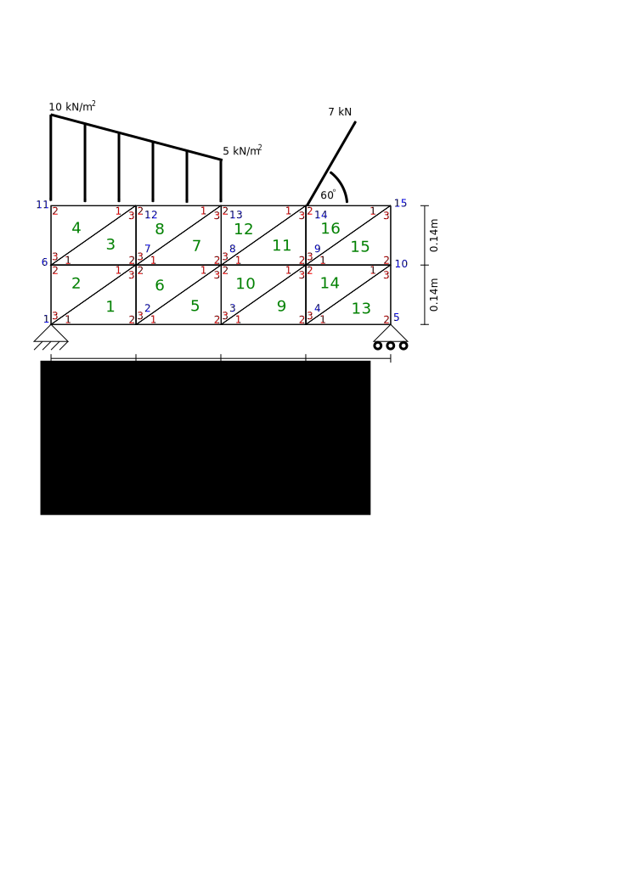

# Programa para calcular los esfuerzos, deformaciones y desplazamientos de un sólido bidimensional utilizando elementos finitos triangulares de tres nodos

Calcule los campos de esfuerzos, desplazamientos y deformaciones de la viga mostrada:

Asuma:
* densidad del material = 7.8 kg/m³
* módulo de elasticidad = 200GPa
* coeficiente de Poisson 0 0.30
* espesor de la viga = 10 cm

