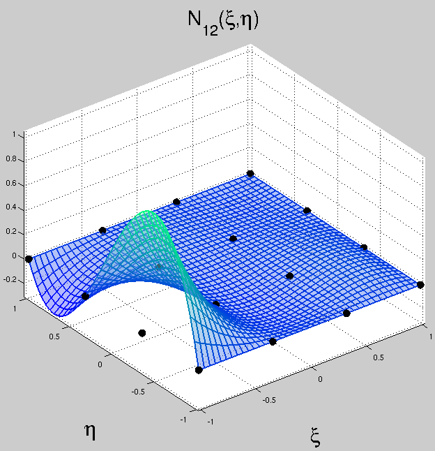
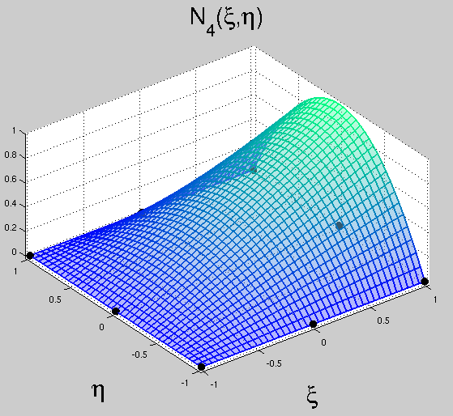
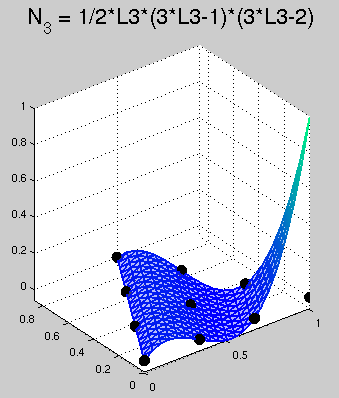
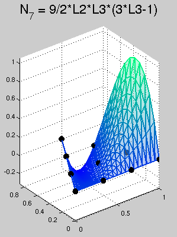
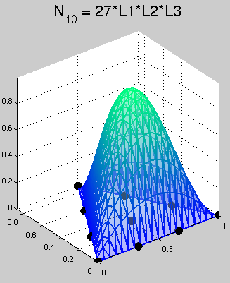

# Programas para el cálculo de las funciones de forma de los elementos finitos bidimensionales

# Funciones de forma de un EF triangular de tres nodos
* MATLAB: [FF_T3.m](FF_T3.m)
* PYTHON: [FF_T3.py](FF_T3.py)

Al ejecutar estos programas se obtiene:
```
u = 
   / x2 y3 - x3 y2   y (x2 - x3)   x (y2 - y3) \
   | ------------- - ----------- + ----------- | u1 +
   \    2 Area         2 Area        2 Area    /

   / y (x1 - x3)   x1 y3 - x3 y1   x (y1 - y3) \
   | ----------- - ------------- - ----------- | u2 +
   \   2 Area         2 Area         2 Area    /

   / x1 y2 - x2 y1   y (x1 - x2)   x (y1 - y2) \
   | ------------- - ----------- + ----------- | u3
   \    2 Area         2 Area        2 Area    /
```


# Funciones de forma de un EF rectangular de cuatro nodos y matriz de rigidez `K` asociada
* MATLAB: [FF_Q4.m](FF_Q4.m)

Con la ayuda de este programa se puede encontrar `K`:

```
K =
[ 2*a1 + 2*a4,         a36,         c41,         b36,        -a14,        -a36,         c14,         b63]
[         a36, 2*a2 + 2*a5,         b63,         c25,        -a36,        -a25,         b36,         c52]
[         c41,         b63, 2*a1 + 2*a4,        -a36,         c14,         b36,        -a14,         a36]
[         b36,         c25,        -a36, 2*a2 + 2*a5,         b63,         c52,         a36,        -a25]
[        -a14,        -a36,         c14,         b63, 2*a1 + 2*a4,         a36,         c41,         b36]
[        -a36,        -a25,         b36,         c52,         a36, 2*a2 + 2*a5,         b63,         c25]
[         c14,         b36,        -a14,         a36,         c41,         b63, 2*a1 + 2*a4,        -a36]
[         b63,         c52,         a36,        -a25,         b36,         c25,        -a36, 2*a2 + 2*a5]
```
 
Para facilitar la comparación de la matriz con el libro de Oñate se muestra únicamente la parte superior de `K`:
```
[ 2*a1 + 2*a4,         a36,         c41,         b36,        -a14,        -a36,         c14,         b63]
[           0, 2*a2 + 2*a5,         b63,         c25,        -a36,        -a25,         b36,         c52]
[           0,           0, 2*a1 + 2*a4,        -a36,         c14,         b36,        -a14,         a36]
[           0,           0,           0, 2*a2 + 2*a5,         b63,         c52,         a36,        -a25]
[           0,           0,           0,           0, 2*a1 + 2*a4,         a36,         c41,         b36]
[           0,           0,           0,           0,           0, 2*a2 + 2*a5,         b63,         c25]
[           0,           0,           0,           0,           0,           0, 2*a1 + 2*a4,        -a36]
[           0,           0,           0,           0,           0,           0,           0, 2*a2 + 2*a5]
```

# Funciones de forma del EF rectangular lagrangiano de 9 nodos
* MATLAB: [FF_lagrangianos_Q9.m](FF_lagrangianos_Q9.m)

# Funciones de forma del EF rectangular lagrangiano de 16 nodos
* MATLAB: [FF_lagrangianos_Q16.m](FF_lagrangianos_Q16.m)
* PYTHON: [FF_lagrangianos_Q16.py](FF_lagrangianos_Q16.py)

Con este código se obtuvo por ejemplo que la función de forma 12 de este elemento es:
```
N12 = 
    9 (xi - 1) (3 xi - 1) (3 xi + 1) (eta - 1) (3 eta - 1) (eta + 1)
  - ----------------------------------------------------------------
                                  256
```

Siendo el gráfico de esta función:



# Funciones de forma de los EFs rectangulares serendípitos de 4 y de 8 nodos
* MATLAB: [FF_serendipitos_Q4_Q8.m](FF_serendipitos_Q4_Q8.m)
* PYTHON: [FF_serendipitos_Q4_Q8.py](FF_serendipitos_Q4_Q8.py)

Con este código se obtuvo por ejemplo que la función de forma 4 de este elemento es:
```
N4 = 
        2
    (eta  - 1) (xi + 1)
  - -------------------
             2
```

Siendo el gráfico de esta función:



# Funciones de forma de los EFs triangulares de 3, 6 y 10 nodos
* MATLAB: [FF_triangulos.m](FF_triangulos.m): este método utiliza funciones de forma especificadas con coordenadas de área.
* MATLAB: [FF_T10_metodo_alternativo.py](FF_T10_metodo_alternativo.py): este método calcula las funciones de forma del EF triangular de 10 nodos asumiendo que es un elemento finito serendípito.

Con este código se obtuvo por ejemplo las siguientes funciones de forma:
```
N{3} = 1/2 L3 (3 L3 - 1) (3 L3 - 2)

N{7} = 9/2 L2 L3 (3 L3 - 1)

N{10} = 27 L1 L2 L3
```

Siendo los gráficos de estas funciones:






