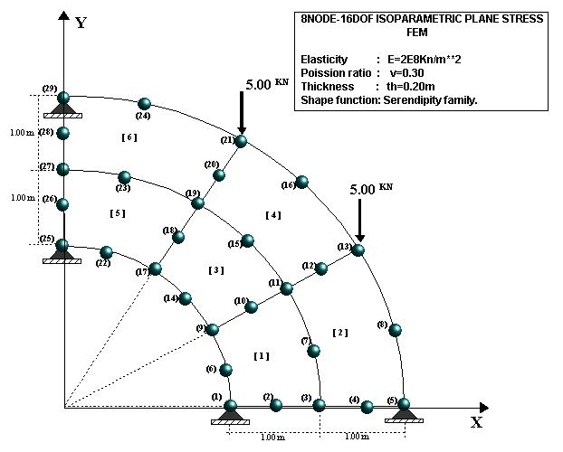
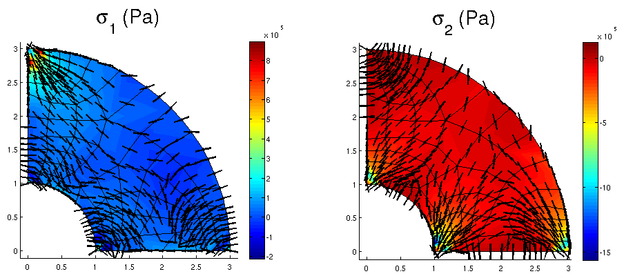
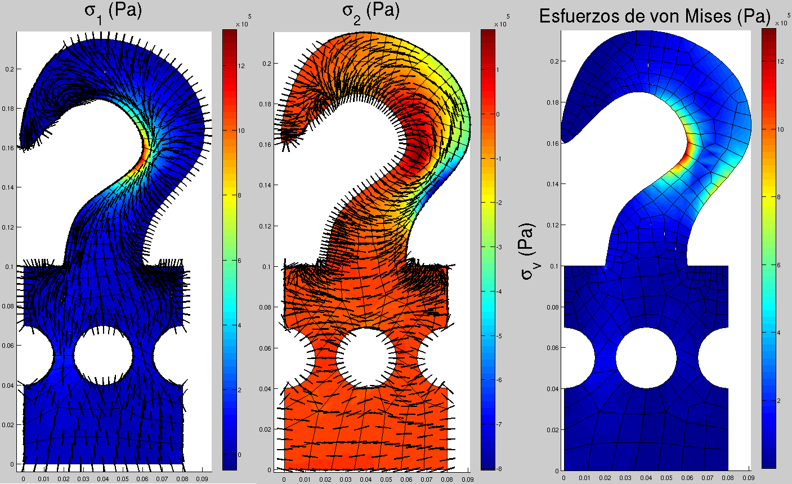
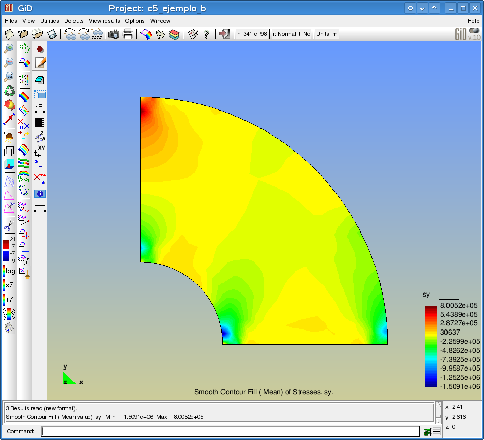

# Programa para calcular los esfuerzos, deformaciones y desplazamientos de un sólido bidimensional utilizando elementos finitos isoparamétricos rectangulares de ocho nodos

En este carpeta se encuentra varias versiones para:
* [PYTHON](python/)
* [MATLAB](matlab/)
* [JULIA 0.5.1 (experimental)](julia_0.51/)

de un programa que estima los desplazamientos, deformaciones, esfuerzos, esfuerzos principales y esfuerzos de von Mises de un sólido bidimensional utilizando elementos finitos isoparamétricos rectangulares de ocho nodos.

En el código se analizan tres modelos diferentes:

* Malla 1:

* Malla 2:

* Malla 3: (malla creada por Alejandro Cardona Jiménez)

NOTA 1: la matriz para extrapolar los esfuerzos desde los puntos de Gauss hacia los nodos se dedujo con el programa 
* MATLAB: [c5_extrapolacion_esfuerzos.m](c5_extrapolacion_esfuerzos.m)

NOTA 2: falta calcular las deformaciones principales. 

NOTA 3: la versión de MATLAB exporta los resultados a [GiD](http://gid.cimne.upc.es/) por ejemplo: 

