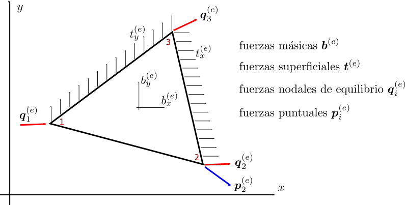

# Elemento finito triangular de 3 nodos

En esta carpeta se encuentra código para analizar el EF finito triangular de tres nodos:

## Función para convertir las fuerzas superficiales en fuerzas nodales equivalentes

Las siguiente función convierte las fuerzas superficiales aplicadas a un elemento finito triangular de 3 nodos a sus correspondientes cargas nodales equivalentes ft:

* MATLAB: [t2ft_T3.m](t2ft_T3.m)
* PYTHON: función `t2ft_T3` dentro de [func_EF_T3.py](func_EF_T3.py)

## Programa para calcular los esfuerzos, deformaciones y desplazamientos de un sólido bidimensional utilizando elementos finitos triangulares de tres nodos

Calcule los campos de esfuerzos, desplazamientos y deformaciones de la viga mostrada:

Asuma:
* densidad del material = 7.8 kg/m³
* módulo de elasticidad = 200GPa
* coeficiente de Poisson = 0.30
* espesor de la viga = 10 cm

Implementaciones:
* MATLAB: [ejemplo_viga_T3.m](ejemplo_viga_T3.m)
* PYTHON: se hicieron dos implementaciones: una con matrices completas [ejemplo_viga_T3.py](ejemplo_viga_T3.py) y otra con matrices ralas [ejemplo_viga_T3_sparse.py](ejemplo_viga_T3_sparse.py) 

Los tiempo de ejecución de ambas versiones son:
* TIEMPO VERSION FULL:   0.0057590007781982 segundos (mejor tiempo de 5 corridas)
* TIEMPO VERSION SPARSE: 0.0761265754699707 segundos (mejor tiempo de 5 corridas)

Es decir, la versión SPARSE es 13 veces más lenta.

De otro lado:
* TAMAÑO MEMORIA "K" VERSION FULL:    749200 bytes
* TAMAÑO MEMORIA "K" VERSION SPARSE:  41140 bytes

Es decir, para este ejemplo, la versión SPARSE usa 18 veces menos memoria que la versión FULL.

En conclusión, solo se justifica utilizar SPARSE si estamos cortos de memoria.
