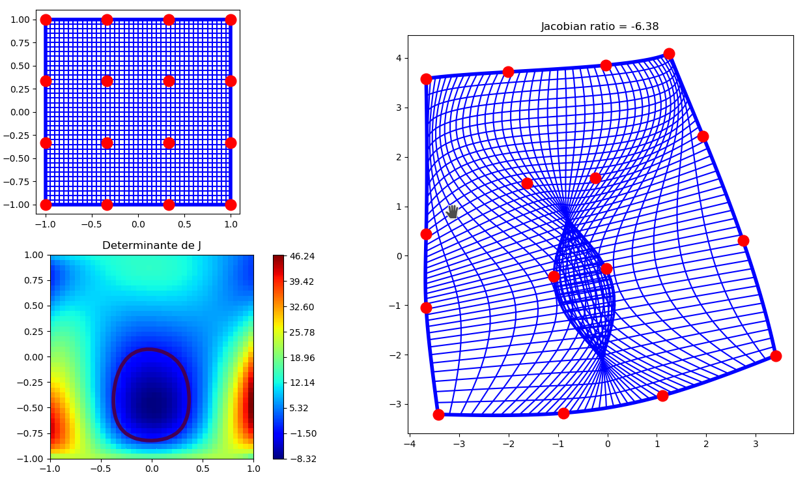

# Efecto del Jacobiano en la transformación isoparamétrica

Este programa explica que es una transformación isoparamétrica y analiza la importancia del determinante de la matriz jacobiana en la transformación isoparamétrica.

* MATLAB: [c5_jacobiano_isoparametrico.m](c5_jacobiano_isoparametrico.m) (FALTA: poner los comentarios)
* PYTHON: [c5_jacobiano_isoparametrico.py](c5_jacobiano_isoparametrico.py)
