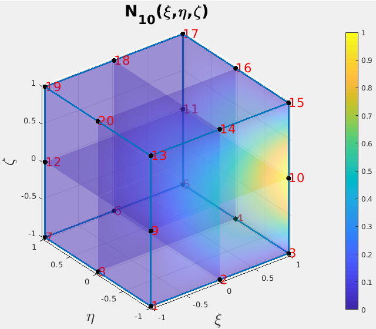

# Programas para el cálculo de las funciones de forma de los elementos finitos tridimensionales

# Funciones de forma de un EF tetraédrico de cuatro nodos
Con el programa 

* MATLAB: [FF_T4.m](FF_T4.m)

se comprueba que las funciones de forma del EF tetraédrico de cuatro nodos están dadas por:
```
N{1} = (a1 + b1*x + c1*y + d1*z)/(6*V);
N{2} = (a2 + b2*x + c2*y + d2*z)/(6*V);
N{3} = (a3 + b3*x + c3*y + d3*z)/(6*V);
N{4} = (a4 + b4*x + c4*y + d4*z)/(6*V);
```

donde:
`V` representa el volumen del tetraédro:
```matlab
V = det([ 1 x1 y1 z1          % Volumen del tetraedro con vértices
          1 x2 y2 z2          % (x1,y1,z1), ..., (x4,y4,z4) 
          1 x3 y3 z3          % suponiendo que (x1,y1,z1), ..., (x3,y3,z3)          
          1 x4 y4 z4 ])/6;    % se numeraron en sentido antihorario cuando 
                              % se mira desde (x4,y4,z4)
```
y `ai`,  `bi`, `ci` y `di` (para i = 1, 2, 3, 4) están dados por:
```matlab
a1 =   det([x2 y2 z2; x3 y3 z3; x4 y4 z4]);
a2 =  -det([x3 y3 z3; x4 y4 z4; x1 y1 z1]);
a3 =   det([x4 y4 z4; x1 y1 z1; x2 y2 z2]);
a4 =  -det([x1 y1 z1; x2 y2 z2; x3 y3 z3]);

b1 = -det([ 1 y2 z2;  1 y3 z3;  1 y4 z4]); % OJO CON LOS SIGNOS
b2 =  det([ 1 y3 z3;  1 y4 z4;  1 y1 z1]); % NO DAN LO MISMO QUE LA 
b3 = -det([ 1 y4 z4;  1 y1 z1;  1 y2 z2]); % LITERATURA
b4 =  det([ 1 y1 z1;  1 y2 z2;  1 y3 z3]);

c1 = -det([x2  1 z2; x3  1 z3; x4  1 z4]);
c2 =  det([x3  1 z3; x4  1 z4; x1  1 z1]);
c3 = -det([x4  1 z4; x1  1 z1; x2  1 z2]);
c4 =  det([x1  1 z1; x2  1 z2; x3  1 z3]);

d1 = -det([x2 y2  1; x3 y3  1; x4 y4  1]);
d2 =  det([x3 y3  1; x4 y4  1; x1 y1  1]);
d3 = -det([x4 y4  1; x1 y1  1; x2 y2  1]);
d4 =  det([x1 y1  1; x2 y2  1; x3 y3  1]);
```

# Funciones de forma de un EF tetraédrico de 10 nodos

Con la ayuda de

* MATLAB: [FF_T10.m](FF_T10.m)

se pueden encontrar las funciones de forma del EF tetraédrico de 10 nodos y sus derivadas:

Funciones de forma del tetraedro de 10 nodos:
```
N{1}  = 2*L1^2 - L1
N{2}  = 4*L1*L2
N{3}  = 2*L2^2 - L2
N{4}  = 4*L2*L3
N{5}  = 2*L3^2 - L3
N{6}  = 4*L1*L3
N{7}  = 4*L2*L4
N{8}  = 4*L3*L4
N{9}  = 4*L1*L4
N{10} = 2*L4^2 - L4
```

y sus derivadas:
```
dN{1}/dL2  = 0
dN{2}/dL2  = 4*L1
dN{3}/dL2  = 4*L2 - 1
dN{4}/dL2  = 4*L3
dN{5}/dL2  = 0
dN{6}/dL2  = 0
dN{7}/dL2  = 4*L4
dN{8}/dL2  = 0
dN{9}/dL2  = 0
dN{10}/dL2 = 0
```

```
dN{1}/dL3  = 0
dN{2}/dL3  = 0
dN{3}/dL3  = 0
dN{4}/dL3  = 4*L2
dN{5}/dL3  = 4*L3 - 1
dN{6}/dL3  = 4*L1
dN{7}/dL3  = 0
dN{8}/dL3  = 4*L4
dN{9}/dL3  = 0
dN{10}/dL3 = 0
```

```
dN{1}/dL4  = 0
dN{2}/dL4  = 0
dN{3}/dL4  = 0
dN{4}/dL4  = 0
dN{5}/dL4  = 0
dN{6}/dL4  = 0
dN{7}/dL4  = 4*L2
dN{8}/dL4  = 4*L3
dN{9}/dL4  = 4*L1
dN{10}/dL4 = 4*L4 - 1
```


# Funciones de forma del EF hexaédrico lagrangiano de 8 nodos


Con la ayuda de:

* MATLAB: [FF_H8.m](FF_H8.m)

se encuentran las funciones de forma del EF hexaédrico lagrangiano de 8 nodos:
```
N{1} = -(eta/2 - 1/2)*(xi/2 - 1/2)*(zeta/2 - 1/2)
N{2} =  (eta/2 - 1/2)*(xi/2 + 1/2)*(zeta/2 - 1/2)
N{3} = -(eta/2 + 1/2)*(xi/2 + 1/2)*(zeta/2 - 1/2)
N{4} =  (eta/2 + 1/2)*(xi/2 - 1/2)*(zeta/2 - 1/2)
N{5} =  (eta/2 - 1/2)*(xi/2 - 1/2)*(zeta/2 + 1/2)
N{6} = -(eta/2 - 1/2)*(xi/2 + 1/2)*(zeta/2 + 1/2)
N{7} =  (eta/2 + 1/2)*(xi/2 + 1/2)*(zeta/2 + 1/2)
N{8} = -(eta/2 + 1/2)*(xi/2 - 1/2)*(zeta/2 + 1/2)
```

sus derivadas con respecto a `xi`:
```
dN1_dxi = -((eta/2 - 1/2)*(zeta/2 - 1/2))/2
dN2_dxi =  ((eta/2 - 1/2)*(zeta/2 - 1/2))/2
dN3_dxi = -((eta/2 + 1/2)*(zeta/2 - 1/2))/2
dN4_dxi =  ((eta/2 + 1/2)*(zeta/2 - 1/2))/2
dN5_dxi =  ((eta/2 - 1/2)*(zeta/2 + 1/2))/2
dN6_dxi = -((eta/2 - 1/2)*(zeta/2 + 1/2))/2
dN7_dxi =  ((eta/2 + 1/2)*(zeta/2 + 1/2))/2
dN8_dxi = -((eta/2 + 1/2)*(zeta/2 + 1/2))/2
```

sus derivadas con respecto a `eta`:
```
dN1_deta = -((xi/2 - 1/2)*(zeta/2 - 1/2))/2
dN2_deta =  ((xi/2 + 1/2)*(zeta/2 - 1/2))/2
dN3_deta = -((xi/2 + 1/2)*(zeta/2 - 1/2))/2
dN4_deta =  ((xi/2 - 1/2)*(zeta/2 - 1/2))/2
dN5_deta =  ((xi/2 - 1/2)*(zeta/2 + 1/2))/2
dN6_deta = -((xi/2 + 1/2)*(zeta/2 + 1/2))/2
dN7_deta =  ((xi/2 + 1/2)*(zeta/2 + 1/2))/2
dN8_deta = -((xi/2 - 1/2)*(zeta/2 + 1/2))/2
```

sus derivadas con respecto a `zeta`:
```
dN1_dzeta = -((eta/2 - 1/2)*(xi/2 - 1/2))/2
dN2_dzeta =  ((eta/2 - 1/2)*(xi/2 + 1/2))/2
dN3_dzeta = -((eta/2 + 1/2)*(xi/2 + 1/2))/2
dN4_dzeta =  ((eta/2 + 1/2)*(xi/2 - 1/2))/2
dN5_dzeta =  ((eta/2 - 1/2)*(xi/2 - 1/2))/2
dN6_dzeta = -((eta/2 - 1/2)*(xi/2 + 1/2))/2
dN7_dzeta =  ((eta/2 + 1/2)*(xi/2 + 1/2))/2
dN8_dzeta = -((eta/2 + 1/2)*(xi/2 - 1/2))/2
```

y su matriz de masa consistente:
```
M = rho*V/27*
[ 8, 0, 0, 4, 0, 0, 2, 0, 0, 4, 0, 0, 4, 0, 0, 2, 0, 0, 1, 0, 0, 2, 0, 0]
[ 0, 8, 0, 0, 4, 0, 0, 2, 0, 0, 4, 0, 0, 4, 0, 0, 2, 0, 0, 1, 0, 0, 2, 0]
[ 0, 0, 8, 0, 0, 4, 0, 0, 2, 0, 0, 4, 0, 0, 4, 0, 0, 2, 0, 0, 1, 0, 0, 2]
[ 4, 0, 0, 8, 0, 0, 4, 0, 0, 2, 0, 0, 2, 0, 0, 4, 0, 0, 2, 0, 0, 1, 0, 0]
[ 0, 4, 0, 0, 8, 0, 0, 4, 0, 0, 2, 0, 0, 2, 0, 0, 4, 0, 0, 2, 0, 0, 1, 0]
[ 0, 0, 4, 0, 0, 8, 0, 0, 4, 0, 0, 2, 0, 0, 2, 0, 0, 4, 0, 0, 2, 0, 0, 1]
[ 2, 0, 0, 4, 0, 0, 8, 0, 0, 4, 0, 0, 1, 0, 0, 2, 0, 0, 4, 0, 0, 2, 0, 0]
[ 0, 2, 0, 0, 4, 0, 0, 8, 0, 0, 4, 0, 0, 1, 0, 0, 2, 0, 0, 4, 0, 0, 2, 0]
[ 0, 0, 2, 0, 0, 4, 0, 0, 8, 0, 0, 4, 0, 0, 1, 0, 0, 2, 0, 0, 4, 0, 0, 2]
[ 4, 0, 0, 2, 0, 0, 4, 0, 0, 8, 0, 0, 2, 0, 0, 1, 0, 0, 2, 0, 0, 4, 0, 0]
[ 0, 4, 0, 0, 2, 0, 0, 4, 0, 0, 8, 0, 0, 2, 0, 0, 1, 0, 0, 2, 0, 0, 4, 0]
[ 0, 0, 4, 0, 0, 2, 0, 0, 4, 0, 0, 8, 0, 0, 2, 0, 0, 1, 0, 0, 2, 0, 0, 4]
[ 4, 0, 0, 2, 0, 0, 1, 0, 0, 2, 0, 0, 8, 0, 0, 4, 0, 0, 2, 0, 0, 4, 0, 0]
[ 0, 4, 0, 0, 2, 0, 0, 1, 0, 0, 2, 0, 0, 8, 0, 0, 4, 0, 0, 2, 0, 0, 4, 0]
[ 0, 0, 4, 0, 0, 2, 0, 0, 1, 0, 0, 2, 0, 0, 8, 0, 0, 4, 0, 0, 2, 0, 0, 4]
[ 2, 0, 0, 4, 0, 0, 2, 0, 0, 1, 0, 0, 4, 0, 0, 8, 0, 0, 4, 0, 0, 2, 0, 0]
[ 0, 2, 0, 0, 4, 0, 0, 2, 0, 0, 1, 0, 0, 4, 0, 0, 8, 0, 0, 4, 0, 0, 2, 0]
[ 0, 0, 2, 0, 0, 4, 0, 0, 2, 0, 0, 1, 0, 0, 4, 0, 0, 8, 0, 0, 4, 0, 0, 2]
[ 1, 0, 0, 2, 0, 0, 4, 0, 0, 2, 0, 0, 2, 0, 0, 4, 0, 0, 8, 0, 0, 4, 0, 0]
[ 0, 1, 0, 0, 2, 0, 0, 4, 0, 0, 2, 0, 0, 2, 0, 0, 4, 0, 0, 8, 0, 0, 4, 0]
[ 0, 0, 1, 0, 0, 2, 0, 0, 4, 0, 0, 2, 0, 0, 2, 0, 0, 4, 0, 0, 8, 0, 0, 4]
[ 2, 0, 0, 1, 0, 0, 2, 0, 0, 4, 0, 0, 4, 0, 0, 2, 0, 0, 4, 0, 0, 8, 0, 0]
[ 0, 2, 0, 0, 1, 0, 0, 2, 0, 0, 4, 0, 0, 4, 0, 0, 2, 0, 0, 4, 0, 0, 8, 0]
[ 0, 0, 2, 0, 0, 1, 0, 0, 2, 0, 0, 4, 0, 0, 4, 0, 0, 2, 0, 0, 4, 0, 0, 8]
```
siendo `V` el volumen del hexaedro.

El gráfico de la función de forma N8 es:


# Funciones de forma del EF hexaédrico serendípito de 20 nodos


Con la ayuda de:

* MATLAB: [FF_H20.m](FF_H20.m)

se encuentran las funciones de forma del EF hexaédrico lagrangiano de 8 nodos:
```
N1  =  ((eta - 1)*(xi - 1)*(zeta - 1)*(eta + xi + zeta + 2))/8
N2  = -((xi^2 - 1)*(eta - 1)*(zeta - 1))/4
N3  = -((eta - 1)*(xi + 1)*(zeta - 1)*(eta - xi + zeta + 2))/8
N4  =  ((eta^2 - 1)*(xi + 1)*(zeta - 1))/4
N5  = -((eta + 1)*(xi + 1)*(zeta - 1)*(eta + xi - zeta - 2))/8
N6  =  ((xi^2 - 1)*(eta + 1)*(zeta - 1))/4
N7  = -((eta + 1)*(xi - 1)*(zeta - 1)*(xi - eta + zeta + 2))/8
N8  = -((eta^2 - 1)*(xi - 1)*(zeta - 1))/4
N9  = -((zeta^2 - 1)*(eta - 1)*(xi - 1))/4
N10 =  ((zeta^2 - 1)*(eta - 1)*(xi + 1))/4
N11 = -((zeta^2 - 1)*(eta + 1)*(xi + 1))/4
N12 =  ((zeta^2 - 1)*(eta + 1)*(xi - 1))/4
N13 = -((eta - 1)*(xi - 1)*(zeta + 1)*(eta + xi - zeta + 2))/8
N14 =  ((xi^2 - 1)*(eta - 1)*(zeta + 1))/4
N15 =  ((eta - 1)*(xi + 1)*(zeta + 1)*(eta - xi - zeta + 2))/8
N16 = -((eta^2 - 1)*(xi + 1)*(zeta + 1))/4
N17 =  ((eta + 1)*(xi + 1)*(zeta + 1)*(eta + xi + zeta - 2))/8
N18 = -((xi^2 - 1)*(eta + 1)*(zeta + 1))/4
N19 = -((eta + 1)*(xi - 1)*(zeta + 1)*(eta - xi + zeta - 2))/8
N20 =  ((eta^2 - 1)*(xi - 1)*(zeta + 1))/4
```

sus derivadas con respecto a `xi`:
```
dN1_dxi  =  ((eta - 1)*(zeta - 1)*(eta + 2*xi + zeta + 1))/8
dN2_dxi  = -(xi*(eta - 1)*(zeta - 1))/2
dN3_dxi  = -((eta - 1)*(zeta - 1)*(eta - 2*xi + zeta + 1))/8
dN4_dxi  =  ((eta^2 - 1)*(zeta - 1))/4
dN5_dxi  = -((eta + 1)*(zeta - 1)*(eta + 2*xi - zeta - 1))/8
dN6_dxi  =  (xi*(eta + 1)*(zeta - 1))/2
dN7_dxi  = -((eta + 1)*(zeta - 1)*(2*xi - eta + zeta + 1))/8
dN8_dxi  = -((eta^2 - 1)*(zeta - 1))/4
dN9_dxi  = -((zeta^2 - 1)*(eta - 1))/4
dN10_dxi =  ((zeta^2 - 1)*(eta - 1))/4
dN11_dxi = -((zeta^2 - 1)*(eta + 1))/4
dN12_dxi =  ((zeta^2 - 1)*(eta + 1))/4
dN13_dxi = -((eta - 1)*(zeta + 1)*(eta + 2*xi - zeta + 1))/8
dN14_dxi =  (xi*(eta - 1)*(zeta + 1))/2
dN15_dxi =  ((eta - 1)*(zeta + 1)*(eta - 2*xi - zeta + 1))/8
dN16_dxi = -((eta^2 - 1)*(zeta + 1))/4
dN17_dxi =  ((eta + 1)*(zeta + 1)*(eta + 2*xi + zeta - 1))/8
dN18_dxi = -(xi*(eta + 1)*(zeta + 1))/2
dN19_dxi = -((eta + 1)*(zeta + 1)*(eta - 2*xi + zeta - 1))/8
dN20_dxi =  ((eta^2 - 1)*(zeta + 1))/4
```

sus derivadas con respecto a `eta`:
```
dN1_deta  =  ((xi - 1)*(zeta - 1)*(2*eta + xi + zeta + 1))/8
dN2_deta  = -((xi^2 - 1)*(zeta - 1))/4
dN3_deta  = -((xi + 1)*(zeta - 1)*(2*eta - xi + zeta + 1))/8
dN4_deta  =  (eta*(xi + 1)*(zeta - 1))/2
dN5_deta  = -((xi + 1)*(zeta - 1)*(2*eta + xi - zeta - 1))/8
dN6_deta  =  ((xi^2 - 1)*(zeta - 1))/4
dN7_deta  = -((xi - 1)*(zeta - 1)*(xi - 2*eta + zeta + 1))/8
dN8_deta  = -(eta*(xi - 1)*(zeta - 1))/2
dN9_deta  = -((zeta^2 - 1)*(xi - 1))/4
dN10_deta =  ((zeta^2 - 1)*(xi + 1))/4
dN11_deta = -((zeta^2 - 1)*(xi + 1))/4
dN12_deta =  ((zeta^2 - 1)*(xi - 1))/4
dN13_deta = -((xi - 1)*(zeta + 1)*(2*eta + xi - zeta + 1))/8
dN14_deta =  ((xi^2 - 1)*(zeta + 1))/4
dN15_deta =  ((xi + 1)*(zeta + 1)*(2*eta - xi - zeta + 1))/8
dN16_deta = -(eta*(xi + 1)*(zeta + 1))/2
dN17_deta =  ((xi + 1)*(zeta + 1)*(2*eta + xi + zeta - 1))/8
dN18_deta = -((xi^2 - 1)*(zeta + 1))/4
dN19_deta = -((xi - 1)*(zeta + 1)*(2*eta - xi + zeta - 1))/8
dN20_deta =  (eta*(xi - 1)*(zeta + 1))/2
```

y sus derivadas con respecto a `zeta`:
```
dN1_dzeta  =  ((eta - 1)*(xi - 1)*(eta + xi + 2*zeta + 1))/8
dN2_dzeta  = -((xi^2 - 1)*(eta - 1))/4
dN3_dzeta  = -((eta - 1)*(xi + 1)*(eta - xi + 2*zeta + 1))/8
dN4_dzeta  =  ((eta^2 - 1)*(xi + 1))/4
dN5_dzeta  = -((eta + 1)*(xi + 1)*(eta + xi - 2*zeta - 1))/8
dN6_dzeta  =  ((xi^2 - 1)*(eta + 1))/4
dN7_dzeta  = -((eta + 1)*(xi - 1)*(xi - eta + 2*zeta + 1))/8
dN8_dzeta  = -((eta^2 - 1)*(xi - 1))/4
dN9_dzeta  = -(zeta*(eta - 1)*(xi - 1))/2
dN10_dzeta =  (zeta*(eta - 1)*(xi + 1))/2
dN11_dzeta = -(zeta*(eta + 1)*(xi + 1))/2
dN12_dzeta =  (zeta*(eta + 1)*(xi - 1))/2
dN13_dzeta = -((eta - 1)*(xi - 1)*(eta + xi - 2*zeta + 1))/8
dN14_dzeta =  ((xi^2 - 1)*(eta - 1))/4
dN15_dzeta =  ((eta - 1)*(xi + 1)*(eta - xi - 2*zeta + 1))/8
dN16_dzeta = -((eta^2 - 1)*(xi + 1))/4
dN17_dzeta =  ((eta + 1)*(xi + 1)*(eta + xi + 2*zeta - 1))/8
dN18_dzeta = -((xi^2 - 1)*(eta + 1))/4
dN19_dzeta = -((eta + 1)*(xi - 1)*(eta - xi + 2*zeta - 1))/8
dN20_dzeta =  ((eta^2 - 1)*(xi - 1))/4
```

El gráfico de la función de forma N10 es:


