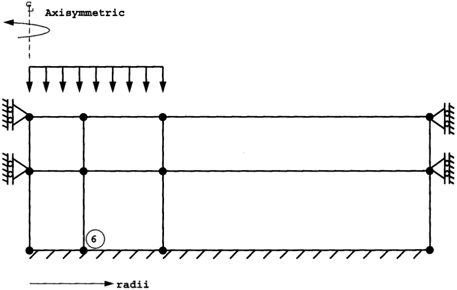

# Programa para calcular los esfuerzos, deformaciones y desplazamientos en el caso axisimétrico utilizando elementos finitos isoparamétricos rectangulares de ocho nodos

Se analiza en particular el problema de esfuerzos en la masa del suelo. Las condiciones de frontera utilizadas se ilustran a continuación:

La malla de EFs utilizada se calculó utilizando el programa [GMSH](http://gmsh.info/). Ver carpeta: [malla/](malla/).

Esfuerzos sigma_z:

Deformación de la masa del suelo:

