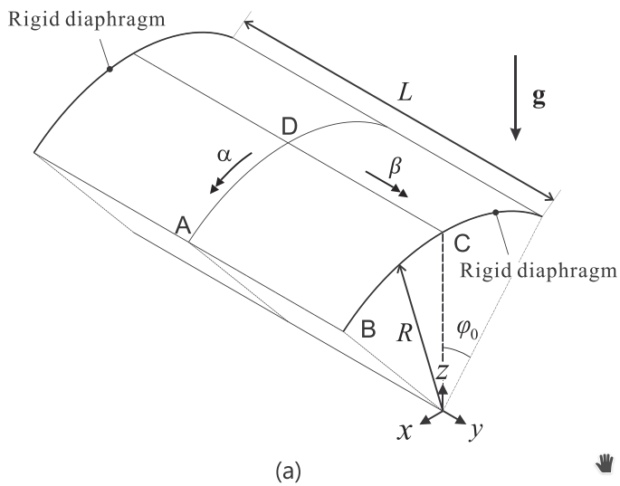
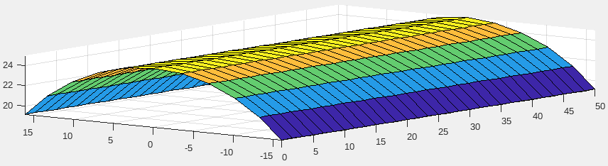
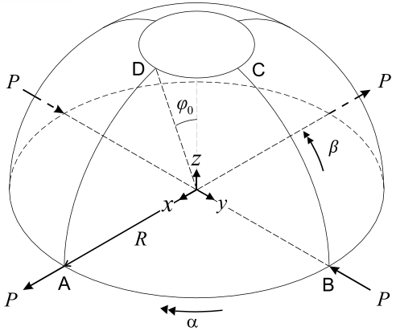
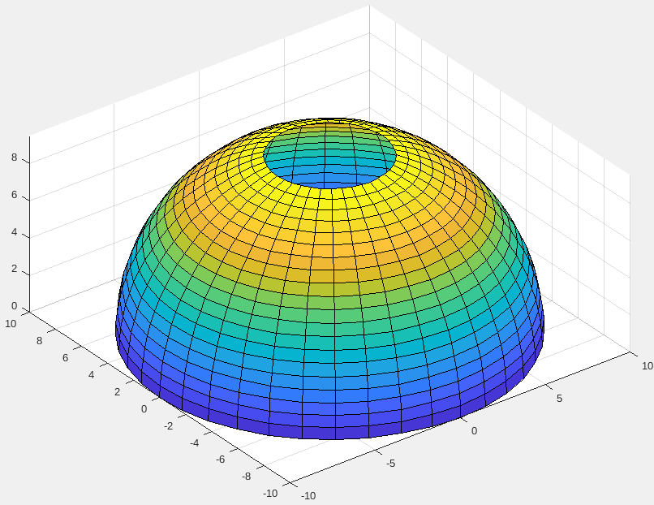

# Generación de mallas asociadas a varios ejemplos en los que se verifica el desempeño del EF de cascarón

A continuación se listan unos programas que generan mallas de EFs asociadas a unos ejemplos clásicos de la bibliografía del análisis de cáscaras por el MEF. 

## Bóveda cilíndrica de Scordelis-Lo

Las dimensiones de esta bódeda son L=50m, radio de curvatura R=25m, ángulo \theta=80 grados y espesor t = 0.25. 

La bóveda se somete a una carga vertical uniforme en dirección Z de valor q = 90. Las constantes del material se asumen E = 4.32e8 y nu = 0. La bóveda está simplemente apoyada en sus dos extremos sobre dos paredes rígidas, que impiden las deformaciones en las direcciones Y y Z, pero dejan libre el movimiento X y los giros.

Por simetría solo es necesario mallar un cuarto del cascarón. Sin embargo, el código aquí mostrado malla todo el cascarón.

El archivo [malla_scordelis_lo_Q4.m](malla_scordelis_lo_Q4.m) genera dicha bóveda para los EFs Q4:

## Domo semiesférico

El archivo [malla_domo_semiesferico_Q4.m](malla_domo_semiesferico_Q4.m) genera dicha bóveda para los EFs Q4:

