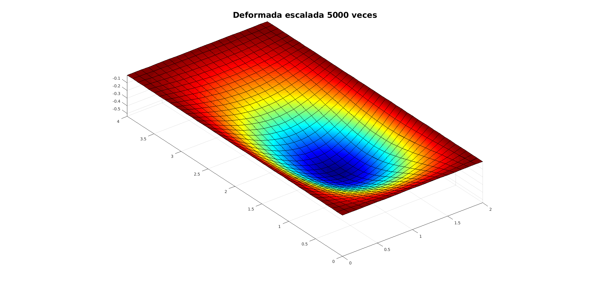
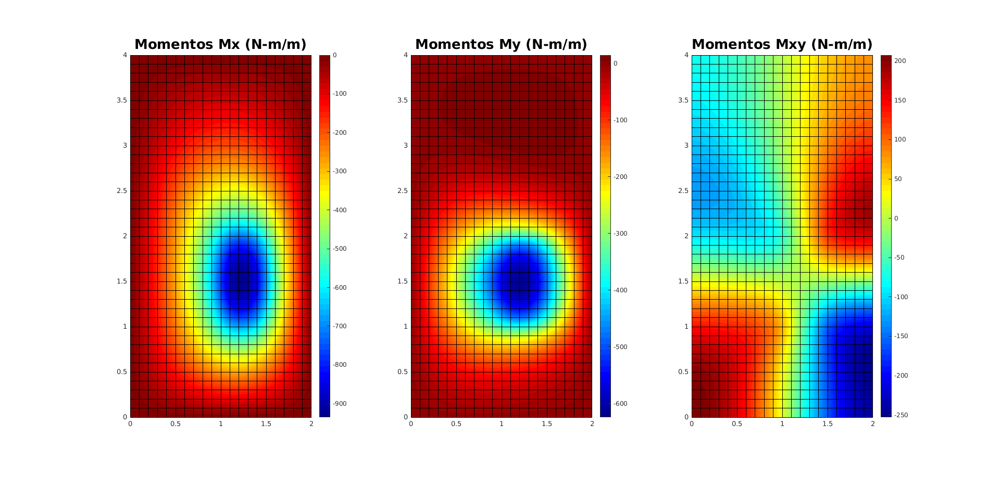
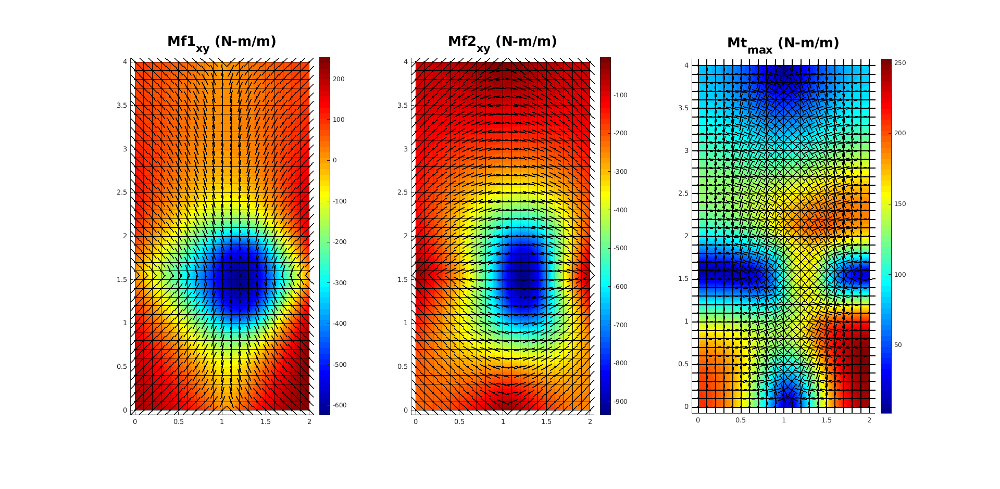
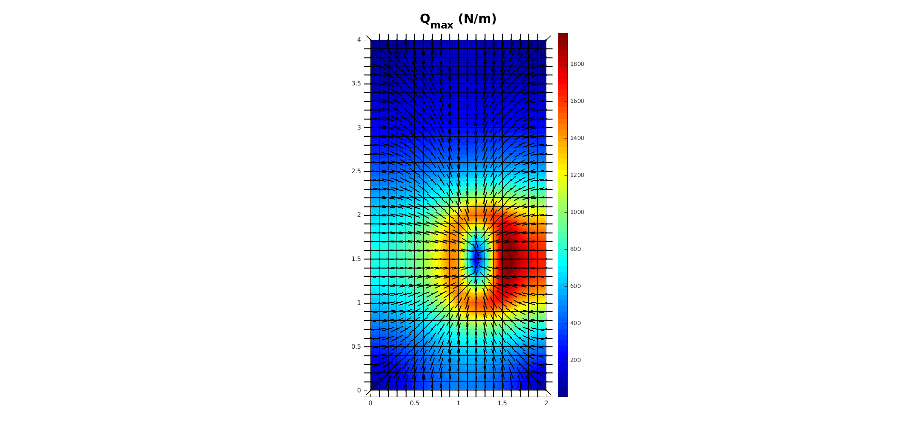

# Cálculo de una losa simplemente apoyada en sus cuatro bordes

Considere la losa mostrada en la figura

dicha losa tiene una dimensión de 2m x 4m, está hecha con un material de E =  GPa y ν = 0.30 y soporta una carga q = ***.

La losa se calculó con elementos finitos MZC obteniendo los siguientes diagramas:

## Deformación vertical w

## Momentos flectores Mx y My y torsores Mxy

## Momentos flectores máximos y mínimos y momentos torsores máximos con sus respectivas inclinaciones

## Fuerzas cortantes Qx y Qy

## Fuerzas cortantes máximas Qmax con su respectivas inclinaciones

Código elaborado por:
* Diego Andrés Alvarez Marín 
* Sebastián Jaramillo MorenoElaborado por:
