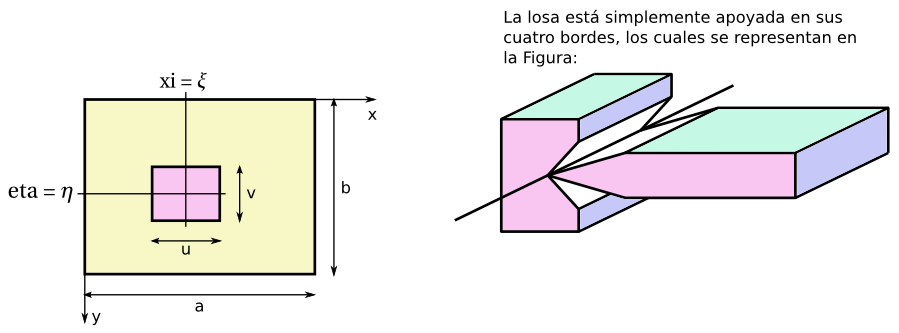
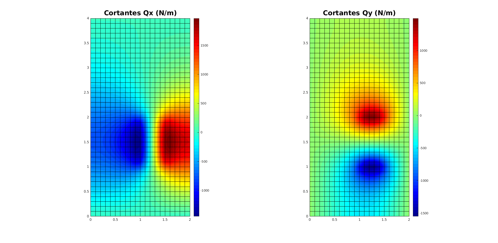
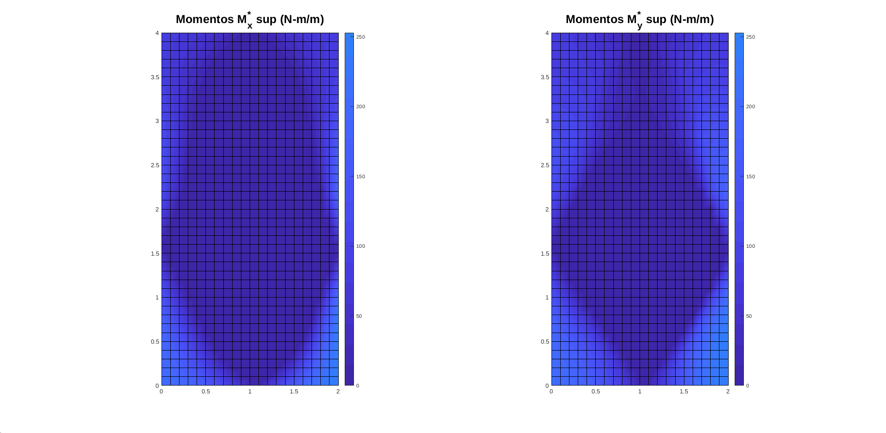
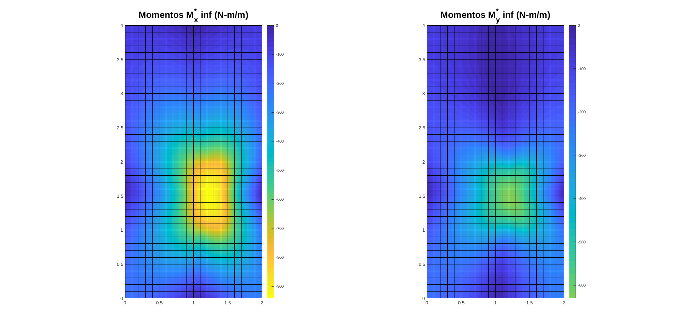

# Cálculo de una losa simplemente apoyada en sus cuatro bordes utilizando el EF de losa MZC

Considere la losa mostrada en la figura

dicha losa tiene:
* dimensión: a = 2m, b = 4m, espesor t = 5 cm.
* material: E = 210 GPa y ν = 0.30.
* soporta una carga p = 10 kN/m^2, con u = 0.5m, v = 1m, ξ = 1.25m, η = 1.5 m.

La losa se calculó con elementos finitos MZC en el archivo [EF_MZC.m](EF_MZC.m) obteniendo los siguientes diagramas:

### Deformación vertical w

### Momentos flectores Mx y My y torsores Mxy

### Momentos flectores máximos y mínimos y momentos torsores máximos con sus respectivas inclinaciones

Recuerde que M1f y Mf2 nos dicen la forma de colocar el refuerzo óptimo en la parte superior e inferior de la losa, respectivamente.

### Fuerzas cortantes Qx y Qy

### Fuerzas cortantes máximas Qmax con su respectivas inclinaciones

### Momentos de diseño de Wood y Armer en la parte superior e inferior

### Comparación contra la solución teórica

El desplazamiento vertical de la losa se comparó contra su solución teórica, la cual se encuentra en Eduard Ventsel and Theodor Krauthammer (2001) - Thin plates and shells: theory, analysis and applications. Marcel Dekker : New York. Páginas 53 y 54.

La deformación teórica en la placa esta dada por:
<!---
Compile en: https://tex.s2cms.com

\begin{equation}
  w(x,y) = \frac{1}{\pi^4 D}\sum_{m=1}^\infty \sum_{n=1}^\infty
  \frac{p_{mn}}{\left(\frac{m^2}{a^2} + \frac{n^2}{b^2}\right)^2}
  \sin\left(\frac{m \pi x}{a}\right)
  \sin\left(\frac{n \pi y}{b}\right)
\end{equation}
donde
\begin{equation}
  p_{mn} = \frac{16 p}{\pi^2 m n}
  \sin\left(\frac{m \pi \xi}{a}\right)
  \sin\left(\frac{n \pi \eta}{b}\right)
  \sin\left(\frac{m \pi u}{2a}\right)
  \sin\left(\frac{n \pi v}{2b}\right)
\end{equation}
--->

%20%3D%20%5Cfrac%7B1%7D%7B%5Cpi%5E4%20D%7D%5Csum_%7Bm%3D1%7D%5E%5Cinfty%20%5Csum_%7Bn%3D1%7D%5E%5Cinfty%0A%20%20%5Cfrac%7Bp_%7Bmn%7D%7D%7B%5Cleft(%5Cfrac%7Bm%5E2%7D%7Ba%5E2%7D%20%2B%20%5Cfrac%7Bn%5E2%7D%7Bb%5E2%7D%5Cright)%5E2%7D%0A%20%20%5Csin%5Cleft(%5Cfrac%7Bm%20%5Cpi%20x%7D%7Ba%7D%5Cright)%0A%20%20%5Csin%5Cleft(%5Cfrac%7Bn%20%5Cpi%20y%7D%7Bb%7D%5Cright))

donde

%0A%20%20%5Csin%5Cleft(%5Cfrac%7Bn%20%5Cpi%20%5Ceta%7D%7Bb%7D%5Cright)%0A%20%20%5Csin%5Cleft(%5Cfrac%7Bm%20%5Cpi%20u%7D%7B2a%7D%5Cright)%0A%20%20%5Csin%5Cleft(%5Cfrac%7Bn%20%5Cpi%20v%7D%7B2b%7D%5Cright))

obteniendo un error absoluto relativo máximo del 0.27815%. Las fórmulas anteriores se encuentran implementadas en el archivo [calc_w.m](calc_w.m).

Código elaborado por:
* Diego Andrés Alvarez Marín 
* Sebastián Jaramillo Moreno
