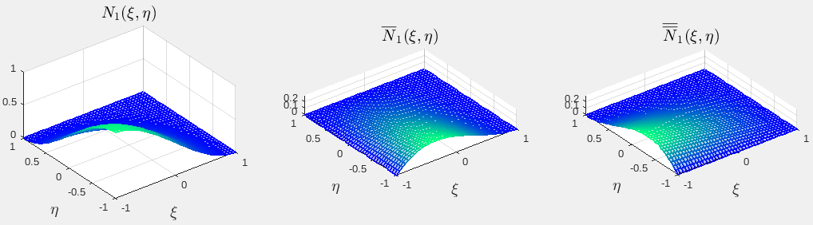
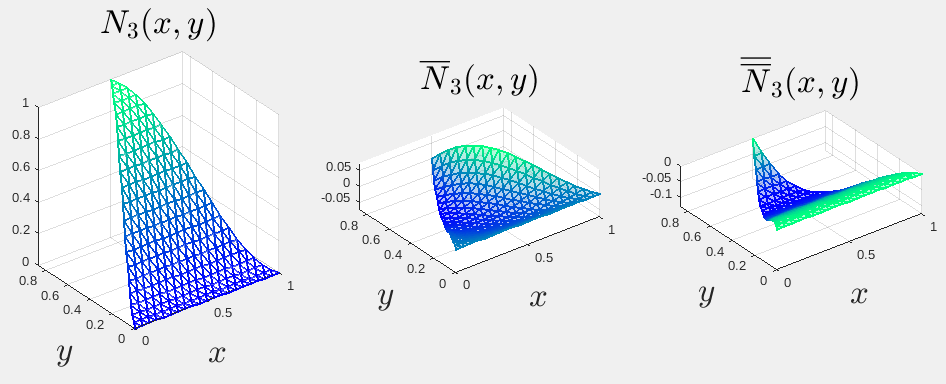

# Placas delgadas: Teoría de Kirchhoff-Love

## Programa para obtener las funciones de forma del elemento finito de losa MZC

Con el programa [func_forma_MZC.m](func_forma_MZC.m) se obtuvieron, por ejemplo, las siguientes funciones de forma:
```
                                  2           2
           (eta - 1) (xi + 1) (eta  + eta + xi  - xi - 2)
N{2}   =   ----------------------------------------------
                                  8


             (eta - 1) (xi - 1) (xi + 1)
Nb{2}  =   - ----------------------------
                          8        

                   2
          (eta - 1)  (eta + 1) (xi + 1)
Nbb{2} =  -----------------------------
                        8
```

Siendo los gráficos de estas funciones:


Con el mismo programa se obtiene la matriz de rigidez del elemento (una matriz de 12x12) que se muestra a continuación
<!---
La imagen la creé con Text Tex en LibreOffice Impress y la mejoré con Inkscape

\boldsymbol{K}^{(e)} = \frac{D}{ab}
\left(\begin{smallmatrix}
\frac{b^2}{a^2} - \frac{\nu}{5} + \frac{a^2}{b^2} + \frac{7}{10} & \frac{2 \nu}{5} + \frac{b^2}{a^2} + \frac{1}{10} & \frac{2 \nu}{5} + \frac{a^2}{b^2} + \frac{1}{10} & \frac{\nu}{5} - \frac{b^2}{a^2} + \frac{a^2}{2 b^2} - \frac{7}{10} & \frac{b^2}{a^2} - \frac{\nu}{10} + \frac{1}{10} & \frac{a^2}{2 b^2} - \frac{2 \nu}{5} - \frac{1}{10} & \frac{7}{10} - \frac{b^2}{2 a^2} - \frac{a^2}{2 b^2} - \frac{\nu}{5} & \frac{\nu}{10} + \frac{b^2}{2 a^2} - \frac{1}{10} & \frac{\nu}{10} + \frac{a^2}{2 b^2} - \frac{1}{10} & \frac{\nu}{5} + \frac{b^2}{2 a^2} - \frac{a^2}{b^2} - \frac{7}{10} & \frac{b^2}{2 a^2} - \frac{2 \nu}{5} - \frac{1}{10} & \frac{a^2}{b^2} - \frac{\nu}{10} + \frac{1}{10}\\
\frac{2 \nu}{5} + \frac{b^2}{a^2} + \frac{1}{10} & \frac{4 b^2}{3 a^2} - \frac{4 \nu}{15} + \frac{4}{15} & \nu & \frac{\nu}{10} - \frac{b^2}{a^2} - \frac{1}{10} & \frac{\nu}{15} + \frac{2 b^2}{3 a^2} - \frac{1}{15} & 0 & \frac{1}{10} - \frac{b^2}{2 a^2} - \frac{\nu}{10} & \frac{b^2}{3 a^2} - \frac{\nu}{15} + \frac{1}{15} & 0 & \frac{b^2}{2 a^2} - \frac{2 \nu}{5} - \frac{1}{10} & \frac{4 \nu}{15} + \frac{2 b^2}{3 a^2} - \frac{4}{15} & 0\\
\frac{2 \nu}{5} + \frac{a^2}{b^2} + \frac{1}{10} & \nu & \frac{4 a^2}{3 b^2} - \frac{4 \nu}{15} + \frac{4}{15} & \frac{a^2}{2 b^2} - \frac{2 \nu}{5} - \frac{1}{10} & 0 & \frac{4 \nu}{15} + \frac{2 a^2}{3 b^2} - \frac{4}{15} & \frac{1}{10} - \frac{a^2}{2 b^2} - \frac{\nu}{10} & 0 & \frac{a^2}{3 b^2} - \frac{\nu}{15} + \frac{1}{15} & \frac{\nu}{10} - \frac{a^2}{b^2} - \frac{1}{10} & 0 & \frac{\nu}{15} + \frac{2 a^2}{3 b^2} - \frac{1}{15}\\
\frac{\nu}{5} - \frac{b^2}{a^2} + \frac{a^2}{2 b^2} - \frac{7}{10} & \frac{\nu}{10} - \frac{b^2}{a^2} - \frac{1}{10} & \frac{a^2}{2 b^2} - \frac{2 \nu}{5} - \frac{1}{10} & \frac{b^2}{a^2} - \frac{\nu}{5} + \frac{a^2}{b^2} + \frac{7}{10} &  - \frac{2 \nu}{5} - \frac{b^2}{a^2} - \frac{1}{10} & \frac{2 \nu}{5} + \frac{a^2}{b^2} + \frac{1}{10} & \frac{\nu}{5} + \frac{b^2}{2 a^2} - \frac{a^2}{b^2} - \frac{7}{10} & \frac{2 \nu}{5} - \frac{b^2}{2 a^2} + \frac{1}{10} & \frac{a^2}{b^2} - \frac{\nu}{10} + \frac{1}{10} & \frac{7}{10} - \frac{b^2}{2 a^2} - \frac{a^2}{2 b^2} - \frac{\nu}{5} & \frac{1}{10} - \frac{b^2}{2 a^2} - \frac{\nu}{10} & \frac{\nu}{10} + \frac{a^2}{2 b^2} - \frac{1}{10}\\
\frac{b^2}{a^2} - \frac{\nu}{10} + \frac{1}{10} & \frac{\nu}{15} + \frac{2 b^2}{3 a^2} - \frac{1}{15} & 0 &  - \frac{2 \nu}{5} - \frac{b^2}{a^2} - \frac{1}{10} & \frac{4 b^2}{3 a^2} - \frac{4 \nu}{15} + \frac{4}{15} & - \nu & \frac{2 \nu}{5} - \frac{b^2}{2 a^2} + \frac{1}{10} & \frac{4 \nu}{15} + \frac{2 b^2}{3 a^2} - \frac{4}{15} & 0 & \frac{\nu}{10} + \frac{b^2}{2 a^2} - \frac{1}{10} & \frac{b^2}{3 a^2} - \frac{\nu}{15} + \frac{1}{15} & 0\\
\frac{a^2}{2 b^2} - \frac{2 \nu}{5} - \frac{1}{10} & 0 & \frac{4 \nu}{15} + \frac{2 a^2}{3 b^2} - \frac{4}{15} & \frac{2 \nu}{5} + \frac{a^2}{b^2} + \frac{1}{10} & - \nu & \frac{4 a^2}{3 b^2} - \frac{4 \nu}{15} + \frac{4}{15} & \frac{\nu}{10} - \frac{a^2}{b^2} - \frac{1}{10} & 0 & \frac{\nu}{15} + \frac{2 a^2}{3 b^2} - \frac{1}{15} & \frac{1}{10} - \frac{a^2}{2 b^2} - \frac{\nu}{10} & 0 & \frac{a^2}{3 b^2} - \frac{\nu}{15} + \frac{1}{15}\\

\frac{7}{10} - \frac{b^2}{2 a^2} - \frac{a^2}{2 b^2} - \frac{\nu}{5} & \frac{1}{10} - \frac{b^2}{2 a^2} - \frac{\nu}{10} & \frac{1}{10} - \frac{a^2}{2 b^2} - \frac{\nu}{10} & \frac{\nu}{5} + \frac{b^2}{2 a^2} - \frac{a^2}{b^2} - \frac{7}{10} & \frac{2 \nu}{5} - \frac{b^2}{2 a^2} + \frac{1}{10} & \frac{\nu}{10} - \frac{a^2}{b^2} - \frac{1}{10} & \frac{b^2}{a^2} - \frac{\nu}{5} + \frac{a^2}{b^2} + \frac{7}{10} &  - \frac{2 \nu}{5} - \frac{b^2}{a^2} - \frac{1}{10} &  - \frac{2 \nu}{5} - \frac{a^2}{b^2} - \frac{1}{10} & \frac{\nu}{5} - \frac{b^2}{a^2} + \frac{a^2}{2 b^2} - \frac{7}{10} & \frac{\nu}{10} - \frac{b^2}{a^2} - \frac{1}{10} & \frac{2 \nu}{5} - \frac{a^2}{2 b^2} + \frac{1}{10}\\
\frac{\nu}{10} + \frac{b^2}{2 a^2} - \frac{1}{10} & \frac{b^2}{3 a^2} - \frac{\nu}{15} + \frac{1}{15} & 0 & \frac{2 \nu}{5} - \frac{b^2}{2 a^2} + \frac{1}{10} & \frac{4 \nu}{15} + \frac{2 b^2}{3 a^2} - \frac{4}{15} & 0 &  - \frac{2 \nu}{5} - \frac{b^2}{a^2} - \frac{1}{10} & \frac{4 b^2}{3 a^2} - \frac{4 \nu}{15} + \frac{4}{15} & \nu & \frac{b^2}{a^2} - \frac{\nu}{10} + \frac{1}{10} & \frac{\nu}{15} + \frac{2 b^2}{3 a^2} - \frac{1}{15} & 0\\
 \frac{\nu}{10} + \frac{a^2}{2 b^2} - \frac{1}{10} & 0 & \frac{a^2}{3 b^2} - \frac{\nu}{15} + \frac{1}{15} & \frac{a^2}{b^2} - \frac{\nu}{10} + \frac{1}{10} & 0 & \frac{\nu}{15} + \frac{2 a^2}{3 b^2} - \frac{1}{15} &  - \frac{2 \nu}{5} - \frac{a^2}{b^2} - \frac{1}{10} & \nu & \frac{4 a^2}{3 b^2} - \frac{4 \nu}{15} + \frac{4}{15} & \frac{2 \nu}{5} - \frac{a^2}{2 b^2} + \frac{1}{10} & 0 & \frac{4 \nu}{15} + \frac{2 a^2}{3 b^2} - \frac{4}{15}\\
 \frac{\nu}{5} + \frac{b^2}{2 a^2} - \frac{a^2}{b^2} - \frac{7}{10} & \frac{b^2}{2 a^2} - \frac{2 \nu}{5} - \frac{1}{10} & \frac{\nu}{10} - \frac{a^2}{b^2} - \frac{1}{10} & \frac{7}{10} - \frac{b^2}{2 a^2} - \frac{a^2}{2 b^2} - \frac{\nu}{5} & \frac{\nu}{10} + \frac{b^2}{2 a^2} - \frac{1}{10} & \frac{1}{10} - \frac{a^2}{2 b^2} - \frac{\nu}{10} & \frac{\nu}{5} - \frac{b^2}{a^2} + \frac{a^2}{2 b^2} - \frac{7}{10} & \frac{b^2}{a^2} - \frac{\nu}{10} + \frac{1}{10} & \frac{2 \nu}{5} - \frac{a^2}{2 b^2} + \frac{1}{10} & \frac{b^2}{a^2} - \frac{\nu}{5} + \frac{a^2}{b^2} + \frac{7}{10} & \frac{2 \nu}{5} + \frac{b^2}{a^2} + \frac{1}{10} &  - \frac{2 \nu}{5} - \frac{a^2}{b^2} - \frac{1}{10}\\
 \frac{b^2}{2 a^2} - \frac{2 \nu}{5} - \frac{1}{10} & \frac{4 \nu}{15} + \frac{2 b^2}{3 a^2} - \frac{4}{15} & 0 & \frac{1}{10} - \frac{b^2}{2 a^2} - \frac{\nu}{10} & \frac{b^2}{3 a^2} - \frac{\nu}{15} + \frac{1}{15} & 0 & \frac{\nu}{10} - \frac{b^2}{a^2} - \frac{1}{10} & \frac{\nu}{15} + \frac{2 b^2}{3 a^2} - \frac{1}{15} & 0 & \frac{2 \nu}{5} + \frac{b^2}{a^2} + \frac{1}{10} & \frac{4 b^2}{3 a^2} - \frac{4 \nu}{15} + \frac{4}{15} & - \nu\\
 \frac{a^2}{b^2} - \frac{\nu}{10} + \frac{1}{10} & 0 & \frac{\nu}{15} + \frac{2 a^2}{3 b^2} - \frac{1}{15} & \frac{\nu}{10} + \frac{a^2}{2 b^2} - \frac{1}{10} & 0 & \frac{a^2}{3 b^2} - \frac{\nu}{15} + \frac{1}{15} & \frac{2 \nu}{5} - \frac{a^2}{2 b^2} + \frac{1}{10} & 0 & \frac{4 \nu}{15} + \frac{2 a^2}{3 b^2} - \frac{4}{15} &  - \frac{2 \nu}{5} - \frac{a^2}{b^2} - \frac{1}{10} & - \nu & \frac{4 a^2}{3 b^2} - \frac{4 \nu}{15} + \frac{4}{15}
\end{smallmatrix}\right)b
--->

donde
```
D = \frac{E t^3}{12(1-\nu)}
```

## Calculo de las funciones de forma y matriz L del elemento de Tocher
El programa [func_forma_Tocher.m](func_forma_Tocher.m) deduce y grafica las mencionadas funciones de forma. Por ejemplo, las funciones de forma del nodo 3 son:


