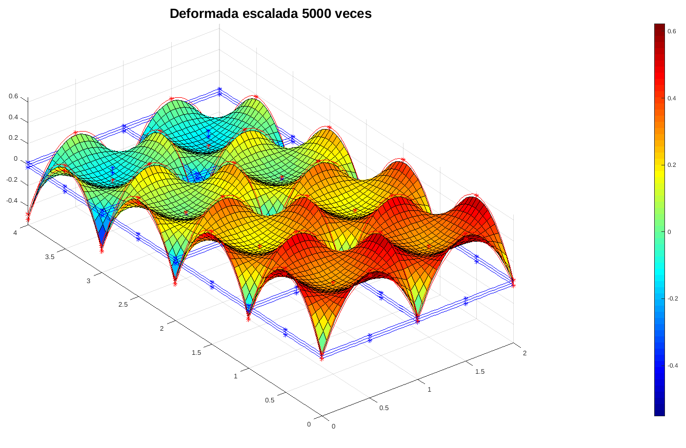
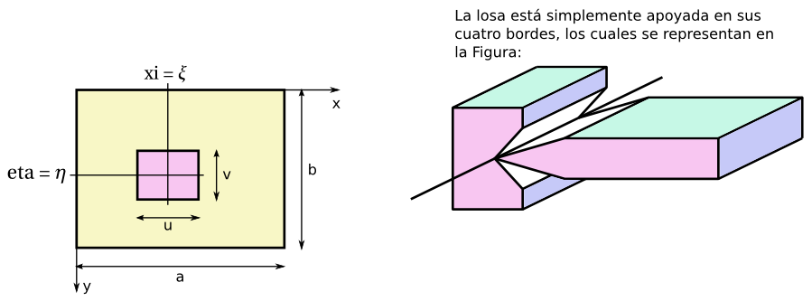
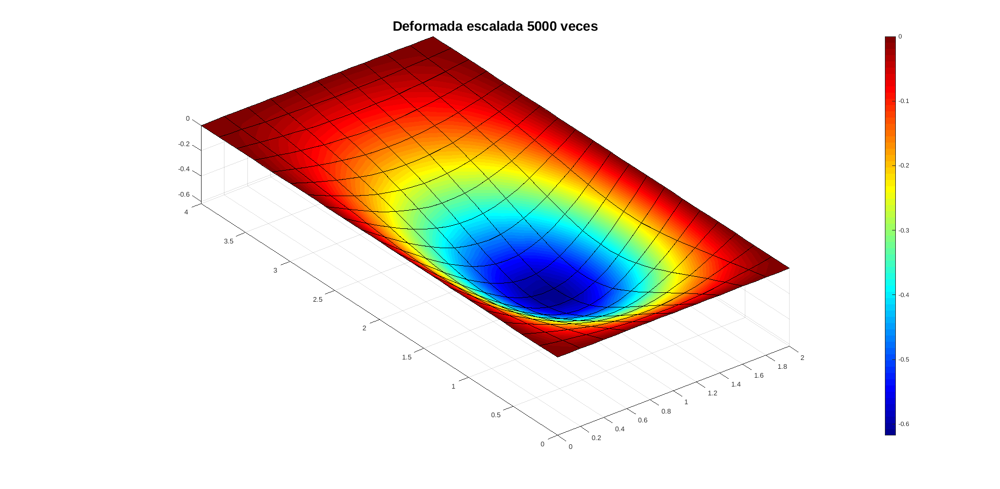
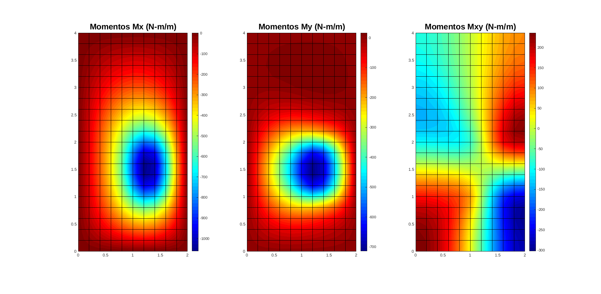
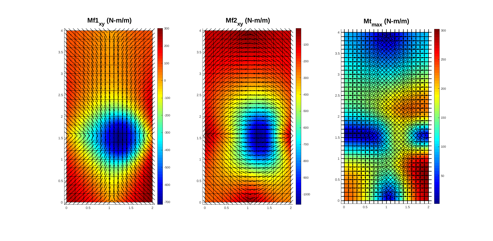
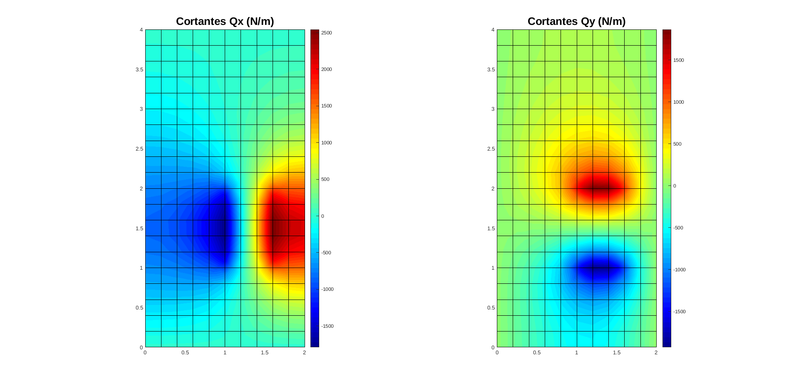
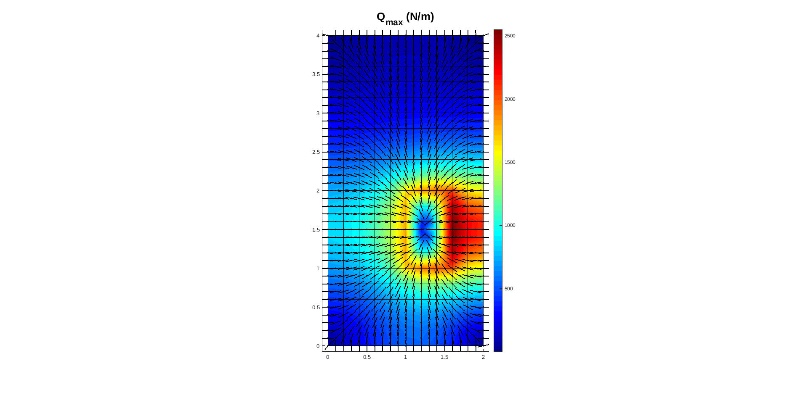

# Teoría de losas Mindlin. Elemento finito QL9

## Modos de energía nula del EF QL9 con integración selectiva

El programa [modos_energia_nula_QL9.m](modos_energia_nula_QL9.m) muestra el modo de energía nula que aparece cuando se utiliza integración selectiva con el EF QL9

## Cálculo de una losa simplemente apoyada en sus cuatro bordes utilizando el EF de losa QL9 

Considere la losa mostrada en la figura

dicha losa tiene:
* dimensión: a = 2m, b = 4m, espesor t = 5 cm.
* material: E = 210 GPa y ν = 0.30.
* soporta una carga p = 10 kN/m^2, con u = 0.5m, v = 1m, ξ = 1.25m, η = 1.5 m.

La losa se calculó con elementos finitos QL9 en el archivo [ejemplo_losa_QL9.m](ejemplo_losa_QL9.m) obteniendo los siguientes diagramas:

### Deformación vertical w

### Momentos flectores Mx y My y torsores Mxy

### Momentos flectores máximos y mínimos y momentos torsores máximos con sus respectivas inclinaciones

Recuerde que M1f y Mf2 nos dicen la forma de colocar el refuerzo óptimo en la parte superior e inferior de la losa, respectivamente.

### Fuerzas cortantes Qx y Qy

### Fuerzas cortantes máximas Qmax con su respectivas inclinaciones

