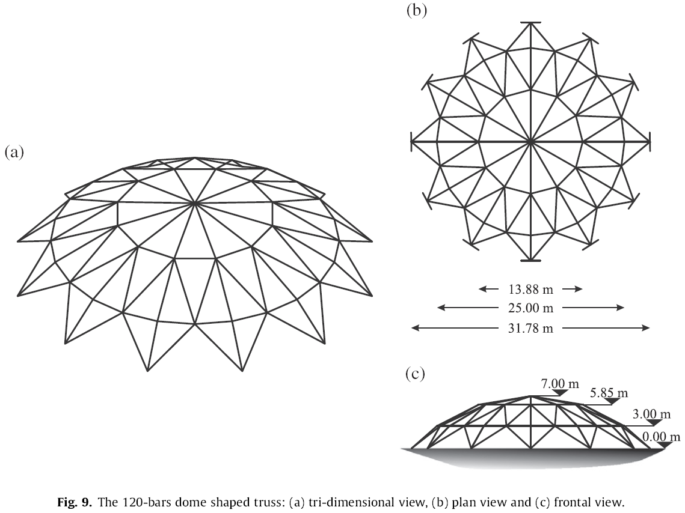
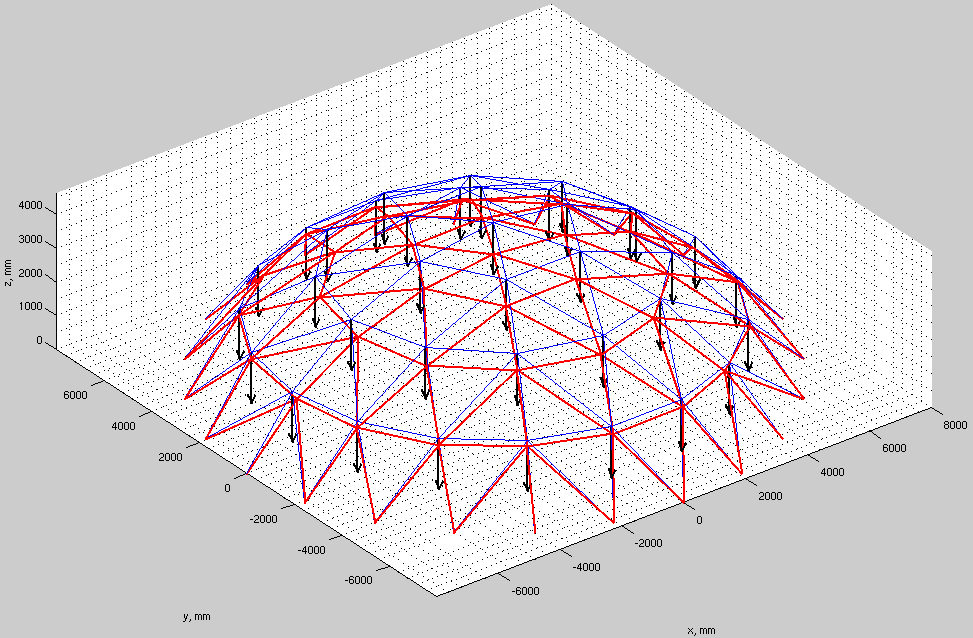
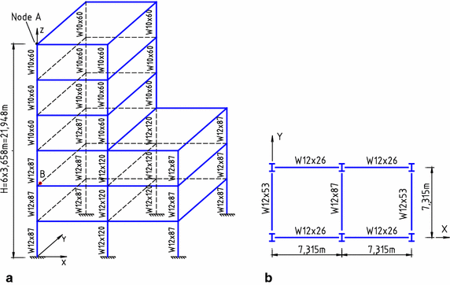

# Análisis matricial de estructuras de barras en 1D

Fuente: <http://xkcd.com/323/>

##  Análisis de 3 barras trabajando a tracción
Subdirectorio: [barra_1d](./barra_1d/)

Los programas de esta carpeta, estiman las reacciones en los apoyos (nodos 1 y 2), los desplazamientos en los nodos no restringidos (nodos 3 y 4) y las fuerzas axiales en los nodos y barras de la estructura mostrada:

## Análisis matricial de cerchas 2D
Los programas de esta carpeta, resuelven la estructura mostrada. El material es acero con E=2040 ton/m². Las áreas están dadas entre paréntesis en cm²:

## Análisis matricial de cerchas 2D con apoyos inclinados
Los programas de esta carpeta, resuelven la estructura mostrada. El material es acero con E=2040 ton/m². Las áreas están dadas entre paréntesis en cm²:

## Análisis matricial de pórticos 2D

### Deducción de la matriz de rigidez de un pórtico en 2D

* [c1_deduccion_K_portico2D.m](portico_2d/c1_deduccion_K_portico2D.m) **usa el toolbox de álgebra simbólica**
<!---
Compile en: https://tex.s2cms.com

\renewcommand\arraystretch{1.4}
\begin{bmatrix}
X_i\\
Y_i\\
M_i\\
X_j\\
Y_j\\
M_j
\end{bmatrix}
=
\begin{bmatrix}
  \frac{EA}{L} & 0 & 0 & -\frac{EA}{L} & 0 & 0 \\
  0 & \frac{12EI}{L^3} & \frac{6EI}{L^2} & 0 & -\frac{12EI}{L^3} & \frac{6EI}{L^2} \\
  0 & \frac{6EI}{L^2} & \frac{4EI}{L} & 0 & -\frac{6EI}{L^2} & \frac{2EI}{L} \\
  -\frac{EA}{L} & 0 & 0 & \frac{EA}{L} & 0 & 0 \\
  0 & -\frac{12EI}{L^3} & -\frac{6EI}{L^2} & 0 & \frac{12EI}{L^3} & -\frac{6EI}{L^2} \\
  0 & \frac{6EI}{L^2} & \frac{2EI}{L} & 0 & -\frac{6EI}{L^2} & \frac{4EI}{L}
\end{bmatrix}
\begin{bmatrix}
u_i\\
v_i\\
\theta_i\\
u_j\\
v_j\\
\theta_j
\end{bmatrix}
--->

![](https://tex.s2cms.ru/svg/%5Crenewcommand%5Carraystretch%7B1.4%7D%0A%5Cbegin%7Bbmatrix%7D%0AX_i%5C%5C%0AY_i%5C%5C%0AM_i%5C%5C%0AX_j%5C%5C%0AY_j%5C%5C%0AM_j%0A%5Cend%7Bbmatrix%7D%0A%3D%0A%5Cbegin%7Bbmatrix%7D%0A%20%20%5Cfrac%7BEA%7D%7BL%7D%20%26%200%20%26%200%20%26%20-%5Cfrac%7BEA%7D%7BL%7D%20%26%200%20%26%200%20%5C%5C%0A%20%200%20%26%20%5Cfrac%7B12EI%7D%7BL%5E3%7D%20%26%20%5Cfrac%7B6EI%7D%7BL%5E2%7D%20%26%200%20%26%20-%5Cfrac%7B12EI%7D%7BL%5E3%7D%20%26%20%5Cfrac%7B6EI%7D%7BL%5E2%7D%20%5C%5C%0A%20%200%20%26%20%5Cfrac%7B6EI%7D%7BL%5E2%7D%20%26%20%5Cfrac%7B4EI%7D%7BL%7D%20%26%200%20%26%20-%5Cfrac%7B6EI%7D%7BL%5E2%7D%20%26%20%5Cfrac%7B2EI%7D%7BL%7D%20%5C%5C%0A%20%20-%5Cfrac%7BEA%7D%7BL%7D%20%26%200%20%26%200%20%26%20%5Cfrac%7BEA%7D%7BL%7D%20%26%200%20%26%200%20%5C%5C%0A%20%200%20%26%20-%5Cfrac%7B12EI%7D%7BL%5E3%7D%20%26%20-%5Cfrac%7B6EI%7D%7BL%5E2%7D%20%26%200%20%26%20%5Cfrac%7B12EI%7D%7BL%5E3%7D%20%26%20-%5Cfrac%7B6EI%7D%7BL%5E2%7D%20%5C%5C%0A%20%200%20%26%20%5Cfrac%7B6EI%7D%7BL%5E2%7D%20%26%20%5Cfrac%7B2EI%7D%7BL%7D%20%26%200%20%26%20-%5Cfrac%7B6EI%7D%7BL%5E2%7D%20%26%20%5Cfrac%7B4EI%7D%7BL%7D%0A%5Cend%7Bbmatrix%7D%0A%5Cbegin%7Bbmatrix%7D%0Au_i%5C%5C%0Av_i%5C%5C%0A%5Ctheta_i%5C%5C%0Au_j%5C%5C%0Av_j%5C%5C%0A%5Ctheta_j%0A%5Cend%7Bbmatrix%7D)

## Ejemplo 11.23 del libro: Uribe Escamilla, Jairo. Análisis de Estructuras. Colombia:Ediciones Uniandes, 1993

* Solución Uribe Escamilla: [c1_ej_11_23_uribe_escamilla.pdf](portico_2d/c1_ej_11_23_uribe_escamilla.pdf)
* Código MATLAB (versión sencilla): [c1_ejemplo_marco.m](portico_2d/c1_ejemplo_marco.m) 
* Código MATLAB (versión que grafica diagramas y deformada) [c1_ejemplo_marco_2D_con_deformada_matlab.zip](portico_2d/c1_ejemplo_marco_2D_con_deformada_matlab.zip) (nota la versión MATLAB está mucho más completa que la de PYTHON)
* Código PYTHON 3 (versión que grafica diagramas y deformada) [c1_ejemplo_marco_2D_con_deformada_python3.zip](portico_2d/c1_ejemplo_marco_2D_con_deformada_python3.zip)

<!---

=Análisis matricial de barras 2D con empotramiento en un extremo y rótula en el otro=
** Cálculo de las matrices de rigidez empotrado-rótula, rótula-empotrado: 
*** Código compatible con MATLAB 2013a: [[file:c1_K_elemento_empotrado_rodillo_matlab2013a.m]] **usa el toolbox de álgebra simbolica**
*** Cödigo MATLAB: [[file:c1_K_elemento_empotrado_rodillo.m]] **usa el toolbox de álgebra simbolica**

* Rótulas intermedias a una viga: 
* Código MATLAB: [[file:c1_ejemplo_rotula.zip]] **FALTA MEJORAR LA CLARIDAD DE ESTE CODIGO**

="Cercha" FINK=
[[image:cercha2_taller1c.gif]]

Haga un programa en MATLAB para determinar:
* Desplazamientos horizontales y verticales en cada nodo
* Fuerzas axiales
* Fuerzas cortantes y momentos flectores
* Las fuerzas en los apoyos (reacciones)

Todos los análisis de resultados deben incluir los siguientes diagramas (realizados en MATLAB):
* Fuerzas axiales para cada barra
* Diagramas de fuerza cortante
* Diagrama de momento flector
* Diagrama de la deformada de la estructura
* Diagrama que muestre los grados de libertad asociados a cada elemento estructural

Asuma:
* E = 200 GPa
* densidad del material = 7800 kg/m^3 (para el cálculo del peso propio de la estructura)
* Sección:
** circular de radio 4 cm para los elementos inclinados
** rectangular de lado 4 cm para los elementos horizontales

El nodo C y el nodo G se encuentran en la mitad de los elementos AE y BE respectivamente.
Analice como si fuera:
# una cercha: incluyendo el peso propio de la misma
# un pórtico
# los elementos AE, BE y AB son continuos, es decir, la rótulas C, G, D y F no existen dentro de dichos elementos. Sin embargo las barras CD, FG, DE y FE si llegan a estos elementos estructurales mediante una rótula. Adicionalmente, los nodos A, B y E son rótulas. Explique detalladamente como hizo esta modelación con MATLAB
# compare las respuesta obtenidas en MATLAB con el software de análisis estructural de su predilección (de todos los puntos analizados). En este caso se incluye la solución utilizando SAP2000

Solución en MATLAB y SAP2000: [[file:c1_taller_estructura_fink.zip]]

--->

## Análisis matricial de una cercha en 3D

Código MATLAB: [c1_ejemplo_cercha_3D.zip](cercha_3d/c1_ejemplo_cercha_3D.zip)

## Análisis matricial de un pórtico en 3D (nota: falta comparar con un programa de cálculo estructural)

Código MATLAB:  [c1_ejemplo_portico_3D.zip](portico_3d/c1_ejemplo_portico_3D.zip)
