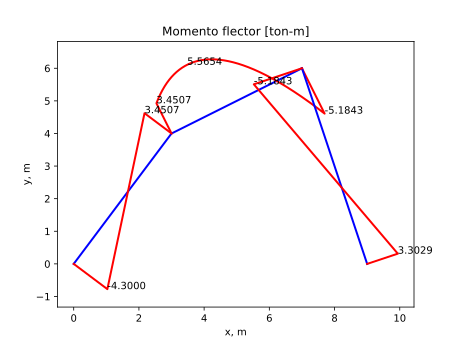

#  Ejemplo 11.23 de Uribe Escamilla: análisis de un pórtico bidimensional con deformada

Los programas:
* MATLAB: [matlab/ejemplo_portico_2D_con_deformada.m](matlab/ejemplo_portico_2D_con_deformada.m)
* PYTHON: [python/ejemplo_portico_2D_con_deformada.py](python/ejemplo_portico_2D_con_deformada.py)

estiman las reacciones en los apoyos, y grafican la deformada y los diagramas de fuerza axial, fuerza cortante y momento flector del pórtico 2D que se muestra a continuación:

Se incluye el archivo [ejemplo_portico.pdf](ejemplo_portico.pdf) para que se compare con el libro de Uribe Escamilla. Dicho libro se puede descargar libremente de:

https://www.researchgate.net/publication/31754481_Analisis_de_estructuras_J_Uribe_Escamilla (el ejemplo se encuentra en la página 526 de esta versión del libro).

Los gráficos arrojados por estos programas son:

* Numeración de nodos y elementos:

* Deformada del pórtico:

* Fuerza axial:

* Fuerza cortante:

* Momento flector:

