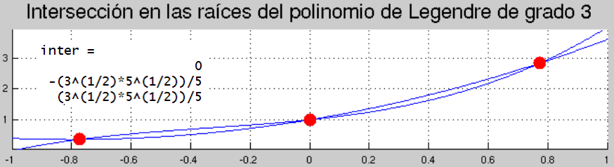

# Elementos finitos para modelar la flexión de vigas de Euler-Bernoulli

## Cálculo de las funciones de forma y la matriz K del elemento de viga de Euler-Bernoulli
* MATLAB: [func_forma_euler_bernoulli.m](func_forma_euler_bernoulli.m)

## Programa para el cálculo de las funciones de forma del elemento de viga de Euler-Bernoulli usando polinomios interpoladores de Hermite
* MATLAB: [hermite.m](hermite.m)

# Un polinomio de orden `n` y otro de orden `n-1` ajustado por mínimos cuadrados se intersectan en la raíces del polinomio de Legendre de orden `n`

Cuando la intersección de un polinomio de grado `n` con su ajuste por mínimos cuadrados un polinomio de grado `n-1` sucede, se pueden observar que dicha intersección ocurre en raíces del polinomio de Legendre de orden `n`:

Código:
* MATLAB: [interseccion_polinomios_en_raices_pol_Legendre.m](../../2D/extrapolacion_de_esfuerzos/interseccion_polinomios_en_raices_pol_Legendre.m)

##  Cálculo de la matriz K para el EF de 2 nodos resolviendo la ecuación diferencial
Ver [aquí](../../repaso_matricial/portico_2d/deduccion_K_y_fe_elemento_portico_2D/).

