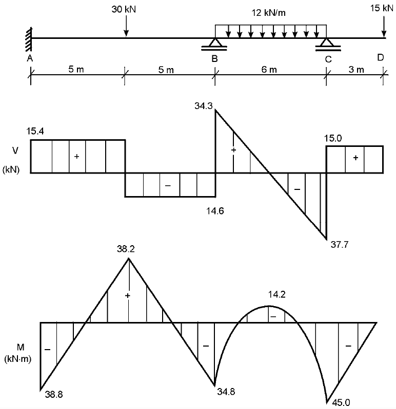

# Elementos finitos para modelar la flexión de vigas de Euler-Bernoulli

## Programas para el cálculo de las funciones de forma del elemento de viga de Euler-Bernoulli

### Usando polinomios interpoladores de Hermite
* MATLAB: [hermite.m](hermite.m)

### Resolviendo un sistema de ecuaciones
* MATLAB: [func_forma_euler_bernoulli.m](func_forma_euler_bernoulli.m). Nota: este programa adicionalmente calcula la matriz de rigidez `K` y la matriz de masa consistente `M`.

Estos programas verifican que las funciones de forma buscadas son:
```
         3
       xi    3 xi   1
N1 =   --- - ---- + -
        4      4    2

         3     2
       xi    xi    xi   1
N1b =  --- - --- - -- + -
        4     4     4   4

           3
         xi    3 xi   1
N2 =   - --- + ---- + -
          4      4    2

         3     2
       xi    xi    xi   1
N2b =  --- + --- - -- - -
        4     4     4   4
```


y que la matriz de rigidez del EF de viga de dos nodos es:
```
        /  12,  6 L,  -12,  6 L \
        |                       |
        |         2           2 |
    E I | 6 L, 4 L , -6 L, 2 L  |
K = ---*|                       |
      3 | -12, -6 L,  12,  -6 L |
     L  |                       |
        |         2           2 |
        \ 6 L, 2 L , -6 L, 4 L  /
```

## Un polinomio de orden `n` y otro de orden `n-1` ajustado por mínimos cuadrados se intersectan en la raíces del polinomio de Legendre de orden `n`

Cuando la intersección de un polinomio de grado `n` con su ajuste por mínimos cuadrados un polinomio de grado `n-1` sucede, se pueden observar que dicha intersección ocurre en raíces del polinomio de Legendre de orden `n`:


Código:
* MATLAB: [interseccion_polinomios_en_raices_pol_Legendre.m](../../2D/extrapolacion_de_esfuerzos/interseccion_polinomios_en_raices_pol_Legendre.m)

##  Cálculo de la matriz K para el EF de 2 nodos de Euler-Bernoulli resolviendo la ecuación diferencial
Ver [aquí](../../repaso_matricial/portico_2d/deduccion_K_y_fe_elemento_portico_2D/).


## Cálculo de los diagramas de cortante, momento, ángulo de inclinación y desplazamiento de una viga

Considere la siguiente viga, la cual se tomó del libro [J. Uribe Escamilla (2002) - Análisis de estructuras](https://www.researchgate.net/publication/31754481_Analisis_de_estructuras_J_Uribe_Escamilla):



Dicha viga se resolvió utilizando la teoría de **Euler-Bernoulli**:

* Solución resolviendo directamente la ecuación diferencial (usando la funcion bvp5c): 
  * MATLAB: [c4_escamilla_ej_5_5_EB_eq_diff.m](resolviendo_la_ecuacion_diferencial/c4_escamilla_ej_5_5_EB_eq_diff.m) NOTA: este es un método que no funciona bien con MATLAB, porque requiere un tamaño de rejilla extremadamente pequeño para dar resultados muy precisos.

* Solución por el método de los elementos finitos:
  * MATLAB: [c4_ejemplo_EB.m](c4_ejemplo_EB.m)

La salida de este último código es:


siendo las reacciones de la viga:
```
Fuerzas nodales de equilibrio (solo se imprimen los diferentes de cero)
~~~~~~~~~~~~~~~~~~~~~~~~~~~~~~~~~~~~~~~~~~~~~~~~~~~~~~~~~~~~~~~~~~~~~~~
Nodo   1 Ry =         15.4 kN, Mz =        38.83 kN-m
Nodo 101 Ry =        48.91 kN, Mz =            0 kN-m
Nodo 161 Ry =        52.69 kN, Mz =            0 kN-m
```
