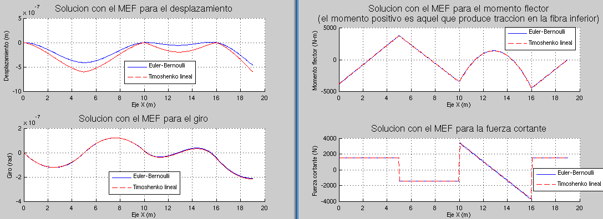

# Elementos finitos para modelar la flexión de vigas de Timoshenko

## Cálculo de las funciones de forma del elemento de viga de Euler-Bernoulli lineal
El programa:
* [Kb_Ks_timoshenko_lineal.m](Kb_Ks_timoshenko_lineal.m)

calcula:

Las matrices de deformación por flexión `Bb` y por cortante `Bs`:
```
Bb =
[ 0, -1/L, 0, 1/L]
```
```
Bs =
[ -1/L, xi/2 - 1/2, 1/L, - xi/2 - 1/2]
```

Las matrices `Kb` y `Ks` que se calculan por la integración exacta:
```
Kb = (E*I/L) * 
/ 0,  0, 0,  0 \
|              |
| 0,  1, 0, -1 |
|              |
| 0,  0, 0,  0 |
|              |
\ 0, -1, 0,  1 /
```
```
Ks = (G*Aast/L) * 
/      L         L  \
|  1,  -,   -1,  -  |
|      2         2  |
|                   |
|       2         2 |
|  L   L     L   L  |
|  -,  --, - -,  -- |
|  2    3    2    6 |
|                   |
|       L         L |
| -1, - -,  1,  - - |
|       2         2 |
|                   |
|       2         2 |
|  L   L     L   L  |
|  -,  --, - -,  -- |
\  2    6    2    3 /
```

Las matrices `Kb` y `Ks` que se calculan con Gauss-Legendre usando 1 punto de integración:
```
Kb = (E*I/L) * 
/ 0,  0, 0,  0 \
|              |
| 0,  1, 0, -1 |
|              |
| 0,  0, 0,  0 |
|              |
\ 0, -1, 0,  1 /
```
```
Ks = (G*Aast/L) * 
/      L         L  \
|  1,  -,   -1,  -  |
|      2         2  |
|                   |
|       2         2 |
|  L   L     L   L  |
|  -,  --, - -,  -- |
|  2    4    2    4 |
|                   |
|       L         L |
| -1, - -,  1,  - - |
|       2         2 |
|                   |
|       2         2 |
|  L   L     L   L  |
|  -,  --, - -,  -- |
\  2    4    2    4 /
```

Las matrices `Kb` y `Ks` que se calculan con Gauss-Legendre usando 2 puntos de integración:
```
Kb = (E*I/L) * 
/ 0,  0, 0,  0 \
|              |
| 0,  1, 0, -1 |
|              |
| 0,  0, 0,  0 |
|              |
\ 0, -1, 0,  1 /
```
```
Ks = (G*Aast/L) * 
/      L         L  \
|  1,  -,   -1,  -  |
|      2         2  |
|                   |
|       2         2 |
|  L   L     L   L  |
|  -,  --, - -,  -- |
|  2    3    2    6 |
|                   |
|       L         L |
| -1, - -,  1,  - - |
|       2         2 |
|                   |
|       2         2 |
|  L   L     L   L  |
|  -,  --, - -,  -- |
\  2    6    2    3 /
```

El vector de fuerzas nodales equivalentes `fe` asociados a una carga distribuída `q` constante y un momento distribuído `m` tambien uniforme:
```
fe = 
/ L fz \
| ---- |
|   2  |
|      |
|  L m |
|  --- |
|   2  |
|      |
| L fz |
| ---- |
|   2  |
|      |
|  L m |
|  --- |
\   2  /
```
El vector de fuerzas nodales equivalentes `fe` asociados a una carga distribuída trapezoidal y sin momentos distribuidos:
```
fe = 
/ L (2 q1 + q2) \
| ------------- |
|       6       |
|               |
|       0       |
|               |
| L (q1 + 2 q2) |
| ------------- |
|       6       |
|               |
\       0       /
```

## Ejercicio de la Sección 2.4 de Oñate: comparación EB vs T (1 GL) vs T (2 GL)
El código

* [sec_2_4_EB_vs_T.m](sec_2_4_EB_vs_T.m)

implementa el ejercicio que hay en la Sección 2.4 de Oñate (2013) y obtiene este gráfico:


Básicamente este ejercicio compara los desplazamientos calculados con las teorías de Euler-Bernoulli y Timoshenko utilizando una matriz de rigidez por cortante `Ks` calculada con integración reducida (1 punto de GL) e integración completa (2 puntos de GL). Se deduce de este ejercicio que:
* En una viga esbelta (`λ` muy grande) el efecto del esfuerzo cortante es despreciable y la solución numérica coincide con la predicha por la teoría de Euler-Bernoulli.
* A medida que el número de EFs aumenta, también así lo hace la calidad de la solución para el EF con que aplica integración reducida a `Ks`.
* Con la integración exacta de `Ks` se produce el fenómeno de *shear locking* (bloqueo de la solución). Dicho fenómeno hace que la viga sea en el límite `λ→∞` infinitamente rígida. Este EF con integración exacta solo funcionaría con un número exagerado de EFs (asumiendo que `λ` no tiende a infinito), y aún así su precisión no sería buena, lo que lo hace inutilizable en la mayoría de los casos.
* Con la integración reducida de `Ks` se evita el fenómeno del bloqueo por cortante (shear locking) y el EF resultante es válido para vigas de pequeño y gran canto. Veremos más adelante, que en este caso el punto central de Gauss-Legendre es adicionalmente el punto óptimo para el cálculo de los esfuerzos.

## Ejemplo viga Euler-Bernoulli vs viga Timoshenko
El programa [c4_ejemplo_T.m](c4_ejemplo_T.m) calcula la viga de Timoshenko con elementos finitos de dos nodos. Dicho programa utiliza [c4_ejemplo_EB.m](c4_ejemplo_EB.m) para hacer una comparación con el método de Euler-Bernoulli. Por ejemplo, [c4_ejemplo_T.m](c4_ejemplo_T.m) calcula la viga:


obteniendo la siguiente comparación para h = 2.0 m. (NOTA: esta viga es demasiado alta para que Timoshenko o Euler-Bernoulli sea aplicable, pero la idea es exagerar las diferencias):




## Cálculo de las funciones de forma del elemento de viga de Euler-Bernoulli cuadrático
El programa:
* [Kb_Ks_timoshenko_cuadratico.m](Kb_Ks_timoshenko_cuadratico.m)

calcula:

Las matrices de deformación por flexión `Bb` y por cortante `Bs`:
```
Bb = (2/L) * 
/         1                    1 \
| 0, xi - -, 0, -2 xi, 0, xi + - |
\         2                    2 /
```
```
Bs = (2/L) * 
/                                      2                               \
|      1    L xi (xi - 1)         L (xi  - 1)       1    L xi (xi + 1) |
| xi - -, - -------------, -2 xi, -----------, xi + -, - ------------- |
\      2          4                    2            2          4       /
```

Las matrices `Kb` y `Ks` que se calculan por la integración exacta:
```
Kb = ((E*I)/(3*L)) * 
/ 0,  0, 0,  0, 0,  0 \
|                     |
| 0,  7, 0, -8, 0,  1 |
|                     |
| 0,  0, 0,  0, 0,  0 |
|                     |
| 0, -8, 0, 16, 0, -8 |
|                     |
| 0,  0, 0,  0, 0,  0 |
|                     |
\ 0,  1, 0, -8, 0,  7 /
```
```
Ks = ((G*Aast)/(9*L)) * 
/          9 L                          3 L \
|   21,    ---,   -24,  6 L,    3,    - --- |
|           2                            2  |
|                                           |
|            2             2              2 |
|  9 L    6 L           3 L    3 L     3 L  |
|  ---,   ----,  -6 L,  ----,  ---,  - ---- |
|   2       5             5     2       10  |
|                                           |
|  -24,   -6 L,   48,    0,    -24,    6 L  |
|                                           |
|            2             2             2  |
|         3 L          24 L           3 L   |
|  6 L,   ----,    0,  -----,  -6 L,  ----  |
|           5            5              5   |
|                                           |
|          3 L                          9 L |
|   3,     ---,   -24,  -6 L,   21,   - --- |
|           2                            2  |
|                                           |
|             2            2             2  |
|   3 L    3 L          3 L     9 L   6 L   |
| - ---, - ----,  6 L,  ----, - ---,  ----  |
\    2      10            5      2      5   /
```

Las matrices `Kb` y `Ks` que se calculan con Gauss-Legendre usando 2 puntos de integración:
```
Kb = ((E*I)/(3*L)) * 
/ 0,  0, 0,  0, 0,  0 \
|                     |
| 0,  7, 0, -8, 0,  1 |
|                     |
| 0,  0, 0,  0, 0,  0 |
|                     |
| 0, -8, 0, 16, 0, -8 |
|                     |
| 0,  0, 0,  0, 0,  0 |
|                     |
\ 0,  1, 0, -8, 0,  7 /
```
```
Ks = ((G*Aast)/(9*L)) * 
/         9 L                       3 L \
|   21,   ---,  -24,  6 L,   3,   - --- |
|          2                         2  |
|                                       |
|                                     2 |
|  9 L     2           2    3 L      L  |
|  ---,   L ,  -6 L,  L ,   ---,   - -- |
|   2                        2        2 |
|                                       |
|  -24,  -6 L,  48,    0,   -24,   6 L  |
|                                       |
|          2            2            2  |
|  6 L,   L ,    0,  4 L ,  -6 L,   L   |
|                                       |
|         3 L                       9 L |
|   3,    ---,  -24, -6 L,   21,  - --- |
|          2                         2  |
|                                       |
|           2                           |
|   3 L    L           2     9 L     2  |
| - ---, - --,  6 L,  L ,  - ---,   L   |
\    2      2                 2         /
```

Las matrices `Kb` y `Ks` que se calculan con Gauss-Legendre usando 3 puntos de integración:
```
Kb = ((E*I)/(3*L)) * 
/ 0,  0, 0,  0, 0,  0 \
|                     |
| 0,  7, 0, -8, 0,  1 |
|                     |
| 0,  0, 0,  0, 0,  0 |
|                     |
| 0, -8, 0, 16, 0, -8 |
|                     |
| 0,  0, 0,  0, 0,  0 |
|                     |
\ 0,  1, 0, -8, 0,  7 /
```
```
Ks = ((G*Aast)/(9*L)) * 
/          9 L                          3 L \
|   21,    ---,   -24,  6 L,    3,    - --- |
|           2                            2  |
|                                           |
|            2             2              2 |
|  9 L    6 L           3 L    3 L     3 L  |
|  ---,   ----,  -6 L,  ----,  ---,  - ---- |
|   2       5             5     2       10  |
|                                           |
|  -24,   -6 L,   48,    0,    -24,    6 L  |
|                                           |
|            2             2             2  |
|         3 L          24 L           3 L   |
|  6 L,   ----,    0,  -----,  -6 L,  ----  |
|           5            5              5   |
|                                           |
|          3 L                          9 L |
|   3,     ---,   -24,  -6 L,   21,   - --- |
|           2                            2  |
|                                           |
|             2            2             2  |
|   3 L    3 L          3 L     9 L   6 L   |
| - ---, - ----,  6 L,  ----, - ---,  ----  |
\    2      10            5      2      5   /
```


##  Cálculo de la matriz K para el EF de 2 nodos calculado utilizando integración exacta:
* [K_exacta_viga_T.m](K_exacta_viga_T.m)
* [f_exacta_carga_trapezoidal_T.m](f_exacta_carga_trapezoidal_T.m)
* [c4_ejemplo_con_K_T_exacta.m](c4_ejemplo_con_K_T_exacta.m)

## Interpolación acoplada (linked interpolation):
Este programa usa la la imposición del campo de deformaciones angulares para `gxz` con el objeto de calcular la interpolación acoplada de la sección 2.8.3:
* [ej_2_2_interpolacion_acoplada.m](ej_2_2_interpolacion_acoplada.m)

El programa calcula los términos `w3` y `t3` en:
```matlab
w = N1*w1 + N2*w3 + N3*w2;  % OJO al orden de los terminos!!!
t = N1*t1 + N2*t3 + N3*t2;  % OJO al orden de los terminos!!!
```

imponiendo al campo de deformaciones angulares `gxz = A + B*xi + C*xi^2` la condición `B=0` y `C=0`:
```matlab
sol = solve(B==0, C==0, w3,t3);
disp('w3 = '); disp(sol.w3)
disp('t3 = '); disp(sol.t3)
```

De este modo, obtiene la interpolación acoplada:
```
w = (1/2 - xi/2)*w1 + (xi/2 + 1/2)*w2 + (1 - xi^2)*(t1 - t2)*L/8
t = (1/2 - xi/2)*t1 + (xi/2 + 1/2)*t2
```

## Imposición de un campo de deformaciones angulares para gxz:
Los programas 
* [Bs_sustitutiva_T2.m](Bs_sustitutiva_T2.m) y [ej_2_8_imposicion_gxz_T2.m](ej_2_8_imposicion_gxz_T2.m)
* [Bs_sustitutiva_T3.m](Bs_sustitutiva_T3.m) y [ej_2_9_imposicion_gxz_T3.m](ej_2_9_imposicion_gxz_T3.m)

imponen las deformaciones

<!---
Compile en: https://tex.s2cms.com

\gamma_{xz}(\xi) = \sum_{k=1}^{n_\gamma} N_{\gamma_k}(\xi) \gamma_k = \sum_{k=1}^{n_\gamma} N_{\gamma_k}(\xi) \ma{B}_s(\xi_k)\ve{a} = \overline{\ma{B}_s}(\xi) \ve{a}
--->

%20%3D%20%5Csum_%7Bk%3D1%7D%5E%7Bn_%5Cgamma%7D%20N_%7B%5Cgamma_k%7D(%5Cxi)%20%5Cgamma_k%20%3D%20%5Csum_%7Bk%3D1%7D%5E%7Bn_%5Cgamma%7D%20N_%7B%5Cgamma_k%7D(%5Cxi)%20%5Cma%7BB%7D_s(%5Cxi_k)%5Cve%7Ba%7D%20%3D%20%5Coverline%7B%5Cma%7BB%7D_s%7D(%5Cxi)%20%5Cve%7Ba%7D)

con `n_gamma = 1` y `n_gamma = 2` en EF de Timoshenko de 2 y 3 nodos respectivamente. El programa calcula en ambos casos las matrices `Bs_substitutiva` y `Ks` para dichos elementos.

---

El programa
* [ej_2_3.m](ej_2_3.m)

a partir del elemento de viga de Timoshenko con `w = pol grado 3` y `t = pol grado 2`, obtiene un elemento de variación lineal para el momento flector y constante para el esfuerzo cortante.

```
-1        -1/sqrt(3)            0            1/sqrt(3)         1 
 x-------------x----------------x----------------x-------------x--> xi
 w1            w2                                w3            w4
 t1                             t5                             t4
```

---
El programa
* [ej_2_4.m](ej_2_4.m)

a partir del elemento de viga de Timoshenko con `w = pol grado 2` y `t = pol grado 2`, obtiene un elemento de variación lineal para el momento flector y constante para el esfuerzo cortante.

```
-1                              0                              1 
 x------------------------------x------------------------------x--> xi
 w1                             w2                             w3
 t1                             t2                             t3
```

---

El programa
* [ej_2_5.m](ej_2_5.m)

a partir del elemento de viga de Timoshenko con `w = pol grado 3` y `t = pol grado 2` e imponiendo que `gxz = 0`, obtiene un elemento de viga de dos nodos de Euler-Bernoulli.

```
-1        -1/sqrt(3)            0            1/sqrt(3)         1 
 x-------------x----------------x----------------x-------------x--> xi
 w1            w2                                w3            w4
 t1                             t5                             t4
```

**NOTA: este elemento no cumple la condición de sólido rígido \sum_i N_i = 0**

---

El programa
* [ej_2_6.m](ej_2_6.m)

a partir del elemento de viga de Timoshenko con `w = pol grado 2` y `t = pol grado 2` e imponiendo que `gxz(+/- 1/sqrt(3)) = 0`, obtiene un elemento de viga de dos nodos de Euler-Bernoulli.
```
-1                              0                              1 
 x------------------------------x------------------------------x--> xi
 w1                             w2                             w3
 t1                             t2                             t3
 ```

**NOTA: este elemento no cumple la condición de sólido rígido \sum_i N_i = 0**

---

El programa
* [ej_2_7.m](ej_2_7.m)

a partir del elemento de viga de Timoshenko con `w = pol grado 2` y `t = pol grado 1` e imponiendo gxz constante y eliminando el nodo `w2`, obtiene el EF de viga de Timoshenko de dos nodos.

```
-1                              0                              1 
 x------------------------------x------------------------------x--> xi
 w1                             w2                             w3
 t1                                                            t3
```