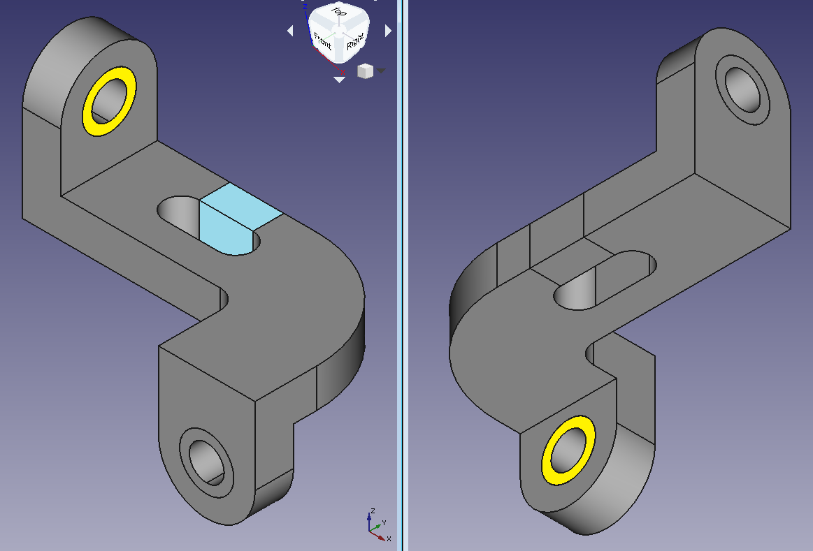

# Taller de modelado por elementos finitos e interpretación de gráficos: modelado de una unión metálica utilizando un software profesional

Con el objeto de contrastar la teoría aprendida y la práctica mediante el uso de un software profesional de elementos finitos, se requiere hacer el análisis de los desplazamientos, diagramas de esfuerzo, deformación, esfuerzos principales, esfuerzos de von Mises, esfuerzos de Tresca (o en su defecto el esfuerzo cortante máximo τₘₐₓ) de una estructura tridimensional. Se espera que el estudiante explore, comente, discuta los conceptos aprendidos en clase, los conceptos nuevos vistos en el software y que propongan soluciones a los problemas propuestos.

Trabajo en grupos de máximo 3 personas. Los miembros de un mismo grupo no pueden utilizar programas de la misma casa. Por ejemplo, en un mismo grupo no pueden estar quien maneja AUTODESK ROBOT y AUTODESK INVENTOR, ya que ambos programas son de la casa AUTODESK. Cada grupo debe utilizar las mismas suposiciones en el modelado, en caso que las deban hacer y deben justificar el porqué las hicieron.

Por favor reportar los grupos de trabajo en GOOGLE CLASSROOM.

Fecha y hora de entrega: se especificará en GOOGLE CLASSROOM. Por cada día hora de retraso se descontará una décima de la nota final.

<!---
Presentación individual y grupal: viernes febrero 14, 2020 a las 7:00 a.m.
--->

## El problema propuesto

La idea de este trabajo es modelar mediante elementos finitos 3D el componente metálico mostrado:

la cual está contenida en los archivos [solido.iges](figs/solido.iges), [solido.stl](figs/solido.stl) y [solido.dwg](figs/solido.dwg). El archivo fue creado por Esteban Hernandez Soto (nhernandez@unal.edu.co). Los gráficos y otros resultados arrojados por el programa de elementos finitos deberán ser cuidadosamente analizados de forma grupal.

Las dimensiones del dibujo están dadas en milímetros. Para el modelado, se asumirá que por los huecos circulares pasan pernos. Las superficies que están en contacto con las cabezas de los pernos estarán representadas por las regiones mostradas en amarillo. NOTA: esta suposición no es del todo correcta. Para modelar correctamente la acción de los pernos toca tener en cuenta una teoría no lineal llamada *superficies de contacto*, que no la veremos en el curso. En las regiones azules, se aplicarán unos esfuerzos de compresión de 40 MPa.

<!----
Se asumirá que enel desplazamiento normal a esas superficies amarillas y el desplazamiento normal a la superficie de los huecos donde se insertan los pernos serán nulos.
--->

Las propiedades del material serán:
* [Aluminio 6061](https://en.wikipedia.org/wiki/6061_aluminium_alloy)
* Módulo de elasticidad E: 68.9 GPa
* Densidad ρ: 2.70 g/cm³
* Coeficiente de Poisson ν: 0.33
* Esfuerzo de fluencia: 125 MPa

## Programa a utilizar
Cada estudiante debe utilizar un programa diferente. Reportar el programa a utilizar en la hoja de cálculo que aparece en GOOGLE CLASSROOM.

## Se solicita
* Explicar detalladamente como se modeló la acción de los pernos.

* Calcular las reacciones en los apoyos. Calcular las tracciones asociadas a los pernos del apoyo.

* Explicar detalladamente como se ingresaron las cargas.

* Hacer el cálculo de los diagramas de esfuerzo, deformación, esfuerzos principales con sus respectivas inclinaciones, esfuerzos de von Mises, esfuerzos de Tresca (el esfuerzo cortante máximo τₘₐₓ), desplazamientos y rotaciones. Si su programa no puede graficar lo anteriormente pedido, debería cambiar de programa, ya que podría perder la oportunidad de contabilizar algunos puntos.

* Hacer un refinamiento de la malla utilizando el método *p* y/o el método *h*.

* Diseñar una malla de elementos finitos adecuada; adicionalmente, se debe analizar la calidad de dicha malla utilizando las herramientas con las que cuenta el programa.

* PUNTO OBLIGATORIO: Hacer un estudio de convergencia de la solución.

* Hacer los siguientes videos (cada integrante del grupo debe hacer los siguientes videos):
  * VIDEO 1 (máximo 20 minutos): en este video se debe explicar en detalle el modelado y análisis de la estructura escogida. Se deben mostrar los resultados sin interpretarlos. Se recomienda que el estudiante explore muy bien todas las funcionalidades del programa para la presentación de resultados (posprocesado). Debe explicar las funcionalidades para generar las malla de EFs, incluyendo las funcionalidades para evaluar la calidad de la malla. **NOTA: este video se reemplazó por una sustentación grupal que se realizará el miércoles 16 de diciembre de 2020.**
  <!---
    * VIDEO 3 (máximo 10 minutos): tutorial que ilustre las diferentes formas de mostrar los resultados.    
  --->    
  * VIDEO 2 (máximo 20 minutos): en este video se debe hacer una reseña crítica de las capacidades teóricas y las hipótesis fundamentales que hace el programa en cuanto al **ANALISIS DE ESTRUCTURAS TRIDIMENSIONALES** (es decir, en cuanto a la matemática interna para el cálculo de desplazamientos, esfuerzos y deformaciones). OJO: no es mostrar como se utiliza el software, sino más mirar los manuales de referencia del mismo y mostrar que teorías, hipótesis, suposiciones, capacidades y limitaciones que tiene el programa escogido y que se utilizaron para calcular la estructura. Entregar, adicionalmente, el archivo PDF utilizado en la presentación de este video. Se sugiere para la presentación tomar capturas de pantalla de los manuales de referencia del programa en cuestión. OJO: no confunda esto con la información comercial. Lo que se está solicitando está dentro de los manuales de referencia.
    Algunos ejemplos de buenos análisis son:
     * STRUSOFT FEM-DESIGN (análisis de losas): https://www.youtube.com/watch?v=xxPzgIl-mEg    
     * MIDAS GEN (análisis de vigas): https://www.youtube.com/watch?v=p06pnzg2ZPg
  * En cada uno de los videos incluir una ventana pequeña en una de las esquinas donde se vea usted hablando sobre el software.
  * El video se debe subir a GOOGLE CLASSROOM, no a YouTube.

* TRABAJO GRUPAL: ~~Presentar un informe escrito que contenga el análisis de los resultados.~~ **NOTA: el documento escrito se reemplazó por una sustentación grupal que se realizará el miércoles 16 de diciembre de 2020.** Recuerde explicar detalladamente como varían las cantidades en el espacio, donde están las cantidades máximas y mínimas, como se relacionan unas gráficas con otras, etc. No es solo ubicar donde están los colores, o los máximos y los mínimos, sino decir, **por qué razón se produce esa coloración**, entendiendo como la estructura está cargada, está apoyada, se deforma, etc. Se sugiere [**este (descargue archivo .PDF)**](https://github.com/diegoandresalvarez/solidos/blob/master/talleres/solidos1/ejemplo_analisis_graficos.pdf) formato para presentar los resultados. En este informe se debe realizar la comparación de los resultados de los programas utilizados en su grupo.

  * NOTA 1: recuerde que se está evaluando el análisis de resultados. Por ejemplo con γxy: ¿qué quiere decir esta deformación? ¿cómo se está comportando en este punto la estructura dado ese valor de γxy? **¿por qué razón se produce?** No es solo ubicar los máximos y los mínimos de dicha cantidad o describir con palabras los gráficos producidos por el programa de elementos finitos.

  * ~~NOTA 2: extensión máxima del informe 40 páginas.~~

  * NOTA 3: en ocasiones, cuando se tienen puntos de singularidad, esos valores son tan altos, que terminan haciendo que todos los colores en la estructura se vean iguales, es decir, mostrándolos como uno solo. En este caso, se sugiere usar una opción del software que limita los colores a mostrar a un rango.

* Se solicita subir todos los archivos asociados al trabajo (.XLSX, .DOCX, .MP4, .MKV, etc) directamente a GOOGLE CLASSROOM. Por favor no los empaquete en un archivo .ZIP o .RAR.

* Active en el software de captura de pantalla la opción para ver el ratón.

Se sugiere aprender a manejar un programa de edición de videos. Esto les facilitará mucho la realización del mismo.

## Criterios de evaluación
* NOTA MAXIMA 8.0. Tenga en cuenta que la nota tiene un componente individual (los videos) y otro grupal (el informe escrito).

* VIDEO 1: Modelado de la estructura (2.6)
  * 1.0 Modeló el perno utilizando el método RBE que se explicó en clase o cualquier otro método avanzado de modelación de pernos.
  * 0.1 Modeló adecuadamente las cargas
  * 0.4 Calculó las reacciones en los apoyos (y *fuerzas* asociadas al perno).
  * 0.1 Calculó el diagrama de los desplazamientos y de la estructura deformada
  * 0.1 Calculó los diagramas de las deformaciones ɛx, ɛy, ɛz, γxy, γxz, γyz *y* los esfuerzos σx, σy, σz, τxy, τxz, τyz. Se debe mostrar cortes de la estructura mostrando algunos de dichos gráficos (si falta alguno de estos gráficos, si los cortes se grafican sin curvas de nivel o sin escalas de colores discretas, y si no se ubican los máximos y los mínimos **no** se otorgarán puntos).
  * 0.1 Calculó el diagrama de las rotaciones.
  * 0.1 Calculó el diagrama de las dilataciones cúbicas.
  * 0.2 Calculó el diagrama de esfuerzos principales σ1, σ2, σ3 *y* sus respectivas inclinaciones (los diagramas de esfuerzos principales sin sus respectivas inclinaciones no otorgarán puntos)
  * 0.1 Calculó el diagrama de esfuerzos de von Mises y/o Tresca y/o τₘₐₓ 
  * PUNTO OBLIGATORIO: diseña una malla de EFs adecuada para la estructura. Si crea simplemente una malla súperrefinada, sin diseño alguno, se tendrá 2.0 unidades menos. Debe utilizar los consejos para hacer buenas mallas.
  * 0.4 Utilizando las herramientas provistas por el software, evalúa la calidad de su malla.
  * 0.3 Hace un refinamiento de la malla utilizando el método *p* y el método *h*
  * 0.4 Expone adecuadamente las capacidades del software en cuanto a la presentación de resultados (postprocesado). Se requiere para este punto que usted explore las opciones que le de el software para la presentación de resultados y gráficos: cortes con curvas de nivel, rangos de colores, diferentes diagramas, cortes en las secciones que muestren como varían las cantidades en área y en línea, opciones para integrar los esfuerzos y obtener las fuerzas cortantes y los momentos flectores equivalentes, etc.
  NOTA: si usted usa un software que no calcula las cantidades anteriormente solicitadas, podría perder puntos. En tal caso, se sugiere cambiar de programa.
  * PUNTO OBLIGATORIO: analiza la convergencia de la solución en ciertos puntos representativos (si no se hace se pierden 2.0 unidades).
  * 0.3 Muestra alguna capacidad extra que tenga el programa que puede ser útil para el análisis y que está directamente contectada con algún tema visto en el curso.

* VIDEO 2 + PDF PRESENTACION: Reseña de las capacidades/hipótesis/suposiciones/limitaciones del software (2.0)
  * 0.6 Hace un recuento de las teorías que soporta el programa, haciendo recortes del manual de referencia del mismo.
  * 0.6 Intenta entender las fórmulas del manual de referencia al verificar su equivalencia con las que se vieron en clase (en ocasiones toca convertir esas ecuaciones a nuestra nomenclatura para poder entenderlas, ya que los programas son usualmente mucho más generales y soportan más casos que los vistos en clase) y/o usan una nomenclatura diferente.
  * 0.6 Explica las ventajas/capacidades y limitaciones/suposiciones que hace el programa en cuanto al análisis estructural?
  * 0.2 Lista otras capacidades tiene el programa que podrían ser útiles para resolver el problema en consideración y que eventualmente podrían ser útiles en el análisis.

* INFORME ESCRITO (TRABAJO GRUPAL): Análisis de resultados (2.4): interpreta gráficos, analiza como varían las cantidades en el espacio? Ubica máximos y mínimos? Relaciona gráficos entre si?
  * 0.4 Diagramas de los desplazamientos del sólido y las deformaciones ɛᵢⱼ (en notación tensorial), dilatación cúbica, rotación.
  * 0.4 Diagramas de esfuerzos σᵢⱼ (en notación tensorial).  
  * 0.2 Diagramas de esfuerzos principales σ1, σ2, σ3 con sus respectivas inclinaciones (si no tiene las inclinaciones se tendrá un 0.0 en este punto). 
  * 0.2 Sugiere como se podría poner el refuerzo óptimo al interior de la estructura asumiendo que esta es de concreto reforzado? (si no calculó las inclinaciones θ₁, se tendrá un 0.0 en este punto).
  * 0.2 Sugiere la forma como la estructura se agrieta, asumiendo que esta es de concreto reforzado? (si no calculó las inclinaciones principales se tendrá un 0.0 en este punto).  
  * 0.2 Diagramas de esfuerzos de von Mises, de Tresca y/o τₘₐₓ
  * 0.2 Reacciones en los apoyos, fuerzas puntuales.  
  * 0.3 Presenta una calificación general realizada a los programas, justificando en una tabla, los pro y los contra de cada software.
  * PUNTO OBLIGATORIO: Presenta la comparación de los resultados obtenidos por los miembros de cada grupo. Comparar en porcentajes. Si no se hace -2.0 unidades.
  * PUNTO OBLIGATORIO: cada grupo debe utilizar las mismas suposiciones en el modelado, en caso que las deban hacer y deben justificar el porqué las hicieron. Si no se hace -2.0 unidades.
  * 0.3 Si el informe se escribe en LaTeX.

  <!--- y momentos flectores equivalentes. --->

* Por mala calidad en el sonido se rebajarán 0.5 unidades. Por favor use un micrófono auxiliar (por ejemplo, un manos libres) y evite usar el micrófono del portátil para hacer el video.

* Si se sube un video de mala calidad (por ejemplo 720p de calidad o inferior) se rebajará 1.0 unidad. Mínimo 1080p. Recuerde que no tenemos limitación en el almacenamiento en GOOGLE CLASSROOM. En caso que su equipo no sea capaz de hacer videos con resolución 1080p, infórmelo previamente, mediante un correo.

* Por cada hora de retraso se descontará una décima de la nota final.

* Si se sube el video a YouTube, se tendrá menos 2.0 unidades. Los videos los debe subir directamente a GOOGLE CLASSROOM.

* Si se usa un software diferente al registrado, se tendrá menos 3.0 unidades.

* Si se modela una estructura diferente a la registrada, se tendrá menos 3.0 unidades.

* Si no se incluye en el video un recuadro donde se donde se vea usted hablando sobre el software se tendrá menos 3.0 unidades.

<!---
 * Hacer presentación de máximo 25 minutos, intentando convencer a los compañeros porqué su programa es el mejor del mercado (imagínense que ustedes son los representantes para Colombia del producto).
 --->

## Consejos
* Explique porqué el comportamiento visto en el gráfico, localice los puntos con los valores máximos y mínimos mostrados, las zonas críticas de la estructura, y cualquier otro apunte que se considere conveniente. **No se limite a describir las figuras que arroja el programa de elementos finitos con palabras**. Aquí lo importante es aprender a interpretar los gráficos.
* El reporte debe incluir los análisis de resultados y cualquier otra información que usted considere necesaria.

## Notas adicionales
Recuerden que la finalidad de los grupos de trabajo es que comparen los programas que utilizaron en cuanto a facilidad de uso, forma de entrar los datos, hipótesis que utilizan los programas, etc. Obviamente, deben comparar los resultados obtenidos. La idea es que si les dan resultados diferentes (que seguramente les darán), intenten explicar el porqué les dio diferente. No los pienso penalizar por resultados diferentes, siempre y cuando me muestren en el video que todo se modeló utilizando unas hipótesis correctas.

Se espera que cada uno lea a fondo el manual del usuario del software. No se queden con los videos de YouTube. En el manual del usuario generalmente existe información importante sobre las hipótesis de modelado que hace cada software.

Me encantaría si en GOOGLE CLASSROOM se especifican las suposiciones hechas y se hace “cooperación” o comunicación entre los grupos de trabajo de las suposiciones que tengan que hacer, de modo tal que todo el curso maneje los mismos parámetros en el modelado.

<!---
Busquen ideas en YouTube con la palabra clave **"steel connection"**.
--->
