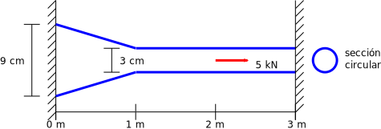

# Taller 1: modelado de una barra doblemente empotrada sometida a cargas axiales
Con el objeto de aplicar la teoría aprendida se requiere hacer el análisis de los desplazamientos, deformaciones y esfuerzos de una barra sometida a fuerzas axiales utilizando la teoría vista en clase y  un software profesional de análisis y diseño estructural. Se espera que el estudiante explore, comente, discuta los conceptos aprendidos en clase, los conceptos nuevos vistos en el software y que propongan soluciones a los problemas propuestos.

Fecha de entrega: se especificará en GOOGLE CLASSROOM. Por cada hora de retraso se descontarán 0.3 unidades de la nota final.

Trabajo a presentar en grupos de máximo dos personas.

## El problema propuesto
Considere la barra doblemente empotrada, de módulo de elasticidad *E* constante, mostrada en la figura:

Suponga que esta barra tiene una sección transversal circular, módulo de elasticidad *E*=200 MPa, y que la carga distribuida que actúa sobre esta (no mostrada) está dada por la parábola *b*(*x*) = 5 kN/m³ *x*² para *x* ∈ [0 m, 3 m].

Se solicita calcular las fuerzas axiales, esfuerzos, deformaciones y desplazamientos en todos los puntos de la barra. Adicionalmente, calcular la reacción en los apoyos. Resuelva usando MATLAB o PYTHON.

1. Haga un programa para calcular la matriz de rigidez ***K*** y el vector de fuerzas nodales equivalentes ***f*** para elementos finitos de cuatro nodos con sección transversal [cónica truncada](http://es.wikipedia.org/wiki/Tronco_de_cono) y bases de radio izquierdo *r*₁ (en *x* = *x*₁) y radio derecho *r*₂ (en *x* = *x*₂). Aquí se deben deducir las fórmulas para este tipo especial de elemento finito.

2. Haga un programa para resolver el ejemplo mostrado usando *n* elementos finitos de igual longitud y la formulación deducida en el punto anterior. Aquí *n* es un número divisible entre 3. Resuelva para *n* = 6 EFs.

3. Vuelva a calcular, pero esta vez usando los EFs de área transversal constante y de 2 nodos (los vistos en clase en las diapositivas 2); use 12 EFs.

4. Deduzca cual es la ecuación diferencial con sus correspondientes condiciones de frontera que describen el desplazamiento de la barra. Resuelva dicha ecuación diferencial con sus correspondientes condiciones de frontera y las funciones `bvp4c()` o `bvp5c()` de MATLAB o la función `solve_bvp()` de PYTHON resuelva el problema.

5. Use un software de EFs profesional para calcular el problema anterior. Haga un video de máximo 10 minutos explicando como modeló dicha barra con el software profesional. Cada uno de los integrantes del grupo debe resolver individualmente este punto, usando un programa diferente al resto de compañeros del curso.

6. Compare todas las soluciones obtenidas anteriormente, incluyendo la del software profesional, contra la solución exacta (punto 4). ¿Cuales son los porcentajes de error obtenidos? ¿Cual es el método más aproximado a la solución analítica?

## Criterios de evaluación
* Por cada punto no resuelto se tendrá una 1.0 unidad menos.

* Punto 1:    
   - 0.3 Incluye la deducción de las fórmulas en el informe

* Punto 2: 
   - 0.5 ¿Funciona adecuadamente el programa, teniendo en cuenta que el área transversal de la barra es variable?
   - 0.3 El programa funciona para *n* variable
   - 0.2 ¿Estimó adecuadamente el esfuerzo en los puntos de Barlow?

* Punto 3: 
   - 0.3 Hace la comparación contra EFs de área constante (use 12 EFs)

* Punto 4:
  - Si no se realiza este punto o simplemente funciona mal se tendrán 2.0 unidades menos.

* Punto 5 (por cada video. Si hace el trabajo solo, estos puntos se multiplican por 2):
  - 0.1 Modeló adecuadamente los apoyos? la estructura? el material?
  - 0.3 Interpretó adecuadamente los gráficos resultantes? Ubicó los esfuerzos/deformaciones/desplazamientos máximos y mínimos? Hace un adecuado análisis de resultados?
  - 0.6 Exploró todas las capacidades de visualización de resultados que ofrece el software?  
  - si no se realiza este punto se tendrán 2.0 unidades menos por cada video no presentado.

* Punto 6:
  - 0.5 Compara adecuadamente todos los métodos empleados contra la solución exacta.
  - 0.9 Hace un adecuado análisis de resultados?

* 0.5 unidades por programar algo novedoso que mejore notablemente algún aspecto del código.

# Otros criterios y notas
* Lo solicitado se debe subir a la plataforma GOOGLE CLASSROOM en formato PDF. El video se debe subir a GOOGLE CLASSROOM, no a YouTube u otra plataforma de videos. El video debe contener un recuadrito en el cual se vea a usted exponiendo el tema.

* Se deben entregar las presentaciones utilizadas en los videos en formato PDF.

* Informe máximo de 15 páginas. NOTA: no incluir en el trabajo escrito códigos de programación, excepto pequeños bloques de máximo 10 o 15 reglones, en caso de ser necesario.

* Se sugiere aprender a manejar un programa de edición de videos. Esto les facilitará grandemente la realización del mismo.

* No los voy a penalizar en caso que ustedes obtengan desplazamientos diferentes a los que deberían dar. La experiencia nos ha demostrado que hay programas que simplemente no funcionan adecuadamente (aunque son pocos). Sin embargo, el estudiante debe demostrar en el video que modeló correctamente la estructura.

* Active en el software de captura de pantalla la opción para ver el ratón.

* Por mala calidad en el sonido se rebajarán 0.5 unidades. Por favor use un micrófono auxiliar (por ejemplo, un manos libres) y evite usar el micrófono del portátil para hacer el video.

* Si se sube un video de mala calidad (por ejemplo 720p de calidad o inferior) se rebajará 1.0 unidad. Mínimo 1080p. Recuerde que no tenemos limitación en el almacenamiento en GOOGLE CLASSROOM. En caso que su equipo no sea capaz de hacer videos con resolución 1080p, infórmelo previamente.

* Por cada día de retrazo se descontarán 3 décimas de la nota final.

* Si se sube el video a YouTube, se tendrá menos 2.0 unidades. Los videos los debe subir directamente a GOOGLE CLASSROOM.

* Si se usa un software diferente al registrado, se tendrá menos 3.0 unidades.

* Si se modela una estructura diferente a la registrada, se tendrá menos 3.0 unidades.

* Si no se incluye en el video un recuadro donde se donde se vea usted hablando sobre el software se tendrá menos 3.0 unidades.

* Si tienen dudas, por favor hágalas en el grupo de WhatsApp del curso, no a al WhatsApp personal del profesor.

* NOTA MAXIMA FINAL = 5.5