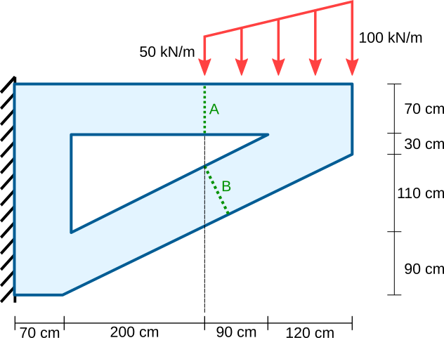

# Cálculo de una estructura por el método de los elementos finitos (para tensión plana).

Se requiere hacer el cálculo de las reacciones, los desplazamientos, deformaciones, esfuerzos, esfuerzos principales y cortante máximo, esfuerzos de von Mises, cálculo del momento flector y de la fuerza cortante en las secciones A y B de la estructura mostrada, utilizando el método de los elementos finitos para tensión plana. Se espera que el estudiante explore, comente, discuta los conceptos aprendidos en clase, los conceptos nuevos vistos en el software y que proponga soluciones a los problemas propuestos.

Trabajo de elaboración en grupos de DOS integrantes.

Fecha de entrega: se especificará en GOOGLE CLASSROOM. Por cada 8 horas de retraso se descontará una décima de la nota final.

## El problema propuesto
Considere la estructura mostrada:

Dicha estructura tiene un espesor de 50 cm y está hecha de un material con un módulo de Young *E* = 23 GPa y un coeficiente de Poisson *ν* = 0.20. Las secciones A y B son ortogonales a la vigas.

Para tal fin usar los métodos:
* De los EFs para tensión plana.
* Programa profesional de análisis estructural con el método de los elementos finitos.

Nota: En las secciones A y B se requiere estimar el momento flector *M* y la fuerza cortante *V*. Para esto, busque en su software una opción de "integración sobre superficie" en su software.

## Se solicita
* Calcular las reacciones en X y Y y el momento de empotramiento en el apoyo. Aquí no solo se debe mostrar como varían las reacciones en los nodos restringidos, sino que se debe calcular la resultante de dichas fuerzas.
* Mostrar los gráficos de los desplazamientos, deformaciones, esfuerzos, esfuerzos principales y cortante máximo τₘₐₓ (o el esfuerzo de Tresca)), esfuerzos de von Mises en la estructura.
* Mostrar la variación de los esfuerzos *σx* y *τxy* (en coordenadas locales) en el empotramiento y las secciones A y B.
* Calcular el momento flector y la fuerza cortante (en coordenadas locales) en las secciones A y B de la estructura mostrada.
* Comparar las respuestas obtenidas por ambos miembros del grupo y con el método de los EFs programado en MATLAB o PYTHON.
* Hacer un buen análisis de resultados. ¿Cómo se interpretan los gráficos?

NOTA: 
* Refine adecuadamente la malla de EFs y demuestre que utilizó las funcionalidades que provee el software para generar una buena malla. Una buena malla no refina innecesariamente donde no se necesita.
* Haga un estudio de convergencia de los resultados en ciertos puntos clave.

* **TRABAJO INDIVIDUAL**: cada integrante del grupo debe hacer los dos videos:
  * VIDEO 1 (máximo 20 minutos): en este video se debe explicar en detalle el modelado de la estructura escogida. Se deben mostrar los resultados sin interpretarlos. Se recomienda que el estudiante explore muy bien todas las funcionalidades del programa para la presentación de resultados (posprocesado). En el mismo video mostrar la comparación de los resultados obtenidos con MATLAB/PYTHON y con el programa escogido. No hay que hacer el análisis de resultados en el video. Esto lo hará en el trabajo escrito.

  * VIDEO 2 (máximo 30 minutos): en este video se debe hacer una reseña crítica de las capacidades, limitaciones y las hipótesis fundamentales que hace el programa en cuanto al análisis por tensión plana (es decir, en cuanto a la matemática interna para el cálculo: algoritmos para la solución de los sistemas de ecuaciones, tipos de elementos finitos usados, métodos para el refinamiento de la malla, métodos para verificar la calidad de la malla de EFs, etc.). OJO: no es mostrar como se utiliza el software, sino más mirar los manuales de referencia y mostrar que teorías, hipótesis, suposiciones, capacidades y limitaciones que tiene el programa escogido y que se utilizaron para calcular la estructura. Entregar, adicionalmente, el archivo PDF utilizado en la presentación de este video. Se sugiere para la presentación tomar capturas de pantalla de los manuales de referencia del programa en cuestión. OJO: no confunda esto con la información comercial. Lo que se está solicitando está dentro de los manuales de referencia.

  Algunos ejemplos de buenos análisis son:
     * STRUSOFT FEM-DESIGN (análisis de losas): https://www.youtube.com/watch?v=xxPzgIl-mEg    
     * MIDAS GEN (análisis de vigas): https://www.youtube.com/watch?v=p06pnzg2ZPg
  * En cada uno de los videos incluir una ventana pequeña en una de las esquinas donde se vea usted hablando sobre el software.
  * El video se debe subir a GOOGLE CLASSROOM, no a YouTube.

* **TRABAJO GRUPAL**: presentar un informe escrito que contenga el análisis de los resultados. Recuerde explicar detalladamente como varían las cantidades en el espacio, donde están las cantidades máximas y mínimas, como se relacionan unas gráficas con otras, etc. No es solo ubicar donde están los colores, o los máximos y los mínimos, sino decir, **por qué razón se produce esa coloración**, entendiendo como la estructura está cargada, está apoyada, se deforma, etc. Se sugiere [**este (descargue archivo .PDF)**](ejemplo_analisis_graficos.pdf) formato para presentar los resultados. En este informe se debe realizar la comparación de los resultados de los programas utilizados en su grupo, en caso que haya decidido hacer este trabajo grupalmente.

  NOTA 1: recuerde que se está evaluando el análisis de resultados. Por ejemplo con γxy: ¿qué quiere decir esta deformación? ¿cómo se está comportando en este punto la estructura dado ese valor de γxy? ¿por qué razón se produce? No es solo ubicar los máximos y los mínimos de dicha cantidad.

  NOTA 2: extensión máxima del informe 25 páginas. Incluya en el informe las gráficas obtenidas por todos los integrantes del grupo.

  NOTA 3: en ocasiones, cuando se tienen puntos de singularidad, esos valores son tan altos, que terminan opacando los colores en la estructura, mostrándolos como uno solo. En este caso, se sugiere usar una opción del software que limita los colores a mostrar a un rango. 

  NOTA 4: suba este informe a GOOGLE CLASSROOM en formato PDF.

### Otros criterios y notas
* Se solicita subir todos los archivos asociados al trabajo (.XLSX, .PDF, .MP4, .MKV, etc) directamente a GOOGLE CLASSROOM. Por favor no los empaquete en un archivo .ZIP o .RAR.

* Active en el software de captura de pantalla la opción para ver el ratón.

* Se espera que cada uno lea a fondo el manual del usuario del software. No se queden con los videos de YouTube. En el manual del usuario generalmente existe información importante sobre las hipótesis de modelado que hace cada software.

* Se sugiere aprender a manejar un programa de edición de videos. Esto les facilitará mucho su realización.

* Por mala calidad en el sonido se rebajarán 0.5 unidades. Por favor use un micrófono auxiliar (por ejemplo, un manos libres) y evite usar el micrófono del portátil para hacer el video.

* Si se sube un video de mala calidad (por ejemplo 720p de calidad o inferior) se rebajará 1.0 unidad. Mínimo 1080p. Recuerde que no tenemos limitación en el almacenamiento en GOOGLE CLASSROOM. En caso que su equipo no sea capaz de hacer videos con resolución 1080p, infórmelo previamente.

* Si modela la estructura como 3D a pesar que es una de tensión/deformación plana se tendrá menos 1.0 unidad. Se debe usar necesariamente la funcionalidad de tensión/deformación plana del programa de elementos finitos.

* Si se sube el video a YouTube, se tendrá menos 2.0 unidades. Los videos los debe subir directamente a GOOGLE CLASSROOM.

* Si se usa un software diferente al registrado, se tendrá menos 3.0 unidades.

* Si no se incluye en el video un recuadro donde se donde se vea usted hablando sobre el software se tendrá menos 3.0 unidades.

## Criterios de evaluación
* NOTA MAXIMA 6.0. Tenga en cuenta que la nota tiene un componente individual (los videos) y otro grupal (el informe escrito).

* **VIDEO 1**: Modelado de la estructura (30% = 1.8)
  * 0.1 Modeló adecuadamente las condiciones de frontera
  * 0.1 Calculó las reacciones en los apoyos  
  * 0.1 Calculó el diagrama de los desplazamientos y de la estructura deformada
  * 0.1 Calculó los diagramas de las deformaciones ɛx, ɛy, ɛz, los esfuerzos σx, σy, τxy (si falta alguno de estos gráficos, si se grafican sin curvas de nivel o sin escalas de colores discretas, y si no se ubican los máximos y los mínimos **no** se otorgarán puntos).
  * 0.1 Calculó el diagrama de las rotaciones.
  * 0.1 Calculó el diagrama de las dilataciones cúbicas.
  * 0.2 Calculó el diagrama de esfuerzos σ1, σ2 *y* sus respectivas inclinaciones (los diagramas de σ1 y σ2 sin sus respectivas inclinaciones no otorgarán puntos)
  * 0.1 Calculó el diagrama de esfuerzos de von Mises y/o Tresca y/o τₘₐₓ 
  * 0.2 Usa el consejo de como hacer buenas mallas
  * 0.7 Expone adecuadamente las capacidades del software en cuanto a la presentación de resultados (postprocesado). Se requiere para este punto que usted explore las opciones que le de el software para la presentación de resultados y gráficos: por curvas de nivel, rangos de colores, diferentes diagramas, cortes en las secciones que muestren como varían las cantidades, opciones para integrar los esfuerzos y obtener las fuerzas cortantes y los momentos flectores equivalentes, etc.
  NOTA: si usted usa un software que no calcula las cantidades anteriormente solicitadas, podría perder puntos. En tal caso, se sugiere cambiar de programa.

* **VIDEO 2 + PDF PRESENTACION**: Reseña de las capacidades/hipótesis/suposiciones/limitaciones del software (35% = 2.1)
  * 0.7 Hace un recuento de las teorías que soporta el programa, haciendo recortes del manual de referencia.
  * 0.7 Intenta entender las fórmulas del manual de referencia al verificar su equivalencia con las que se vieron en clase (en ocasiones toca convertir esas ecuaciones a nuestra nomenclatura para poder entenderlas, ya que los programas son usualmente mucho más generales y soportan más casos que los vistos en clase) y/o usan una nomenclatura diferente.
  * 0.7 Explica las ventajas/capacidades y limitaciones/suposiciones que hace el programa en cuanto al análisis estructural?

* **INFORME ESCRITO**: Análisis de resultados (35% = 2.1): interpreta gráficos, analiza como varían las cantidades en el espacio? Ubica máximos y mínimos? Relaciona gráficos entre si?
  * 0.4 Diagramas de los desplazamientos del sólido y las deformaciones ɛx, ɛy, ɛz, γxy, dilatación cúbica, rotación. 
  * 0.4 Diagramas de esfuerzos σx, σy, τxy. 
  * 0.2 Diagramas de esfuerzos σ1, σ2 con sus inclinaciones (si no tiene las inclinaciones θ₁ y θ₂, se tendrá un 0.0 en este punto). 
  * 0.3 Diagramas de esfuerzos de von Mises, de Tresca y/o τₘₐₓ
  * 0.4 Reacciones en los apoyos, fuerzas puntuales y momentos flectores equivalentes. Nota. Las fuerzas puntuales y los momentos flectores equivalentes en las reacciones se encuentran usando en el software una opción llamada "Integrate over surface".
  * 0.4 Se calculan los momentos flectores y las fuerzas cortantes (en coordenadas locales) en los cortes A y B.

* **COMPONENTE DE PROGRAMACION** (punto obligatorio, si no se realiza alguno de los puntos, se tendrán menos 3.0 unidades): 
  * Resolver el problema usando EFs triangulares isoparamétricos de 10 nodos.
  * La malla se debe generar con el programa GMSH.
  * Preferiblemente, mostrar los resultados en PARAVIEW.

* Por mala calidad en el sonido se rebajarán 0.5 unidades. Por favor use un micrófono auxiliar (por ejemplo, un manos libres) y evite usar el micrófono del portátil para hacer el video.

* Si se sube un video de mala calidad (por ejemplo 720p de calidad o inferior) se rebajará 1.0 unidad. Mínimo 1080p. Recuerde que no tenemos limitación en el almacenamiento en GOOGLE CLASSROOM. En caso que su equipo no sea capaz de hacer videos con resolución 1080p, infórmelo previamente.

* Si modela la estructura como 3D y no usando el caso de tensión planas se tendrá menos 3.0 unidades. Se debe usar necesariamente la funcionalidad de caso axisimétrico del programa de elementos finitos.

* Si se sube el video a YouTube, se tendrá menos 2.0 unidades. Los videos los debe subir directamente a GOOGLE CLASSROOM.

* Si se usa un software diferente al registrado, se tendrá menos 3.0 unidades.

* Si se modela una estructura diferente a la registrada, se tendrá menos 3.0 unidades.

* Si no se incluye en el video un recuadro donde se donde se vea usted hablando sobre el software se tendrá menos 3.0 unidades. En caso de que no tenga cámara de video podría utilizar aplicaciones como [DroidCam](https://play.google.com/store/apps/details?id=com.dev47apps.droidcam) o [DroidCam OBS](https://play.google.com/store/apps/details?id=com.dev47apps.obsdroidcam), con los cuales se puede utilizar su celular como cámara para el computador.
