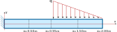

# Taller 1: modelado de una viga utilizando elementos finitos triangulares de 3 nodos

Con el objeto de contrastar la teoría aprendida y la práctica mediante el uso de un software profesional de análisis estructural, se requiere hacer el análisis de los desplazamientos, diagramas de momento flector y de fuerza cortante en una viga con diferentes alturas. Se espera que el estudiante explore, comente, discuta los conceptos aprendidos en clase, los conceptos nuevos vistos en el software y que proponga soluciones a los problemas propuestos.

Trabajo de elaboración individual.

Fecha de entrega: se especificará en GOOGLE CLASSROOM. Por cada 8 horas de retraso se descontará una décima de la nota final.

## El problema propuesto
Considere la viga mostrada:

Dicha viga tiene una sección rectangular de 5 cm de ancho y $h$ de alto, tiene una luz de 2 metros y está hecha de un material con un módulo de Young $E$ = 2 GPa y un coeficiente de Poisson $\nu$ = 0.30. La altura $h$ tomará los valores de 0.2 m y 2.0 m. La carga de la viga valdrá 100 kN/m y 10000 kN/m para las alturas de 0.2 m y 2.0 m respectivamente.

Utilizando los siguientes métodos:
* Método de los elementos finitos 2D (tensión plana) con EFs triangulares de 3 nodos y los programas que se encuentran en GITHUB (MATLAB o PYTHON).
* Programa de análisis estructural que usted registró en ***. NOTA: no se puede tener un software similar al de alguno de sus compañeros.

Se solicita calcular y graficar:

1. Malla de EFs generada con el software GMSH.

2. El desplazamiento vertical $v(x)$ en la y = 0$.

3. La variación de los esfuerzos $\sigma_x(y)$ y $\tau_{xy}$ en las secciones transversales de la viga indicadas (x=0.50m, 0.95m, 1.50m).

4. El momento flector y la fuerza cortante en dichas secciones transversales.

5. Las reacciones en el apoyo (y la distribución de dichas reacciones en la altura).

6. Compare las respuestas obtenidas contra las metodologías estudiadas en el curso de análisis estructural (solución analítica).

7. Haga un video de máximo 10 minutos explicando como modeló dicha viga con el software profesional. Cada uno de los integrantes del grupo debe resolver individualmente este punto, usando un programa diferente al resto de compañeros del curso.

8. Compare todas las soluciones obtenidas anteriormente, incluyendo la del software profesional. ¿Cuales son los porcentajes de error obtenidos? ¿Cual es el método más aproximado a la solución analítica?

<!---

## Criterios de evaluación
* Por cada punto no resuelto se tendrá una 1.0 unidad menos.

* Punto 1:    
   - 0.3 Incluye la deducción de las fórmulas en el informe

* Punto 2: 
   - 0.5 ¿Funciona adecuadamente el programa, teniendo en cuenta que el área transversal de la barra es variable?
   - 0.3 El programa funciona para *n* variable
   - 0.2 ¿Estimó adecuadamente el esfuerzo en los puntos de Barlow?

* Punto 3: 
   - 0.3 Hace la comparación contra EFs de área constante (use 12 EFs)

* Punto 4:
  - Si no se realiza este punto o simplemente funciona mal se tendrán 2.0 unidades menos.

* Punto 5 (por cada video. Si hace el trabajo solo, estos puntos se multiplican por 2):
  - 0.1 Modeló adecuadamente los apoyos? la estructura? el material?
  - 0.3 Interpretó adecuadamente los gráficos resultantes? Ubicó los esfuerzos/deformaciones/desplazamientos máximos y mínimos? Hace un adecuado análisis de resultados?
  - 0.6 Exploró todas las capacidades de visualización de resultados que ofrece el software?  
  - si no se realiza este punto se tendrán 2.0 unidades menos por cada video no presentado.

* Punto 6:
  - 0.5 Compara adecuadamente todos los métodos empleados contra la solución exacta.
  - 0.9 Hace un adecuado análisis de resultados?

* 0.5 unidades por programar algo novedoso que mejore notablemente algún aspecto del código.

# Otros criterios y notas
* Se solicita subir todos los archivos asociados al trabajo (.XLSX, .PDF, .MP4, .MKV, etc) directamente a GOOGLE CLASSROOM. Por favor no los empaquete en un archivo .ZIP o .RAR.

* Lo solicitado se debe subir a la plataforma GOOGLE CLASSROOM en formato PDF. El video se debe subir a GOOGLE CLASSROOM, no a YouTube u otra plataforma de videos. El video debe contener un recuadrito en el cual se vea a usted exponiendo el tema.

* Se deben entregar las presentaciones utilizadas en los videos en formato PDF.

* Informe máximo de 15 páginas. NOTA: no incluir en el trabajo escrito códigos de programación, excepto pequeños bloques de máximo 10 o 15 reglones, en caso de ser necesario.

* Se sugiere aprender a manejar un programa de edición de videos. Esto les facilitará grandemente la realización del mismo.

* No los voy a penalizar en caso que ustedes obtengan desplazamientos diferentes a los que deberían dar. La experiencia nos ha demostrado que hay programas que simplemente no funcionan adecuadamente (aunque son pocos). Sin embargo, el estudiante debe demostrar en el video que modeló correctamente la estructura.

* Active en el software de captura de pantalla la opción para ver el ratón.

* Por mala calidad en el sonido se rebajarán 0.5 unidades. Por favor use un micrófono auxiliar (por ejemplo, un manos libres) y evite usar el micrófono del portátil para hacer el video.

* Si se sube un video de mala calidad (por ejemplo 720p de calidad o inferior) se rebajará 1.0 unidad. Mínimo 1080p. Recuerde que no tenemos limitación en el almacenamiento en GOOGLE CLASSROOM. En caso que su equipo no sea capaz de hacer videos con resolución 1080p, infórmelo previamente.

* Por cada día de retrazo se descontarán 3 décimas de la nota final.

* Si se sube el video a YouTube, se tendrá menos 2.0 unidades. Los videos los debe subir directamente a GOOGLE CLASSROOM.

* Si se usa un software diferente al registrado, se tendrá menos 3.0 unidades.

* Si se modela una estructura diferente a la registrada, o si se modela usando EFs 3D, se tendrá menos 3.0 unidades.

* Si no se incluye en el video un recuadro donde se donde se vea usted hablando sobre el software se tendrá menos 3.0 unidades.

* Si tienen dudas, por favor hágalas en el grupo de WhatsApp del curso, no a al WhatsApp personal del profesor.

* NOTA MAXIMA FINAL = 5.5

--->

<!---
## Se solicita
  * Explique qué es lo que observa en los gráficos.
  * Realice un estudio similar al mostrado en la Sección 9.2 del `main.pdf`, en los que se compare:
    * *v(x,0)* calculado con el método de los EFs 2D con el desplazamiento vertical *v(x)* estimado con las teorías de EB y TE.
    * *v(x,y)*, *σₓ(x,y)* y *τₓᵧ(x,y)* para diferentes puntos de la viga calculado con el método de los EFs 2D con el  estimado con las teorías de EB y TE.
    * Se calcule la fuerza cortante *V(x)*, el momento flector *M(x)* y la fuerza axial *P(x)* para diferentes puntos de la viga con el método de los EFs 2D y con el  estimado con las teorías de EB y TE. Para tal fin se deben emplear las ecuaciones:   
--->
<!---
Compile en: https://tex.s2cms.com

\begin{align*}
V(x) &= - \iint_{A(x)}   \tau_{xy}(x,y,z) \operatorname{d} y \operatorname{d} z \\
M(x) &= - \iint_{A(x)} y \sigma_{x}(x,y,z) \operatorname{d} y \operatorname{d} z \\
P(x) &= + \iint_{A(x)}   \sigma_{x}(x,y,z) \operatorname{d} y \operatorname{d} z 
\end{align*}
--->
<!---
 %20%26%3D%20-%20%5Ciint_%7BA(x)%7D%20%5Ctau_%7Bxy%7D(x%2Cy%2Cz)%20%5Coperatorname%7Bd%7D%20y%20%5Coperatorname%7Bd%7D%20z%20%5C%5C%0AM(x)%20%26%3D%20-%20%5Ciint_%7BA(x)%7D%20y%20%5Csigma_%7Bx%7D(x%2Cy%2Cz)%20%5Coperatorname%7Bd%7D%20y%20%5Coperatorname%7Bd%7D%20z%20%5C%5C%0AP(x)%20%26%3D%20%2B%20%5Ciint_%7BA(x)%7D%20%5Csigma_%7Bx%7D(x%2Cy%2Cz)%20%5Coperatorname%7Bd%7D%20y%20%5Coperatorname%7Bd%7D%20z%20%0A%5Cend%7Balign*%7D)

  * No es necesario escribir una introducción o un marco teórico que contenga la metodología vista en clase.

* Dos videos:
  * VIDEO 1 (máximo 20 minutos): hacer un video que ilustre como resolvió la viga utilizando el programa seleccionado. En el mismo video mostrar la comparación de los resultados obtenidos con MAXIMA y con el programa escogido (usando las teorías de EB, TE y el método de los EFs para tensión plana).

  * VIDEO 2 (máximo 20 minutos): en este video se debe hacer una reseña crítica de las capacidades teóricas y las hipótesis fundamentales que hace el programa en cuanto al **ANALISIS DE VIGAS Y PÓRTICOS** (es decir, en cuanto a la matemática interna para el cálculo de desplazamientos, diagramas de momento flector, fuerza cortante, etc). OJO: no es mostrar como se utiliza el software, sino más mirar los manuales de referencia del mismo y mostrar que teorías, hipótesis, suposiciones, capacidades y limitaciones que tiene el programa escogido y que se utilizaron para calcular la viga. Entregar, adicionalmente, el archivo PDF utilizado en la presentación de este video. Se sugiere para la presentación tomar capturas de pantalla de los manuales de referencia del programa en cuestión. OJO: no confunda esto con la información comercial. Lo que se está solicitando está dentro de los manuales de referencia. Algunos ejemplos de buenos análisis son:
     * MIDAS GEN (análisis de vigas): https://www.youtube.com/watch?v=p06pnzg2ZPg
     * STRUSOFT FEM-DESIGN (análisis de losas): https://www.youtube.com/watch?v=xxPzgIl-mEg

* Se solicita subir todos los archivos asociados al trabajo (.XLSX, .DOCX, .MP4, .MKV, archivo de MAXIMA, etc) directamente a GOOGLE CLASSROOM. Por favor no los empaquete en un archivo .ZIP o .RAR.

* Active en el software de captura de pantalla la opción para ver el ratón.

Se espera que cada uno lea a fondo el manual del usuario del software. No se queden con los videos de YouTube. En el manual del usuario generalmente existe información importante sobre las hipótesis de modelado que hace cada software.

Se sugiere aprender a manejar un programa de edición de videos. Esto les facilitará grandemente la realización del mismo.

## Criterios de evaluación
* NOTA MAXIMA 6.0

* Análisis y comparación de los resultados con diferencias finitas, funciones de singularidad y el software de EFs (60% = 3.6)
  * 0.3 Calculo de reacciones, *V*, *M*, *θ*, *v* con MS EXCEL + diferencias finitas + EB
  * 0.2 Calculo de reacciones, *V*, *M*, *θ*, *v* con MAXIMA + funciones de singularidad + EB
  * 0.3 Calculo de reacciones, *V*, *M*, *θ*, *v* con MAXIMA + funciones de singularidad + TE (empotramientos suave y duro)
  * 0.6 VIDEO 1: Calculo de reacciones, *V*, *M*, *θ*, *v* con el software profesional haciendo un ingreso adecuado de datos. Comparar contra:
     * Método de las funciones de singularidad + EB
     * Método de las funciones de singularidad + TE
     * Método de los EFs para tensión plana
  * Si no se realiza el video 1, se tendrá -2.0 unidades.
  * 0.5 Compara, analiza, hace tablas y/o gráficas comparativas de los resultados entre los diferentes métodos que usan la teoría de Euler-Bernoulli. ¿Explica el por qué de las diferencias?
  * 0.6 Compara, analiza, hace tablas y/o gráficas comparativas de los resultados entre los diferentes métodos que usan la teoría de Timoshenko-Ehrenfest y calcula el porcentaje de diferencia entre los resultados para los diferentes tipos de empotramientos. ¿Compara respuestas entre los diferentes empotramientos de Timoshenko (rígido/suave) y el software? ¿Explica el por qué de las diferencias?
  * 0.5 Compara, analiza, hace tablas y/o gráficas comparativas de los resultados entre el método de EB y el de TE estimados por el método de las funciones de singularidad? ¿Explica el por qué de las diferencias?
  * 0.6 Compara, analiza, hace tablas y/o gráficas comparativas de los resultados entre el método de los EFs para tensión plana y por el método de las funciones de singularidad? ¿Explica el por qué de las diferencias?

* VIDEO 2: reseña crítica de las capacidades teóricas y las hipótesis fundamentales que hace el programa en cuanto al análisis de viga (40% = 2.4)
  * 0.8 Hace un recuento de las teorías que soporta el programa, haciendo recortes del manual de referencia del mismo. Explica capacidades de cálculo y teorías que utiliza el software. 
  * 0.8 Explica hipótesis fundamentales y consejos en el modelado según se detalla en el manual del programa; hace una reseña crítica de las capacidades teóricas, las limitaciones y las hipótesis fundamentales que hace el programa en cuanto al análisis de viga
  * 0.8 Hace una reseña crítica de las ventajas/capacidades y limitaciones/suposiciones que hace el programa en cuanto al análisis de vigas y pórticos

* Por mala calidad en el sonido se rebajarán 0.5 unidades. Por favor use un micrófono auxiliar (por ejemplo, un manos libres) y evite usar el micrófono del portátil para hacer el video.

* Si se sube un video de mala calidad (por ejemplo 720p de calidad o inferior) se rebajará 1.0 unidad. Mínimo 1080p. Recuerde que no tenemos limitación en el almacenamiento en GOOGLE CLASSROOM.

* Si se usa un software diferente al registrado, se tendrá menos 2.0 unidades.

* Por cada día de retrazo se descontarán 3 décimas de la nota final.
--->