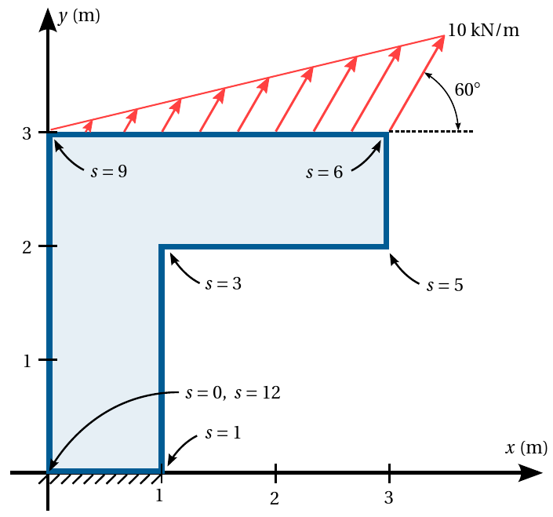

# Taller 1: modelado de una viga utilizando elementos finitos de tensión plana

Con el objeto de contrastar la teoría aprendida y la práctica mediante el uso de un software profesional de análisis estructural, se requiere hacer el análisis de los desplazamientos, diagramas de momento flector y de fuerza cortante en una sección transversal de un pórtico. Se espera que el estudiante explore, comente, discuta los conceptos aprendidos en clase, los conceptos nuevos vistos en el software y que proponga soluciones a los problemas propuestos.

Calculos realizados de forma individual con el software profesional; elaboración del trabajo escrito en grupos de máximo 3 personas.

Fecha de entrega: se especificará en GOOGLE CLASSROOM. Por cada 8 horas de retraso se descontará una décima de la nota final.

## El problema propuesto
Considere el pórtico mostrado:

Este tiene una profundidad de 30 cm y está hecho de un material ortótropo, cuyas propiedades en sus direcciones principales son $E_1 = 9000$ MPa, $E_2 = 700$ MPa, $G_{12} = 600$ MPa, $\nu_{12} = 0.21$, $\alpha_1 = 12 \times 10^{-6}/°\text{C}$ y $\alpha_2 = 9 \times 10^{-6}/°\text{C}$; la dirección principal 1 está inclinada 30° en sentido antihorario con respecto al eje $x$. Adicionalmente, el material tiene una densidad $\rho = 1200$ kg/m³ y la estructura está sujeta a un cambio de temperatura $\Delta T$ de 30°C.

Utilizando los siguientes métodos:
* Método de los elementos finitos 2D (tensión plana) con EFs de tensión plana y los programas que se encuentran en GITHUB (MATLAB o PYTHON).
* Programa de análisis estructural que usted registró en GOOGLE CLASSROOM. NOTA: no se puede tener un software similar al de alguno de sus compañeros del curso.

## Se solicita

### En el informe escrito (grupal):
Se solicita calcular y graficar:

* Malla de EFs generada con el software GMSH. (OBLIGATORIO)

* Los gráficos con escala de colores y curvas de nivel que muestren la variación de los esfuerzos (incluyendo los esfuerzos principales con sus inclinaciones), las deformaciones y los desplazamientos. (OBLIGATORIO con PYTHON/MATLAB y el software profesional de EFs).

* El desplazamiento vertical $v(x,y)$ en $y = 2.5$ m. (OBLIGATORIO)

* La variación de los esfuerzos $\sigma_x(y)$ y $\tau_{xy}(y)$ en las secciones transversales de la viga indicadas ($x$=1.05 m, 2.95 m). (OBLIGATORIO)

* El momento flector, la fuerza cortante y la fuerza axial en las secciones transversales indicadas. Para tal fin se deben emplear las ecuaciones: (+10 décimas) 
$$V(x) = - \iint_{A(x)}   \tau_{xy}(x,y,z)\ \text{d} y \text{d} z$$

$$M(x) = - \iint_{A(x)} y \sigma_{x}(x,y,z)\ \text{d} y \text{d} z$$

$$f_\text{axial}(x) = + \iint_{A(x)} \sigma_{x}(x,y,z)\ \text{d} y \text{d} z$$

* Las reacciones en el apoyo y la distribución de dichas reacciones en $x$. (+10 décimas)

* Análisis de resultados: compare todas las soluciones obtenidas anteriormente, incluyendo la del software profesional y la de sus compañeros. ¿Cuales son los porcentajes de diferencia entre las diferentes soluciones? (+25 décimas):
  - 0.5 Compara adecuadamente todos los métodos empleados.
  - 1.0 Explica qué es lo que observa en los gráficos.
  - 1.0 Hace un adecuado análisis de resultados? ¿Explica el por qué de las diferencias entre los resultados?
  - Recuerde explicar detalladamente como varían las cantidades en el espacio, donde están las cantidades máximas y mínimas, como se relacionan unas gráficas con otras, etc. No es solo ubicar donde están los colores, o los máximos y los mínimos, sino decir, **por qué razón se produce esa coloración**, entendiendo como la estructura está cargada, está apoyada, se deforma, etc. Se sugiere [**este (descargue archivo .PDF)**](https://github.com/diegoandresalvarez/solidos/blob/master/talleres/solidos1/ejemplo_analisis_graficos.pdf) formato para presentar los resultados. Por ejemplo con γxy: ¿qué quiere decir esta deformación? ¿cómo se está comportando en este punto la estructura dado ese valor de γxy? ¿por qué razón se produce? No es solo ubicar los máximos y los mínimos de dicha cantidad.
  - Para este análisis no hay que necesidad de poner los gráficos de todos los compañeros, sino de uno solo, ya que se espera que todas las figuras sean similares.

* Nota extra: 5 décimas por programar algo novedoso que mejore notablemente algún aspecto del código. En este caso dichas décimas se agregarán de forma individual y no grupal.

* Por cada punto no resuelto se descontarán 20 unidades de la nota final.

### En el video 1 (individual):
Haga un video de máximo 15 minutos explicando como modeló dicha estructura con el software profesional. Cada uno de los integrantes del grupo debe resolver individualmente este punto, usando un programa diferente al resto de compañeros del curso. (+10 décimas; sin embargo, si no se realiza, se descontarán 30 décimas):
  - 0.4 Modeló adecuadamente los apoyos? la estructura? el material?
  - 0.6 Exploró todas las capacidades de visualización de resultados que ofrece el software?

### En el video 2 (individual):
Haga un video de máximo 15 minutos con una reseña crítica de las capacidades teóricas y las hipótesis fundamentales que hace el programa. OJO: no es mostrar como se utiliza el software, sino mirar los manuales de referencia y mostrar que teorías, hipótesis, suposiciones, capacidades y limitaciones que tiene el programa escogido y que se utilizaron para calcular la estructura. Entregar, adicionalmente, el archivo PDF utilizado en la presentación de este video. Se sugiere para la presentación tomar capturas de pantalla de los manuales de referencia del programa en cuestión. OJO: no confunda esto con la información comercial. Lo que se está solicitando está dentro de los manuales de referencia. Algunos ejemplos de buenos análisis son:
  * MIDAS GEN (análisis de vigas): https://www.youtube.com/watch?v=p06pnzg2ZPg
  * STRUSOFT FEM-DESIGN (análisis de losas): https://www.youtube.com/watch?v=xxPzgIl-mEg

Se espera que cada uno lea a fondo el manual del usuario del software. No se queden con los videos de YouTube. En el manual del usuario generalmente existe información importante sobre las hipótesis de modelado que hace cada software. (+10 décimas; sin embargo, si no se realiza, se descontarán 30 décimas):
  - 0.4 Hace un recuento de las teorías que soporta el programa, haciendo recortes del manual de referencia del mismo. Explica capacidades de cálculo y teorías que utiliza el software. 
  - 0.4 Explica hipótesis fundamentales y consejos en el modelado según se detalla en el manual del programa.
  - 0.2 Hace una reseña crítica de las ventajas/capacidades y limitaciones/suposiciones que hace el programa.

# Otros criterios y notas
* Se solicita subir todos los archivos asociados al trabajo (.XLSX, .PDF, .MP4, .MKV, etc) directamente a GOOGLE CLASSROOM. Por favor no los empaquete en un archivo .ZIP o .RAR.

* Lo solicitado se debe subir a la plataforma GOOGLE CLASSROOM en formato PDF. Los videos se debe subir a GOOGLE CLASSROOM, no a YouTube u otra plataforma de videos. Estos deben contener un recuadrito en el cual se vea a usted exponiendo el tema. Si no se incluye el recuadro se descontarán 30 décimas.

* Se deben entregar las presentaciones utilizadas en los videos en formato PDF.

* En ocasiones, cuando se tienen puntos de singularidad, esos valores son tan altos, que terminan opacando los colores en la estructura, mostrándolos como uno solo. En este caso, se sugiere usar una opción del software que limita los colores a mostrar a un rango. 

* Informe máximo de 25 páginas.
  * No incluir en el trabajo escrito códigos de programación, excepto pequeños bloques de máximo 10 o 15 reglones, en caso de ser necesario.
  * No es necesario escribir una introducción o un marco teórico que contenga la metodología vista en clase.

* Se sugiere aprender a manejar un programa de edición de videos. Esto les facilitará grandemente su realización.

* No los voy a penalizar en caso que ustedes obtengan desplazamientos diferentes a los que deberían dar. La experiencia ha demostrado que hay programas que simplemente no funcionan adecuadamente (aunque son pocos). Sin embargo, el estudiante debe demostrar en el video que modeló correctamente la estructura.

* Active en el software de captura de pantalla la opción para ver el ratón.

* Por mala calidad en el sonido se rebajarán 5 décimas. Por favor use un micrófono auxiliar (por ejemplo, un manos libres) y evite usar el micrófono del portátil para hacer el video.

* Si se sube un video de mala calidad (por ejemplo 720p de calidad o inferior) se rebajará 5 décimas. Mínimo 1080p. Recuerde que no tenemos limitación en el almacenamiento en GOOGLE CLASSROOM. En caso que su equipo no sea capaz de hacer videos con resolución 1080p, infórmelo previamente.

* Si se sube el video a YouTube, se descontarán 20 décimas. Los videos los debe subir directamente a GOOGLE CLASSROOM.

* Si se usa un software diferente al registrado, se descontarán 30 décimas.

* Si se modela una estructura diferente a la registrada, o si se modela usando EFs 3D, se descontarán 30 décimas. Obligatoriamente debe modelarse utilizando la opción de tensión plana de su software. Mucho cuidado con este punto, ya que existen programas comerciales que no permiten modelar tensión plana y solo permiten modelar estructuras como 3D.

* NOTA MAXIMA FINAL = 6.0