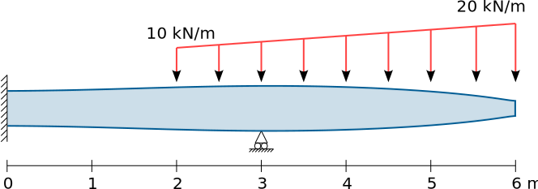
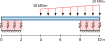

# Taller de vigas

Con el objeto de verificar la validez de las formulaciones de elementos finitos asociados a las teorías de:
* Euler-Bernoulli
* Timoshenko-Ehrenfest 
* Winkler

se requiere hacer el análisis en diferentes vigas de 
* desplazamientos verticales *w*
* diagrama de momento flector *M*
* diagrama de fuerza cortante *V*
* ángulo de giro de la sección transversal *θ*
* reacciones 

y comparar los resultados obtenidos con los estimados con la solución de la ecuación diferencial respectiva.

Se espera que el estudiante explore, comente, discuta los conceptos aprendidos en clase y que proponga soluciones a los problemas propuestos.

Trabajo de elaboración en parejas.

Fecha de entrega: se especificará en GOOGLE CLASSROOM. Por cada cuatro horas de retraso se descontará una décima de la nota final.

## Problema 1:
Considere la viga mostrada:

la cual tiene una sección rectangular variable, cuya altura está descrita por la ecuación $r = 0.3 - 0.025(0.01 \exp(1.1 x) + \sqrt{6-x} + \cos(x))$. La viga está hecha de un material con un módulo de Young *E* = 13 GPa y un coeficiente de Poisson *ν* = 0.20. Asuma el espesor *b* = 0.1 m.

Se solicita:
* Desarrollar un EF de viga de Euler-Bernoulli de tres nodos de área transversal variable. (+1.0 punto)
* Calcular con el EF anteriormente propuesto la viga utilizando mínimo 7 EFs. (+1.0 puntos)
* Comparar la solución anterior con la solución calculada mediante `bvp4c()` o `bvp5c()`. (+0.5 puntos)

## Problema 2:
Considere la viga mostrada:

la cual tiene una sección rectangular con *b* = 0.1 m y *h* = 0.2 m. La viga está hecha de un material con un módulo de Young *E* = 13 GPa y un coeficiente de Poisson *ν* = 0.20. La cimentación elástica tiene un módulo de balastro k = 2000 kN/m.

Se solicita:
* Calcular con un EF de viga de Timoshenko-Ehrenfest + Winkler de dos nodos deducido a partir de la solución de la ecuación diferencial asociada. (+1.0 punto)
* Calcular con un EF de viga de Timoshenko-Ehrenfest + Winkler donde la acción de los resortes se calcule con el método de la matriz de rigidez auxiliar asociada a la cimentación elástica. (+0.5.0 punto)
* Comparar la solución anterior con la solución calculada mediante `bvp4c()` o `bvp5c()`. (+0.5 puntos)
* Calcule la respuesta con el software de análisis estructural de su elección (+0.5)

## Problema 3:
Implementar el artículo:

>    Adhikari (2021) - Exact transcendental stiffness matrices of general beam-columns embedded in elastic mediums. Computers & Structures, Volume 255, 15 October 2021, 106617. https://doi.org/10.1016/j.compstruc.2021.106617

* Deducir las ecuaciones del paper, ya sea en MATLAB o en PYTHON+JUPYTER (+3 puntos)
* Implementar el artículo, ya sea en MATLAB o en PYTHON+JUPYTER, ejemplificandolo con la viga del Problema 2 y asumiendo los datos faltantes. (+3 puntos)

NOTA: esos 6 puntos anteriores se agregarán al examen 1, pero sin superar la nota de 6.0 en el examen + estos puntos adicionales del Problema 3.

## Lo solicitado en el informe
Hacer un informe donde se:
* Comparen todas las respuestas; recuerde hacer cálculos de los porcentajes de error para mirar las diferencias entre las respuestas.
* Haga diagramas que comparen los resultados obtenidos entre las diferentes metodologías. ¿Cuál método calculó las reacciones, momentos de flexión, fuerzas cortantes y desplazamientos más altos y más pequeños?

## Material a entregar
Lo solicitado se debe subir a la plataforma GOOGLE CLASSROOM en formato PDF. El video se debe subir a GOOGLE CLASSROOM, no a YouTube u otra plataforma de videos. El video debe contener un recuadrito en el cual se vea a usted exponiendo el tema.

* VIDEO: Hacer un video de no más de 10 minutos que ilustre como resolvió el Problema 2 con el software. No hay que hacer el análisis de resultados en el video. Esto lo hará en el trabajo escrito.

* Informe del trabajo con el análisis de resultados.

* Envíe, adicionalmente, los archivos de MAXIMA, PYTHON, etc y del software empleado asociados a este ejercicio.

## Criterios de calificación

FALTA

<!---

### Trabajo principal (NOTA MAXIMA: 6.0)
* Calcula y grafica reacciones, *V*, *M*, *θ*, *v* con (cada punto es obligatorio, por cada punto no realizado se tendrá -1.0 unidades):
  * 0.3 EB + método matricial
  * 0.3 TE + método matricial
  * 0.3 EB + método funciones de discontinuidad
  * 0.3 TE + método funciones de discontinuidad
  * VIDEO: 0.3 EB + software que calcula vigas
  * VIDEO: 0.3 TE + software que calcula vigas
  * VIDEO: 0.6 Calcula reacciones, desplazamientos, deformaciones y esfuerzos usando EFs de tensión plana. Debe tener en cuenta los consejos para hacer buenas mallas, no simplemente hacer una malla supertupida. Se aconseja refinar sobre la línea de la sección transversal.
* Estima a partir de *σₓ* y cada *τxz* para cada altura de la viga y para cada sección transversal (cada punto es obligatorio, por cada combinación al altura/sección transversal no realizada se descontarán 2 décimas. Tenga en cuenta que son 3 alturas y 8 secciones):
  * VIDEO: 0.6 Estima a partir de *σₓ* el momento flector *M*.
  * VIDEO: 0.6 Estima a partir de *τxz* la fuerza cortante *V*.

* INFORME: Análisis de resultados (cada punto es obligatorio, por cada punto no realizado se tendrá -2.0 unidades):
  * 1.0 compara entre sí y analiza los trés métodos de EB y los tres métodos de TE.
  * Compara contra los métodos de EB y TE los resultados obtenidos con el método de los EFs para tensión plana. Los resultados deben aparecer en el mismo gráfico que aquellos estimados por la teoría de vigas (similar a como aparece en el `main.pdf`, en la sección 9.2)
     * 0.4 *σₓ* 
     * 0.4 *τxz* (¿compara, adicionalmente, contra la fórmula de Collingnon-Jourawski?)
     * 0.4 *u*
     * 0.4 *w*
     * 0.4 *M* y *V*
     * 0.4 reacciones en los apoyos
  * NOTA: Hacer gráficos y/o tablas comparativos. Calcule porcentajes de error y explique los motivos por los que se tienen esas diferencias. Compare reacciones en los apoyos, diagramas de *V*, *M*, *θ* y *w* y explica el porqué de las diferencias.
--->

### Otros criterios y notas
* Active en el software de captura de pantalla la opción para ver el ratón.

* Por mala calidad en el sonido se rebajarán 0.5 unidades. Por favor use un micrófono auxiliar (por ejemplo, un manos libres) y evite usar el micrófono del portátil para hacer el video.

* Si se sube un video de mala calidad (por ejemplo 720p de calidad o inferior) se rebajará 1.0 unidad. Mínimo 1080p. Recuerde que no tenemos limitación en el almacenamiento en GOOGLE CLASSROOM. En caso que su equipo no sea capaz de hacer videos con resolución 1080p, infórmelo previamente.

* Si modela la estructura como 3D a pesar que es una de tensión/deformación plana se tendrá menos 1.0 unidad. Se debe usar necesariamente la funcionalidad de tensión/deformación plana del programa de elementos finitos (excepto si puede demostrar que este software no tiene esa opción).

* Si se sube el video a YouTube, se tendrá menos 2.0 unidades. Los videos los debe subir directamente a GOOGLE CLASSROOM.

* Si se usa un software diferente al registrado, se tendrá menos 3.0 unidades.

* Si se modela una estructura diferente a la registrada, se tendrá menos 3.0 unidades.

* Si no se incluye en el video un recuadro donde se donde se vea usted hablando sobre el software se tendrá menos 3.0 unidades.