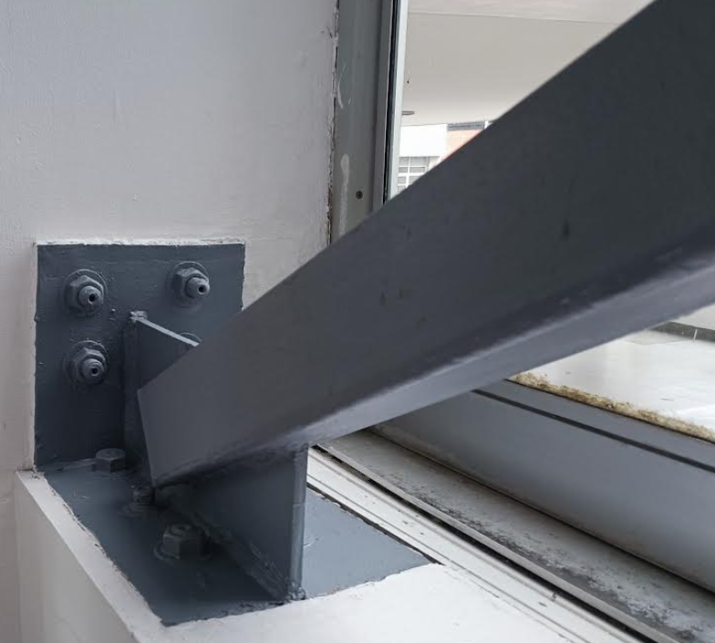

# Taller 3: modelado de una unión metálica utilizando un software profesional

* Fecha y hora de entrega de los videos y del informe: Ver GOOGLE CLASSROOM. Por cada hora de retraso en la entrega del trabajo se descontará 3 décimas de la nota final.

La idea de este trabajo es modelar mediante un programa profesional la unión metálica mostrada:

Esta unión metálica es la que está en el Piso 1 del bloque C, al lado de la puerta de la universidad que da hacia el Hall Cumanday.

<!---
la cual está contenida en el archivo [union_metalica_C410.iges](figs/union_metalica_C410.iges) utilizando elementos finitos de cascarón. Esta unión metálica es la que está en la esquina inferior y de la parte posterior del salón C410. El archivo fue amablemente creado por Juan Esteban Ossa Ossa (jueossaos@unal.edu.co).
--->

Las fuerzas/momentos que debe soportar la unión, a 1 metro de la placa vertical, son:
* A = 100 kN
* V = 50 kN
* M = 70 kN-m

Las propiedades del material serán:
* [Acero estructural ASTM-A36](https://en.wikipedia.org/wiki/A36_steel).
* Módulo de elasticidad: 200 GPa.
* Densidad: 7800 kg/m³
* Coeficiente de Poisson: 0.26
* Esfuerzo de fluencia: 250 MPa

La nota obtenida en este trabajo estará dada por:
* INDIVIDUAL: videos: 75%
* GRUPAL: informe: 25%

## Programa a utilizar
Cada estudiante debe utilizar un programa diferente. 
<!---
Reportar el programa a utilizar en [http://solidos2019b.shoutwiki.com/wiki/Software_para_análisis_estructural_por_elementos_finitos](http://solidos2019b.shoutwiki.com/wiki/Software_para_an%C3%A1lisis_estructural_por_elementos_finitos).
--->

## Trabajo individual
Se solicita realizar un video tutorial que ilustre lo siguiente:
* Explicar detalladamente como se modelaron las condiciones de apoyo, las cargas y los criterios con los que se creó la malla de elementos finitos (+0.5 unidades).
* Hacer el cálculo de los diagramas de desplazamiento, esfuerzos y deformaciones. Los esfuerzos y las deformaciones máximas se deben graficar con sus respectivas direcciones. (+0.5 unidades).
* Calcular las tracciones en cada tornillo del apoyo (+0.5 unidades).
* Hacer un refinamiento de la malla utilizando el método p y el método h (+0.5 unidades).
* Analizar la calidad de la malla utilizando las herramientas con las que cuenta el programa. (+1.5 unidad).
* Hacer un estudio de convergencia de la solución (punto obligatorio: si no se hace -2 unidades).
* Estudiar los manuales del usuario del programa, estableciendo las capacidades del software, así como las limitaciones y las suposiciones hechas en el cálculo. **¿Qué otras capacidades tiene el programa que podrían ser útiles para resolver el problema en consideración y que eventualmente podrían ser útiles en el análisis?** (punto obligatorio: si no se hace -2 unidades)
* Análisis de resultados (punto obligatorio: si no se hace -2 unidades).

<!---
* Hacer 3 videotutoriales que se deben subir a GOOGLE CLASSROOM que ilustren:
  * Todo lo anteriormente planteado. (+4.5 unidades)
    * Tutorial de las funcionalidades para generar las malla de EFs, incluyendo las funcionalidades para evaluar la calidad de la malla. (+3 unidades)
  * Tutorial que ilustre las diferentes formas de mostrar los resultados. (+2 unidades)
  --->

## Trabajo grupal
Cada uno de trabajo contará con máximo 4 integrantes.

Se solicita realizar:
* Presentar un informe escrito que presente la comparación de los resultados obtenidos por los miembros de cada grupo. Comparar en porcentajes.
* Presentar una calificación general realizada a los programas, justificando en una tabla, los pro y los contra de cada software.
* Cada grupo debe utilizar las mismas suposiciones en el modelado, en caso que las deban hacer y deben justificar el porqué las hicieron.

El trabajo grupal se califica sobre 5.0

## Otros criterios de calificación
* Si no están todos los videos individuales se asume que no se presentó el trabajo grupal.
* Sonido o resolución deficiente en el video: -1 unidad.

## Consejos
* Explique porqué el comportamiento visto en el gráfico, localice los puntos con los valores máximos y mínimos mostrados, las zonas críticas de la estructura, y cualquier otro apunte que se considere conveniente.
* El reporte debe incluir los análisis de resultados y cualquier otra información que usted considere necesaria.

## Notas adicionales
La finalidad de los grupos de trabajo es que comparen los programas que utilizaron en cuanto a facilidad de uso, forma de entrar los datos, hipótesis que utilizan los programas, etc. Obviamente, deben comparar los resultados obtenidos. La idea es que si les dan resultados diferentes (que seguramente les darán), intenten explicar el porqué les dio diferente. No los pienso penalizar por resultados diferentes, siempre y cuando me muestren en el video que todo se modeló utilizando unas hipótesis correctas.

Espero que cada uno lea a fondo el manual del usuario del software. No se queden con los videos de YouTube. En el manual del usuario generalmente existe importante información sobre las hipótesis de modelado que hace cada software.

Me encantaría si entre los diferentes compañeros del curso se ponen de acuerdo para especificar las suposiciones que se requieran hacer, de modo tal que todo el curso maneje los mismos parámetros en el modelado.

Busquen ideas en YouTube con la palabra clave **"steel connection"**.
