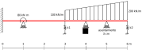

# Taller de vigas: comparación de las teorías de Euler-Bernoulli y Timoshenko

Con el objeto de contrastar la teoría aprendida y la práctica mediante el uso de un software profesional de análisis estructural, se requiere hacer el análisis de los desplazamientos, diagramas de momento flector y de fuerza cortante en una viga, utilizando las teorías de Euler-Bernoulli y de Timoshenko. Se espera que el estudiante explore, comente, discuta los conceptos aprendidos en clase, los conceptos nuevos vistos en el software y que proponga soluciones a los problemas propuestos.

Trabajo de elaboración individual

Fecha de entrega: junio 14, 2020 a las 23:59. Por cada día de retraso se tendrán -0.3 unidades en la nota final.

## El problema propuesto
Considere la viga mostrada:

Dicha viga tiene una sección rectangular. En x=0m, la viga tiene 10 cm de ancho y 40 cm de alto; la altura varía linealmente hasta x=2m donde tiene una altura de 20 cm; el tramo de viga entre x=2m y x=6m tiene una 10 cm de ancho y 20 cm de alto; la viga está hecha de un material con un módulo de Young E = 20 GPa y un coeficiente de Poisson ν = 0.30. Asuma k1 = k2 = 1000 kN/m.

Se solicita calcular y graficar los diagramas de:
* Fuerza cortante
* Momento de flexión
* Ángulo de giro de la viga
* Desplazamiento vertical

Utilizando los siguientes métodos:
<!---
* Viga de Euler-Bernoulli (solución exacta).
--->
* Viga de Timoshenko que resulta al utilizar la interpolación acoplada que aparece en la diapositiva 69 de [04b_EF_vigas_Timoshenko.pdf](../../diapositivas/04b_EF_vigas_Timoshenko.pdf).
* Viga de Euler-Bernoulli - método matricial donde la matriz de rigidez aparece al resolver la ecuación diferencial.
* Viga de Timoshenko - método matricial donde la matriz de rigidez se calcula numéricamente en cada paso usando la función `bvp4c()` o `bvp5c()` de MATLAB o su equivalente en PYTHON (+2 puntos extra).
* Programa de análisis estructural que usted registró en http://solidos2020a.shoutwiki.com/wiki/Software_para_an%C3%A1lisis_estructural_por_elementos_finitos utilizando las teorías de Euler-Bernoulli y Timoshenko. NOTA: no usar como software el FTOOL.

## Lo solicitado en el informe
Hacer un informe donde se:
* Compare todas las las respuestas; recuerde hacer cálculos de los porcentajes de error para mirar las diferencias entre las respuestas. 
* Haga diagramas que comparen los resultados obtenidos entre ambas teorías de vigas. ¿Cuál método calculó las reacciones, momentos de flexión, fuerzas cortantes y desplazamientos más altos y más pequeños? 
* Configure su software de modo que se emplee la misma convención para mostrar los diagramas de fuerzas cortantes y momentos flectores empleados en clase. Los momentos son positivos cuando la fibra a tracción está a compresión. El eje dependiente M(x) se grafica hacia arriba.

## Material a entregar
Lo solicitado se debe subir a la plataforma GOOGLE CLASSROOM en formato PDF. Los videos se deben subir a YouTube y se deben enlazar en GOOGLE CLASSROOM.

* Hacer un video de no más de 30 minutos donde se haga una revisión crítica de las capacidades teóricas y las hipótesis fundamentales que hace el programa en cuanto al análisis de vigas. OJO: no es mostrar como se utiliza el software, sino más mirar los manuales de referencia del mismo y mostrar que teorías, hipótesis, suposiciones, capacidades y limitaciones que tiene el programa escogido. Entregar, adicionalmente, el archivo PDF utilizado en la presentación de este video. En ese PDF se pueden incluir pantallazos de los manuales de referencia del software escogido.
* Hacer un video de no más de 15 minutos que ilustre como resolvió la viga utilizando el programa seleccionado. En el mismo video mostrar la comparación de los resultados obtenidos con MATLAB/PYTHON y con el programa escogido. 
* Informe del trabajo con el análisis de resultados.
* Envíe, adicionalmente, los archivos de MAXIMA, EXCEL y del software empleado asociados a este ejercicio.

Active en el software de captura de pantalla la opción para ver el ratón.

## Criterios de evaluación
* Análisis y comparación de los resultados con interpolación acoplada, solución de la ecuación diferencial y el software de EFs: 60%.
* Revisión crítica de las capacidades teóricas y las hipótesis fundamentales que hace el programa en cuanto al análisis de viga: 40%.
* Nota máxima: 6.0
* Si se programa algo que mejore radicalmente los códigos de la WIKI de vigas, se tendrá una unidad adicional.
* Si se modela la viga usando EFs de tensión plana y se comparan los resultados de desplazamiento horizontal `u`, esfuerzo normal `sx` y desplazamiento vertical del eje neutro de la viga `w`, se tendrá una unidad adicional.
* Por mala calidad en el sonido se rebajarán 0.5 unidades.

---

## Taller alternativo

* En vez de hacer este taller, se puede implementar un artículo científico sobre el tema de vigas de una revista de impacto internacional. El profesor debe dar visto bueno sobre el artículo. En este caso, la nota máxima sera 8.0. 
* Se debe realizar una exposición de máximo 20 minutos, preferiblemente hecha con [JupyterLab](https://jupyterlab.readthedocs.io/en/stable/) o [Jupyter](https://jupyter.readthedocs.io/en/latest/) o con el [MATLAB Live Editor](https://www.mathworks.com/products/matlab/live-editor.html).
* Si se modela la viga usando EFs de tensión plana y se comparan los resultados de desplazamiento horizontal `u`, esfuerzo normal `sx` y desplazamiento vertical del eje neutro de la viga `w`, se tendrá una unidad adicional.

Ideas: implementar viga de Reddy, Timoshenko con elementos finitos mixtos (enfoques de Hellinger-Reissner, Hu-Washizu), etc.
