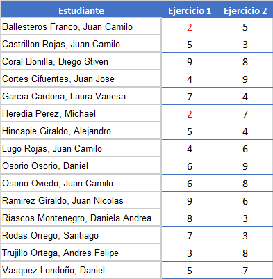

# Taller 2: modelado de cascarones utilizando software profesional.

Con el objeto de aplicar la teoría aprendida se requiere hacer el análisis de los desplazamientos, diagramas de momentos flectores y de torsión, de fuerza cortante y esfuerzos críticos en un cascarón utilizando la teoría de Mindlin y un software profesional de análisis y diseño estructural. Se espera que el estudiante explore, comente, discuta los conceptos aprendidos en clase, los conceptos nuevos vistos en el software y que propongan soluciones a los problemas propuestos.

Fecha de entrega: lunes julio 20 a las 7:00 am. Por cada hora de retraso se descontarán 0.3 unidades en la nota final.

Trabajo de realización individual.

## El problema propuesto
La idea de este trabajo es modelar mediante un programa profesional dos cascarones. Dichos cascarones los asignará el profesor a partir de los que figuran en el artículo:

[Yeongbin Ko, Youngyu Lee, Phill-Seung Lee and Klaus-Jürgen Bathe (2017). *Performance of the MITC3+ and MITC4+ shell elements in widely-used benchmark problems*. Computers and Structures 193, p. 187--206. DOI: https://doi.org/10.1016/j.compstruc.2017.08.003](http://web.mit.edu/kjb/www/Principal_Publications/Performance_of_the_MITC3+_and_MITC4+_shell_elements_in_widely_used_benchmark_problems.pdf)

Los ejercicios a realizar se sortearán de la siguiente forma:

donde los ejercicios correspondientes son:
- 3.2 circular plate problems (clamped and simply supported cases) 
- 3.3 pinched cylinder problem
- 3.4 Scordelis-Lo roof problem
- 3.5 twisted beam problems (in-plane and out-of-plane load)
- 3.6 hook problem 
- 3.7 hemispherical shell with cut-out problem
- 3.8 full hemisphere shell
- 3.9 hyperbolic paraboloid shell

Los estudiantes con el ejercicio número 2 deberán buscar en la literatura la solución teórica al problema 2 y programarla.

## Trabajo individual
Se solicita realizar para cada cascarón:
* Explicar detalladamente como se modelaron las condiciones de frontera.
* Hacer el cálculo de los diagramas de momentos de flexión y torsión. Los momentos principales deberán tener sus respectivas direcciones.
* Hacer el cálculo de las fuerzas cortantes. Las fuerzas cortantes máximas deberá tener su respectiva dirección.
* Hacer el cálculo de los momentos de diseño Mx^* y My^*. En su defecto aprender a manejar la funcionalidad de su programa para el diseño del refuerzo del cascarón.
* Hacer el cálculo de los esfuerzos de von Mises y de los esfuerzos máximos/mínimos en la superficie superior/inferior del cascarón.
* Calcular las reacciones en los apoyos.
* Calcular con la teoría de losas gruesas y con la teoría de losas delgadas.

Como se están analizando unos problemas "benchmark" se conoce la respuesta exacta de cada cascarón en ciertos puntos. Se solicita comparar la respuesta obtenida con dicha respuesta exacta.

* Para cada cascarón hacer un videos de máximo 30 minutos cada uno donde se detalle el modelado, análisis y diseño de cada cascarón utilizando el programa escogido.

* Hacer adicionalmente un video de máximo 30 minutos se debe haga una revisión crítica de las capacidades teóricas y las hipótesis fundamentales que hace el programa en cuanto al **ANALISIS** y **DISEÑO** de cascarones. OJO: no es mostrar como se utiliza el software, sino más mirar los manuales de referencia del mismo y mostrar que teorías, hipótesis, suposiciones, capacidades y limitaciones que tiene el programa escogido. Con respecto a la parte de diseño es estudiar como el software diseña el refuerzo en las losas (teorías empleadas, fórmulas, hipótesis empleadas, etc.). Entregar, adicionalmente, el archivo PDF utilizado en la presentación de este video.

Espero que cada uno lea a fondo el manual del usuario del software. No se queden con los videos de YouTube. En el manual del usuario generalmente existe importante información sobre las hipótesis de modelado que hace cada software.

Finalmente, los videos producidos se deben subir a YouTube.

En conclusión: se deben entregar dos videos más los correspondientes PDFs con las presentaciones utilizadas en esos videos.

## Criterios de evaluación
* 1.5 unidades por cada video de modelación del cascarón:
  - 0.1 Modeló adecuadamente los apoyos? la estructura? el material?
  - 0.2 Refinó adecuadamente la malla de elementos finitos? No de forma arbitraria sino utilizando los criterios escritos en: https://github.com/diegoandresalvarez/elementosfinitos/blob/master/diapositivas/05e_generando_una_buena_malla.pdf
  - 0.3 Interpretó adecuadamente los gráficos resultantes? Ubicó los momentos máximos y mínimos con sus respectivas inclinaciones? Las fuerzas cortantes máximas? Los puntos críticos de la estructura?
  - 0.3 Exploró todas las capacidades de visualización de resultados que ofrece el software?
  - 0.3 Reprodujo los resultados exactos que están listados en el artículo?
  - 0.3 Verificó que el software modelara la respuesta del cascarón para espesores pequeños?

* 3.0 unidades por el video de la revisión crítica de cada programa.
  - 0.5 Listó las hipótesis/suposiciones que hace el software?
  - 0.5 Listó las capacidades y limitaciones que tiene el software?
  - 0.5 Listó las advertencias o consejos que hace el software en cuento a la modelación?
  - 0.5 Hizo una revisión general del software y dió su opinión acerca del mismo? Intuitividad, facilidad de uso, claridad de los manuales, ayudas disponibles en internet y en YouTube.
  - 1.0 Explicó el modelo matemático que hace el software para la diseño del refuerzo?

* Si el video tiene mala calidad en el sonido se tendrá se rebajará 1.0 unidad en dicho video. Por lo tanto, se sugiere utilizar un micrófono diferente al del portátil para grabar el video (por ejemplo usar un manos libres).
* Se sugiere aprender a manejar un programa de edición de videos. Esto les facilitará grandemente la realización del mismo.

NOTA MAXIMA FINAL = 6.0

NOTA: no los voy a penalizar en caso que ustedes obtengan desplazamientos diferentes a los que deberían dar. La experiencia nos ha demostrado que hay programas que simplemente no funcionan adecuadamente (aunque son pocos). Sin embargo, el estudiante debe demostrar en el video que modeló correctamente la estructura.