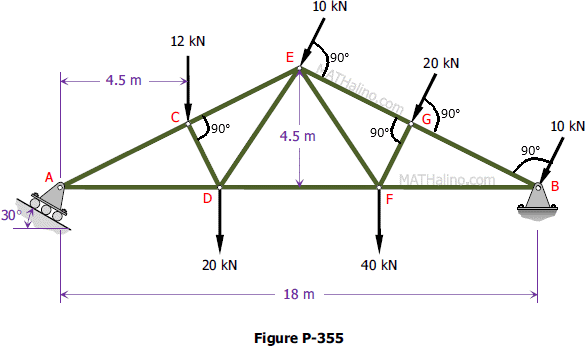
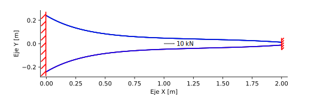

# Taller 1: elementos finitos de barra

* Fecha y hora de entrega: sábado octubre 9, 2019 a las 23:59.
* Presentación individual.
* Lenguajes de programación a utilizar: MATLAB (Ossa) o PYTHON (el resto del grupo).

**Notas:** 
* Por cada día de retraso en la entrega del trabajo se les descontará 0.3 unidades de la nota final.
* El trabajo es sustentable. Si no se aprueba la sustentación se obtendrá un cero en la nota de dicho trabajo.

## Criterios de calificación
* Trabajo presentado utilizando LaTeX = +10% sobre la nota final del taller.
* Codigo sin comentarios = -1.0 por ejercicio.
* Código feo/desordenado = -1.0 por ejercicio (ya que se dificulta la legibilidad del ejercicio).
* Errores en el código = -50% del punto en cuestión.
* No interpretar información dada por el programa que usted elaboró = -1.0 por ejercicio.
* No se relacionan los resultados obtenidos en el informe final = -1.0 por ejercicio.
* Hacer algo más en el código que lo dado en clase y que mejore notablemente la presentación de los resultados = +1.0 por ejercicio.
* Cuando se utiliza un software y se compare contra este los resultados obtenidos por su programa y no se explique porqué difieren los resultados, se tendrá -0.5 por ejercicio.

## Consejos/reglas para presentar el informe
* Haga una tabla de dos columnas. En la izquierda, haga el gráfico, en la derecha, su interpretación. Explique porqué el comportamiento visto en el gráfico, localice los puntos con los valores máximos y mínimos mostrados, las zonas críticas de la estructura, y cualquier otro apunte que se considere conveniente.
* No incluya en el informe el código de su programa (solo se pueden incluir fragmentos en caso extremadamente necesario). Limítese a hacer un análisis de resultados en los informes. Incluya la deducción de las ecuaciones o formulaciones que tuvo que emplear en caso que estas no se hayan discutido en clase.
* Los trabajos se deben entregar preferiblemente de forma electrónica y en formato PDF (si lo entregan impreso que sea por ambos lados de la hoja o en hojas de reciclaje para ahorrar papel). 
* Adjuntar los códigos por correo electrónico SUPERCOMENTADOS. 
* El reporte debe incluir el análisis de resultados y cualquier otra información que usted considere necesaria.
* Extensión máxima 20 hojas.

# Ejercicio 1: cercha con apoyo inclinado (máximo +3 puntos)

Dada la cercha:



Haga un programa que estime (+1 unidad):
* Desplazamientos horizontales y verticales en cada nodo.
* Fuerzas axiales en cada barra.
* Las fuerzas en los apoyos (reacciones).

Se obtendrá +1 unidad si el programa hace gráficos de:
* Estructura deformada.
* Fuerzas axiales para cada barra.


Si se compara la respuesta con la obtenida por el programa de EFs que usted registró en la WIKI se obtendrá +1 unidad. Hacer el video respectivo del modelado  y subirlo a YouTube.

Asuma:
* E = 200 GPa.
* Densidad del material = 0 kg/m^3 (no se tendrá en cuenta el peso propio de la estructura).
* Sección:
  * circular de radio 2 cm para los elementos inclinados.
  * rectangular de lado 4 cm para los elementos horizontales.


# Ejercicio 2: barra doblemente empotrada y resuelta con elementos finitos de barra de n nodos (máximo +2.5 puntos)

Considere la barra doblemente empotrada, de módulo de elasticidad E constante, mostrada en la figura:



Suponga que esta barra tiene una sección transversal circular, con radio que varía según:

```
r(x) = 0.04 + 0.2*exp(-3*x) - 0.1*exp(-2.5*(2.5-x)) para x \in [0 m, 2 m].
```

módulo de elasticidad E=200 GPa, y que la carga distribuida que actúa sobre esta (no mostrada) está dada por la parábola:

```
b(x) = 2 kN/m^3 * x^2 para x \in [0 m, 2 m]
```

* Haga un programa que use matemática simbólica para calcular la matriz de rigidez `K` y el vector de fuerzas nodales equivalentes `f` para elementos finitos con sección transversal [cónica truncada](http://es.wikipedia.org/wiki/Tronco_de_cono) y bases de radio izquierdo r1 (en x=x1) y radio derecho rn (en x=xn). Aquí se deben deducir las fórmulas para este tipo especial de elemento finito. El elemento finito tendrá 4 nodos igualmente espaciados. (+0.5 puntos).

* Resuelva el ejemplo mostrado usando 2, 4 y 6 elementos finitos de igual longitud y la formulación deducida en el punto anterior. Resolver implica: calcular fuerzas axiales, esfuerzos, deformaciones y desplazamientos en todos los puntos de la barra. Muestre tablas/gŕaficos que muestren las respuestas para cada número de elementos finitos (+0.5 puntos).

* Resuelva el punto anterior utilizando integración numérica con cuadraturas de Gauss-Legendre, en vez de la matriz `K` deducida. (+0.5 puntos).

* **PUNTO OBLIGATORIO (si no se hace, se tendrá -1 punto)** Utilizando la ecuación diferencial con sus correspondientes condiciones de frontera y la función `bvp4c()` de MATLAB o `solve_bvp()` de PYTHON, calcular la solución exacta (fuerzas axiales, esfuerzos, deformaciones y desplazamientos en todos los puntos de la barra) y compararla con las soluciones estimadas por el método de los EFs. ¿Cual es el error del método de los EFs? (+1 punto).
