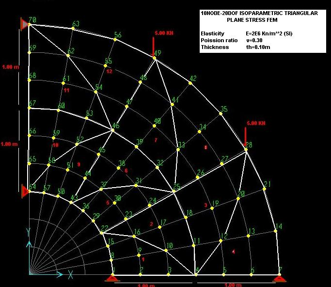

# Taller 2: elementos finitos bidimensionales

* Fecha y hora de entrega: domingo noviembre 24, 2019 a las 23:59.
* Presentación individual.
* Lenguajes de programación a utilizar: MATLAB (Ossa) o PYTHON (el resto del grupo).

**Notas:** 
* Por cada día de retraso en la entrega del trabajo se les descontará 0.3 unidades de la nota final.
* El trabajo es sustentable. Si no se aprueba la sustentación se obtendrá un cero en la nota de dicho trabajo.

## Criterios de calificación
* Trabajo presentado utilizando LaTeX = +10% sobre la nota final del taller.
* Codigo sin comentarios = -1.0 por ejercicio.
* Código feo/desordenado = -1.0 por ejercicio (ya que se dificulta la legibilidad del ejercicio).
* Errores en el código = -50% del punto en cuestión.
* No interpretar información dada por el programa que usted elaboró = -1.0 por ejercicio.
* No se relacionan los resultados obtenidos en el informe final = -1.0 por ejercicio.
* Hacer algo más en el código que lo dado en clase y que mejore notablemente la presentación de los resultados = +1.0 por ejercicio.
* Cuando se utiliza un software y se compare contra este los resultados obtenidos por su programa y no se explique porqué difieren los resultados, se tendrá -0.5 por ejercicio.

## Consejos/reglas para presentar el informe
* Haga una tabla de dos columnas. En la izquierda, haga el gráfico, en la derecha, su interpretación. Explique porqué el comportamiento visto en el gráfico, localice los puntos con los valores máximos y mínimos mostrados, las zonas críticas de la estructura, y cualquier otro apunte que se considere conveniente.
* No incluya en el informe el código de su programa (solo se pueden incluir fragmentos en caso extremadamente necesario). Limítese a hacer un análisis de resultados en los informes. Incluya la deducción de las ecuaciones o formulaciones que tuvo que emplear en caso que estas no se hayan discutido en clase.
* Los trabajos se deben entregar preferiblemente de forma electrónica y en formato PDF (si lo entregan impreso que sea por ambos lados de la hoja o en hojas de reciclaje para ahorrar papel). 
* Adjuntar los códigos por correo electrónico SUPERCOMENTADOS. 
* El reporte debe incluir el análisis de resultados y cualquier otra información que usted considere necesaria.
* Extensión máxima 20 hojas.

# Ejercicio 1: estructura en tensión plana, elementos T10
Dada la estructura siguiente:

y utilizando elementos finitos triangulares de 10 nodos, haga un programa que estime y grafique:
* Desplazamientos horizontales y verticales en cada nodo (+1 unidad)
* Las deformaciones ex, ey, gxy y los esfuerzos sx, sy, txy, s1 (con su ángulo), s2 (con su ángulo), el esfuerzo cortante máximo tmáx (con sus ángulos) y el esfuerzo de von Mises en los puntos de Gauss y en los nodos de la malla de EFs (+2 punto). Si no se realiza la parte de la extrapolación de los esfuerzos a los nodos se tendrán -2 unidades.
* Las fuerzas en los apoyos (reacciones).

Los siguientes puntos son opcionales, siempre y cuando se hayan realizado los ejercicios anteriores:
 * Si se repite el ejercicio, pero esta vez creando la malla con el programa [gmsh](http://gmsh.info/), se tendrá +2 unidades. Si se muestran los resultados utilizando gmsh se tendrá +1 unidades adicionales. 
 * Si se repite el ejercicio, pero esta vez creando la malla con el programa [GiD](https://www.gidhome.com/), se tendrá +0.5 unidades. Si se muestran los resultados utilizando GiD se tendrá +0.5 unidades adicionales. Nota: se deben crear los programas para leer los archivos de la malla o para escribir los archivos con las respuestas. Le pueden preguntar a la gente que está viendo con el profesor Paredes que les indiquen como hacer el ejercicio.
 * Si se compara la respuesta con la obtenida por el programa [GetFEM++](http://getfem.org/index.html) y se muestran los resultados con [Paraview](https://www.paraview.org/), se tendrán +2 unidades.
 * Si se compara la respuesta con la obtenida por el programa de EFs que usted registró en la WIKI se obtendrá +1 unidad.

En cada uno de los tres casos anteriores, hacer el video respectivo que explica el proceso de creación de la malla/modelación de la estructura y subirlo a YouTube. Incluir en el informe los archivos generados. Tener en cuenta las reglas vistas en clase para la creación de una buena malla.

Asuma:
* Módulo de elasticidad = 2 GPa.
* Coeficiente de Poisson = 0.3
* Espesor = 10 cm.
* Densidad del material = 2300 kg/m³.
* Una carga distribuída constante de magnitud 100 kN/m que está actuando sobre el borde exterior (nodos 7, 14, 21, 28, 35, ..., 63, 70) y que apunta en la dirección del origen de coordenadas.
<!--- 
X(theta) = 1 + theta, Y(theta) = theta^2, teniendo en cuenta que theta varía entre 0 y pi/2
--->

# Ejercicio 2: por definir
