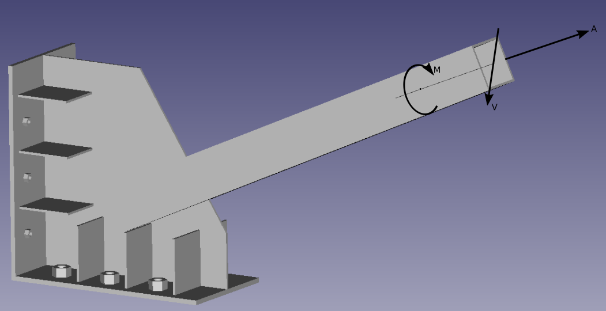

# Taller 3: modelado de una unión metálica utilizando un software profesional (opcional)

* Fecha y hora de entrega de los videos y del informe: jueves diciembre 19, 2019 a las 7:00 a.m.
* Entrega de resultados/videos: viernes diciembre 20, 2019 a las 7:00 a.m. Por cada hora de retraso en la entrega del trabajo se les descontará 0.5 unidades de la nota final.
* Presentación individual y grupal de los presultados.

La idea de este trabajo es modelar mediante un programa profesional la unión metálica mostrada:

la cual está contenida en el archivo [union_metalica_C410.stl](figs/union_metalica_C410.stl) utilizando elementos finitos tridimensionales. Esta unión metálica es la que está en la esquina inferior y de atrás del salón C410. El archivo fue amablemente creado por Juan Esteban Ossa Ossa (jueossaos@unal.edu.co).

Las fuerzas/momentos que debe soportar la unión son:
* A = 100 kN
* V = 50 kN
* M = 70 kN-m

La nota obtenida en este trabajo estará dada por:
* INDIVIDUAL: presentación individual y videos: 85%
* GRUPAL: presentación grupal e informe: 15%

Serán tres grupos de trabajo: cada uno con 4 integrantes (reportar los grupos en la WIKI). Los miembros de un mismo grupo no pueden utilizar programas de la misma casa. (Por ejemplo en un mismo grupo no pueden estar quien maneja el ROBOT y el INVENTOR, ya que ambos programas son de la casa AUTODESK).

## Trabajo individual
Se solicita realizar:
* Explicar detalladamente como se modelaron las condiciones de apoyo y las cargas y con qué criterios se creó la malla de elementos finitos.
* Hacer el cálculo de los diagramas de desplazamiento, esfuerzos y deformaciones. Los esfuerzos y las deformaciones máximas se deben graficar con sus respectivas direcciones.
* Calcular las tracciones en cada tornillo del apoyo.
* Hacer un refinamiento de la malla utilizando el método p y el método h.
* Hacer un estudio de convergencia de la solución.
* Analizar la calidad de la malla utilizando las herramientas con las que cuenta el programa.
* Hacer videotutoriales que se deben subir a YouTube que ilustren:
  * Todo lo anteriormente planteado y el análisis de resultados. (+ 4 unidades)
  * Tutorial de las funcionalidades para generar las malla de EFs, incluyendo las funcionalidades para evaluar la calidad de la malla. (+ 3 unidades)
  * Tutorial que ilustre las diferentes formas de mostrar los resultados. (+ 2 unidades)
 
* Hacer presentación de máximo 25 minutos, intentando convencer a los compañeros porqué su programa es el mejor del mercado (imagínense que ustedes son los representantes para Colombia del producto).

## Trabajo grupal
Se solicita realizar:
* Presentar un informe escrito que presente la comparación de los resultados obtenidos por los miembros de cada grupo. Comparar en porcentajes.
* Presentar una calificación general realizada a los programas, justificando en una tabla, los pro y los contra de cada software.
* Cada grupo debe utilizar las mismas suposiciones en el modelado, en caso que las deban hacer y deben justificar el porqué las hicieron.

Este trabajo se califica sobre 5.0

## Criterios de calificación
* No interpretar información dada por el programa que usted elaboró = -3 unidades.

## Consejos
* Explique porqué el comportamiento visto en el gráfico, localice los puntos con los valores máximos y mínimos mostrados, las zonas críticas de la estructura, y cualquier otro apunte que se considere conveniente.
* Los trabajos se deben entregar preferiblemente de forma electrónica y en formato PDF (si lo entregan impreso que sea por ambos lados de la hoja o en hojas de reciclaje para ahorrar papel). 
* El reporte debe incluir los análisis de resultados y cualquier otra información que usted considere necesaria.
* Extensión máxima 20 hojas.

## Notas adicionales
Recuerden que la finalidad de los grupos de trabajo es que comparen los programas que utilizaron en cuanto a facilidad de uso, forma de entrar los datos, hipótesis que utilizan los programas, etc. Obviamente, deben comparar los resultados obtenidos. La idea es que si les dan resultados diferentes (que seguramente les darán), intenten explicar el porqué les dio diferente. No los pienso penalizar por resultados diferentes, siempre y cuando me muestren en el video que todo se modeló utilizando unas hipótesis correctas.

Espero que cada uno lea a fondo el manual del usuario del software. No se queden con los videos de YouTube. En el manual del usuario generalmente existe importante información sobre las hipótesis de modelado que hace cada software.

Me encantaría si en la WIKI se especifican las suposiciones hechas y se hace “cooperación” o comunicación entre los grupos de trabajo de las suposiciones que tengan que hacer, de modo tal que todo el curso maneje los mismos parámetros en el modelado.
